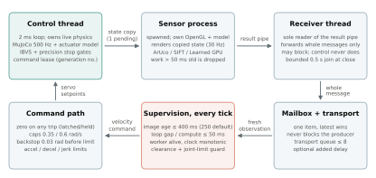
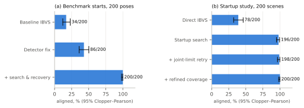
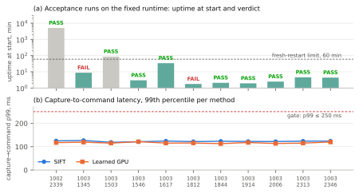
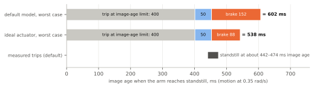

# Engineering Report: Vision-Guided Arm Alignment in Simulation

| | |
|---|---|
| Subject | Visual servoing of a six-joint arm to a taught camera view (MuJoCo, OpenCV, SuperPoint + LightGlue) |
| Report date | 2026-10-06 |
| Covers | First benchmark (2026-09-06) to the automated traceability check and GUI rework (2026-10-04) |
| Platform | One Windows 11 laptop: Ryzen 7 8845HS, RTX 3050. Simulation only |
| Verification status | 26 requirements: 13 VERIFIED, 12 PARTIALLY VERIFIED, 1 NOT VERIFIED |

## Abstract

A simulated six-joint arm moves a wrist camera until its view matches a taught
reference image of an ArUco marker or a known photograph. The design pairs
image-based visual servoing with bounded search, recovery, joint-limit and
clearance supervision. A wall-clock runtime runs perception in a separate process
and never commands motion on an image older than a fixed limit.

Development was measurement-driven. Each change was judged on fixed, seeded test
sets, and success rates carry 95% Clopper–Pearson intervals. Key results:
- **Success rate.** Over all 200 benchmark starts, success rose from 34/200 to
  200/200 (95% CI 98.2–100%), with a remembered viewpoint and a static target.
- **Physical accuracy.** Median tool error with learned matching fell from 9.92 mm
  to 0.17 mm.
- **Acceptance.** Eleven 30-minute acceptance runs on the final runtime completed
  3,243 of 3,245 alignments. The two failures were safe stops on a control-loop
  deadline miss.

Fault injection exercised most safety stops. Requirements are traced to evidence by a
CI-checked tool. Three problems remain open:
- a host-level stall source on Windows that has not been identified;
- degradation of long-lived GPU perception workers;
- the absence of an actuator-side command timeout.

None of the results is a claim about real hardware.

## 1. Introduction

### 1.1 Problem

Image-based visual servoing is easy to demonstrate and hard to make dependable.
A demo needs the target in view, a fast enough detector and a well-conditioned
interaction matrix. A dependable system must also:
- find a target that is not in view;
- survive losing it;
- respect joint limits and obstacles;
- behave safely when perception is slow, stale or dead;
- prove that "converged in the image" means "positioned in the world".

This project treats those as engineering requirements and measures each one.

### 1.2 Objectives

| ID | Objective | Measure |
|---|---|---|
| O1 | Align reliably from a declared distribution of starting poses | Success rate with 95% CI on seeded pose sets |
| O2 | Position the tool accurately, not only the image | Camera and tool error ≤ 2 mm and ≤ 1° |
| O3 | Never move on stale feedback; stop safely on any internal failure | Fault-injection reaction times; zero unsafe motion |
| O4 | Run on a commodity Windows laptop in wall-clock time | Pre-declared acceptance gates on latency and success |
| O5 | Keep claims tied to evidence | Requirement status recomputed from saved results in CI |

### 1.3 Scope and assumptions

- **Simulated world.** The arm, camera and scene are simulated in MuJoCo, and images
  are rendered, not captured.
- **Actuator model.** The braking model uses assumed limits (deceleration 5 rad/s²,
  jerk 150 rad/s³), not drive data.
- **Targets.** One planar target at a time: an ArUco marker or one known photograph.
- **Timing.** All timing results come from a single host.

## 2. Requirements

The 26 requirements come from the project's documentation, configuration and
pre-declared acceptance criteria. None was written after the evidence. Each one is
traced to its hazard, enforcing code, tests and evidence in
[Requirements Verification and Safety Traceability](SAFETY_TRACEABILITY.md).

| Group | Requirements | Examples | VERIFIED / PARTIAL / NOT |
|---|---|---|---|
| Freshness and timing | REQ-01–09, REQ-24 | Zero command ≤ 50 ms after the image-age limit; control gap > 50 ms stops the alignment; stale results never refresh the command lease | 6 / 3 / 1 |
| Motion safety | REQ-10–16, REQ-25, REQ-26 | No contact; 12 mm environment and 6 mm self clearance; joint speed ≤ 0.6 rad/s; bounded search and recovery | 3 / 6 / 0 |
| Task performance | REQ-17–21 | ≤ 2 mm / 1° final error; 95% CI lower bound ≥ 95% success; latency gates | 3 / 2 / 0 |
| Process | REQ-22, REQ-23 | Protected inputs match the validated baseline; timing runs follow the test procedure | 1 / 1 / 0 |

**Acceptance gates.** These are fixed in `tools/acceptance_test.json` before
execution. Each method runs five starting poses with fresh workers, three
alignments each, then 720 s on one reused worker.

| Gate | Limit |
|---|---|
| Success | 95% CI lower bound ≥ 95%, and 0 failed alignments |
| Perception processing p95 / p99 / max | ≤ 150 / 175 / 250 ms |
| Capture-to-command p99 / max | ≤ 250 / 400 ms |
| Later / first processing p99 (worker degradation) | ≤ 1.5× |
| Watchdog-ended alignments; paused time | 0; ≤ 5% of alignment time |
| Control deadline misses; unsafe, post-stop or unlatched motion; contacts | all 0 |
| Final camera/tool error | ≤ 2 mm and ≤ 1° |

## 3. System design

### 3.1 Architecture

*Figure 1. Wall-clock runtime (`realtime.py`). The supervision and command-path
blocks run on the control thread; they are drawn separately to show the order of
checks.*

**Why this structure.**
- **Isolated perception.** Rendering and matching typically take about 45–60 ms per
  frame, with occasional frames over 200 ms. Keeping them in their own process stops a slow or crashed
  matcher from delaying the 2 ms control loop.
- **Non-blocking hand-off.** Hand-offs between control and perception use one-item,
  latest-wins buffers, plus a transport queue bounded at 8 results. The control
  thread never performs a blocking read, so the newest information wins and no
  backlog can form (REQ-07).
- **Timestamps at capture.** Each observation carries its capture time, taken before
  queueing or rendering, so every later delay counts toward its age.
- **Command lease.** A generation number invalidates results captured before the
  current Align (REQ-02).

### 3.2 Control law

The controller is classical image-based visual servoing (IBVS) on the four target
corners, in normalized image coordinates:

    e    = s − s*                          (feature error, 8×1)
    v_c  = −λ · pinv_μ(L̂) · e              (camera twist, 6×1)
    q̇    = pinv_ν(J_c) · v_c               (joint velocities, 6×1)

- `L̂` is the interaction matrix. It is evaluated with corner depths estimated from
  the marker's known size.
- `pinv_μ` and `pinv_ν` are damped pseudo-inverses, with μ = 1·10⁻⁴ and ν = 0.005.
  The damping limits gain near singular configurations.
- `J_c` is the camera Jacobian.

The commands are then limited, in order:
1. the camera twist is capped at 0.12 m/s and 0.4 rad/s;
2. joint speed is capped at 0.35 rad/s for IBVS, and 0.6 rad/s absolutely;
3. the clearance guard and the joint-limit backstop act on what remains.

The default gain is fixed at λ = 1.2 s⁻¹. An optional error-scheduled gain
`λ(e) = 0.8 + 1.6·(1 − exp(−e_rms / 8 px))`, where `e_rms` is the RMS corner error, changes only λ. The interaction model,
joint mapping, limits and stopping logic are shared, so results attribute any change
to the gain alone.

**Stopping.**
- **Image gate.** The image error must stay below 1 px for 0.5 s.
- **Precision gates.** Patch registration against the reference image, plus a
  sensitivity check on the residual camera correction, must also hold (§6.3).
- **Latching.** After any stop the command is held at zero until a new Align.

**Baselines.** Two baselines were kept to justify the IBVS choice:
- pose-based servoing (PBVS), which uses a PnP pose estimate every frame;
- a look-once controller, which estimates the goal once and then executes it on joint
  feedback.

### 3.3 Safety layers

| Layer | Trigger | Reaction | Verified by |
|---|---|---|---|
| Freshness watchdog | Newest accepted image ≥ 400 ms old (250 ms default) | Zero command within one tick; hold up to 2 s, then end | Fault injection: zero command 2.4 ms after the limit |
| Deadline monitor | Loop gap or controller computation > 50 ms | Stop `control_overrun`; the late command is never applied | Stalls of 150, 55 and 35 ms (negative control) |
| Worker supervision | Process exit, pipe EOF, inference error, clock step back | Stop with `worker_failed` / `inference_failed` / `clock_error` | Half-sent frame and blocked read: 30/30 + 5/5 each; random kill 29/30 (one repeat never injected its fault) |
| Physics-gap cap | Scheduler gap > 50 ms | Integrate at most 50 ms; count the rest as discarded | 150 ms stall gave a 50 ms step |
| Speed limits | Commanded joint speed | Clip to 0.35 rad/s (IBVS) and 0.6 rad/s (absolute) | 1.5 rad/s command clipped; measured peak 0.592 rad/s |
| Joint-limit backstop | Within 0.03 rad plus stopping distance of a limit | Zero outward command, latched | Unit tests; the acceptance runs stayed ≥ 0.99 rad from limits |
| Clearance guard | Predicted clearance < 12 mm (environment) or 6 mm (self) | Slow or stop (`collision_blocked`); search detours | 9 fixed collision cases; injected block |
| Bounded search and recovery | Target absent | Startup search ≤ 180 s; recovery ≤ 20 s cumulative and ≤ 3 episodes; find-and-align ≤ 45 s | Unit tests and studies |

Two layers are deliberately absent. Neither is claimed:
- an actuator-side timeout that stops the motors if commands stop arriving (REQ-24);
- a heartbeat from the perception worker.

## 4. Key design decisions

| # | Decision | Alternatives considered | Rationale and evidence | Cost or trade-off |
|---|---|---|---|---|
| D1 | IBVS as the primary controller | PBVS; look-once | Both IBVS and PBVS aligned all 86 detectable starts (4.05 s vs 4.27 s median). Look-once aligned 83/86 and ended 20.9 px off on a moving target. IBVS needs no pose estimate in the loop. | Depends on depth estimates and needs the target in view, so search and recovery are required |
| D2 | Adaptive gain optional, fixed gain default | Always adaptive; higher fixed gain | Adaptive cut median settling time by 26.8% with no measured overshoot. A fixed gain of 2.4 was faster still (1.73 s), so the speed-up is not unique to adaptation. | Keeping the validated default avoids re-verifying every study |
| D3 | Precision stopping on top of the 1 px rule | Tighter pixel threshold | 14 trials were under 1 px but over 2 mm off. Pixel error alone does not bound pose error. | Learned frame time rose from 64.8 to 102.3 ms |
| D4 | Hold-and-resume after a freshness trip | Stop on trip; adaptive quality; latency-scaled speed; two workers; hardware self-check | Smallest change, with no change to the controller or the safety limits. Tolerated extra delay rose from +75 to +150 ms (SIFT) and +25 to +150 ms (Learned). At +75 ms, Learned aligned 10/10 instead of 2/10 (p = 0.0007). | The robot can sit held for up to 2 s; stop-on-trip remains a setting |
| D5 | A receiver thread owns the result pipe | Non-blocking reads on the control thread | A half-sent frame from a dying worker blocked the control loop. A thread that may block keeps the control loop free. | IPC p99 about 0.4–1.1 ms higher |
| D6 | Requirements stated for the zero command, with physical stopping reported separately | A physical standstill limit | No actuator profile can stop by 400 ms of image age when the trip happens at 400 ms (Figure 4). | A real robot needs its own stopping requirement and drive data |
| D7 | Split the worker-death gate into OS detection (recorded) and runtime reaction (≤ 50 ms) | Keep one 50 ms kill-to-stop gate | Windows takes 48–130 ms to report a killed process; the runtime reacts within 3 ms. The old gate measured the OS. | End-to-end detection on Windows is slower than the deadline; bounded by the 400 ms watchdog |
| D8 | Count at most one acceptance run per restart toward the five-in-a-row rule | Count every run after a restart | The test procedure asks for a restart before every run. The stricter reading makes the rule deterministic. | More laptop restarts per verification cycle |

## 5. Verification method

Verification is layered. Each layer answers a different question.

| Layer | Question it answers | Size |
|---|---|---|
| Unit and integration tests | Does each mechanism behave as specified, including edge cases? | ~520 test functions; control-mathematics subset in CI |
| Seeded studies | How well does the method work over a declared distribution of starts? | 100–200 trials per configuration, paired where compared |
| Acceptance test | Does the integrated runtime meet pre-declared gates on the target host? | ~3,245 alignments over 11 runs on the final runtime |
| Margin test | How much extra perception delay is tolerated before failure? | 10 alignments per delay level |
| Fault injection | Does each safety stop trigger, and how fast? | About a dozen scenarios, 3–30 repeats each |
| Traceability check (CI) | Does every stated status and number follow from saved evidence? | 26 requirements, 23 numeric claims |

**Statistics.** Success counts are reported with 95% Clopper–Pearson intervals
([statistics](STATISTICS.md)). A 95% success claim therefore needs at least 72
consecutive successes. Some older studies report Wilson intervals; this report
recomputes every interval as Clopper–Pearson.

**Test conditions.** The [test procedure](TEST_PROCEDURE.md) for timing runs requires:
- a fresh restart (≤ 60 min uptime);
- AC power;
- the "Best performance" power mode;
- no other programs running.

The harness enforces AC power and records uptime and power-state snapshots.

**Evidence integrity.**
- **Protected inputs.** Controller, calibration, scene, safety and transport files
  are hash-checked against `tools/approved_changes.json`.
- **Re-derived verdicts.** `tools/traceability.py` recomputes each run's pass/fail
  from its own result files and rewrites the generated status sections. It fails CI
  on stale text, unpublished evidence or an ambiguous rule.

## 6. Results

### 6.1 Reliability over a declared start distribution

*Figure 2. Success rates with 95% Clopper–Pearson intervals. (a) Same 200 benchmark
poses throughout. (b) Startup study without a remembered viewpoint; each bar adds
one mechanism to the previous one. The 200/200 results are on development scenes.*

| Configuration | Aligned | 95% CI | Note |
|---|---:|---|---|
| Baseline IBVS | 34/200 | 12.1–22.9% | 41 trials lost the marker during motion |
| Detector fix | 86/200 | 36.0–50.2% | 86/86 of detectable starts; 112 starts had no target in view |
| + search and recovery | 200/200 | 98.2–100% | All 114 initially undetected starts recovered; remembered viewpoint, static target |
| Held-out seed, detectable starts | 44/44 | 92.0–100% | Guards against tuning to one seed |
| Startup study, direct IBVS | 78/200 | 32.2–46.1% | No remembered viewpoint; 122 starts initially undetected |
| + startup search | 196/200 | 95.0–99.5% | |
| + joint-limit margin and retry | 198/200 | 96.4–99.9% | No previously successful scene regressed |
| + refined search coverage | 200/200 | 98.2–100% | Regression on development scenes; fresh scenes 100/100 (96.4–100%) |

### 6.2 Controller comparison (same 200 poses)

| Controller | Aligned | Of detectable | Median time | Final error |
|---|---:|---:|---:|---:|
| IBVS | 86/200 | 86/86 | 4.05 s | 0.974 px |
| PBVS | 86/200 | 86/86 | 4.27 s | 0.943 px |
| Look-once + joint feedback | 83/200 | 83/86 | 5.47 s | 0.530 px |

On a moving target, look-once ended 20.854 px from the goal, while both closed-loop
controllers converged. Closed-loop feedback is what buys robustness to model and
target error.

### 6.3 Image convergence versus physical accuracy

- **Finding.** 14 image-converged trials were under 1 px of corner error but more
  than 2 mm off physically.
- **Change.** Precision stopping refines the image near the goal and checks sensitivity
  to the remaining camera motion.
- **Calibration trials.** 72/72 paired calibration trials passed (95.0–100%), plus
  12/12 with new starting poses.
- **Learned matching.** Physical acceptance at 2 mm / 1° rose from 0/24 to 24/24.
  Median tool error among image-converged trials fell from 9.917 mm to 0.168 mm
  (16 converged trials before, 24 after).
- **Cost.** About 37 ms more processing per Learned frame (64.8 → 102.3 ms).

### 6.4 Acceptance on the target host

*Figure 3. All acceptance runs on the fixed runtime. Bars in teal were started
within 60 minutes of a restart. Both failures were caused by a single SIFT
control-deadline miss; in `20261003-181233` the same slowdown also broke the
250 ms processing-max gate (275.6 ms).*

| | SIFT | Learned GPU |
|---|---:|---:|
| Alignments, 11 runs pooled | 1,630 / 1,632 | 1,613 / 1,613 |
| 95% CI per alignment | 99.6–100% | 99.8–100% |
| Capture-to-command p99, range over runs | 119.0–126.7 ms | 113.1–121.6 ms |
| Capture-to-command max, worst run | 250.3 ms | 171.4 ms |
| Control deadline misses | 2 | 0 |
| Watchdog trips | 0 | 0 |
| Worst converged error (latest run) | 0.46 mm / 0.10° | 0.60 mm / 0.12° |
| Minimum clearance above margin; joint margin; peak measured speed (latest run) | 3.0 mm; 0.99 rad; 0.085 rad/s | 3.0 mm; 0.99 rad; 0.222 rad/s |

The pooled rates cover runs under slightly different conditions (uptime, date). They
describe this host and this start set, not a population of machines.

**Gate margin.** Capture-to-command p99 sits at about half its 250 ms gate.

**Per-run verdict.** A run fails on any single miss, and the per-run record after a
fresh restart is 7 passes in 9 runs. The 95% CI on the per-run miss probability is
2.8–60.0%. The pre-declared rule of five consecutive fresh-restart passes was met on
2026-10-04, but a low miss rate is not established.

### 6.5 Timing margin

Under hold-and-resume, the margin test tolerated +150 ms of injected per-frame
perception delay for both methods. Under stop-on-trip it tolerated +75 ms (SIFT) and
+25 ms (Learned). The structural reason is analysed in the
[watchdog decision](WATCHDOG_DECISION.md):
- the worker processes one frame at a time;
- a held image can therefore be about two frame times plus 50 ms of transport old
  before a replacement arrives;
- that leaves about 155 ms per frame before the 400 ms limit.

### 6.6 Stopping behaviour

*Figure 4. Worst-case image age at standstill for motion at the 0.35 rad/s IBVS cap.
The trip itself happens at the limit, so no actuator can be stationary by 400 ms.*

- **Coverage.** The actuator model was exercised in 252 stops: 14 motions × 3 speeds ×
  2 poses × 3 profiles.
- **Default profile.** The worst-case physical stopping time is 96 ms from 0.1 rad/s
  and 204 ms from 0.6 rad/s. Peak deceleration is limited to about 5 rad/s².
  Realtime watchdog stops took 42–72 ms.
- **Predictability.** The setpoint stop time matched the analytic prediction within
  2 ms in 250 of 252 stops. In the other two, the guard was already braking.
- **Standstill.** The worst case is 602 ms of image age at 0.35 rad/s and 654 ms at
  0.6 rad/s. Measured realtime trips reached standstill at about 442–474 ms.
- **What a 400 ms standstill would need.** Tripping at about 198 ms, which is close
  to normal operating image ages.

### 6.7 Fault injection

| Fault | Requirement | Result (cloud campaign, worst passed repeat) |
|---|---|---|
| Control thread blocked 150 ms | REQ-03 | `control_overrun` 2.9 ms after the stalled tick; arm stopped in 58 ms, camera travel 0.6 mm |
| Blocked 35 ms (negative control) | REQ-03 | No stop; alignment converged |
| Controller computation 80 ms late | REQ-03 | Stop 0.4 ms later; late command never applied |
| Clock steps back 1 s | REQ-06 | `clock_error` 0.4 ms after the jump |
| Sensor stalls 0.8 s | REQ-01 | Zero command 2.4 ms after the 400 ms limit |
| Worker killed mid-frame (half-sent message) | REQ-06 | 30/30 and 5/5; control kept ticking; `worker_failed` ≤ 40.1 ms after the kill |
| Worker killed, Windows | REQ-06 | 10/10 twice; runtime reaction ≤ 2.3 ms after the OS reports the exit |
| 1.5 rad/s command | REQ-13 | Clipped to 0.600 rad/s; peak measured 0.592 rad/s |
| Run limit 1 s | REQ-06, REQ-16 | `run_timeout` 3.7 ms after the limit |

The laptop campaign gave similar reactions, slightly slower in places: the stall stop
within 3.7 ms and the clock-step stop within 0.5 ms ([fault injection](FAULT_INJECTION.md)).
The joint-limit backstop and geometric collision blocking were not fault-injected.

## 7. Failure investigations

Each entry follows symptom → root cause → corrective action → verification →
residual risk.

### 7.1 Valid marker silently discarded

| | |
|---|---|
| Symptom | 34/200 aligned; in 41 trials the marker was lost during motion |
| Root cause | OpenCV's default candidate-grouping distance merged close contours and suppressed marker ID 7. Reproduced offline on saved raw frames |
| Corrective action | `minMarkerDistanceRate` set to 0.03 in the scene configuration |
| Verification | 86/200 on the same poses (86/86 detectable), 0 losses during motion; 44/44 on a held-out seed |
| Lesson | The first benchmark measured a perception defect, not the controller. Verify the sensor before tuning the loop |

### 7.2 Control loop frozen by a dying perception worker

| | |
|---|---|
| Symptom | The first fault-injection campaign froze the runtime in 1 of 5 worker kills; it did not shut down within 5 s. Reproduced later on the old code in 1 of 30 kills |
| Root cause | The control thread read the result pipe. A worker killed mid-message left a length header without its body, and the read blocked indefinitely |
| Corrective action | A dedicated receiver thread owns the pipe and forwards whole messages to a non-blocking mailbox. The control loop checks `is_alive()` itself. The parent closes its send end so a half-read ends in EOF |
| Verification | 0 of 34 kills froze; both regression scenarios 35/35; kill-to-stop p50 / max 12.1 / 20.8 ms |
| Residual risk | The cloud comparison showed start-up stalls in 2–3 of 56 sessions with the new runtime against 0 of 56 with the old one. The difference is not significant but is not excluded |

### 7.3 Worker-death detection exceeded its 50 ms gate on Windows

| | |
|---|---|
| Symptom | Kill-request-to-stop of 37–132 ms on the laptop against a 50 ms gate; 0/10 in one scenario |
| Root cause | Instrumentation split the interval: Windows took 48.2–129.8 ms to report the exit, and the runtime stopped 0.4–2.8 ms after that. On random kills the runtime detected the closed pipe 7–16 ms before the OS signalled |
| Corrective action | The gate was redefined as runtime reaction ≤ 50 ms, end-to-end ≤ 400 ms (the watchdog bound), with OS detection recorded but not gated |
| Verification | 10/10 in both scenarios, two confirmation runs |
| Residual risk | On Windows the last command can run about 50–130 ms after perception dies. A worker heartbeat would detect this faster; not built |

### 7.4 Isolated control-deadline misses after a fresh restart

| | |
|---|---|
| Symptom | Two of nine fresh-restart acceptance runs each failed on one SIFT control-loop gap over 50 ms (59.5 ms in `20261003-134526`). The overrun stopped the alignment at once, as designed, but off-goal (35.4 mm and 5.4 mm). In `20261003-181233` SIFT processing also peaked at 275.6 ms, over its 250 ms gate |
| Analysis | Run `20261003-181233` saved the per-cycle stage breakdown. The control loop and the separate sensor process slowed together for about 0.5 s, 2 minutes after boot. Two SIFT feature-extraction steps took 239 and 219 ms against about 27 ms typical. There was no garbage collection and little descheduling. Both processes slowing at once points to the host rather than the control code |
| Root cause | Not identified. Candidates are host-level: power-state or frequency transitions, or post-boot system activity |
| Corrective action | None to production code. The run harness now saves the stall breakdown. The verification rule was made deterministic (D8) |
| Verification | Five consecutive independent fresh-restart passes on 2026-10-03/04 |
| Residual risk | Per-run miss probability 2.8–60.0% (95% CI). A Windows Performance Recorder trace of a failing run is the next diagnostic step |

### 7.5 Long-lived GPU workers degrade

| | |
|---|---|
| Symptom | In long runs before 2026-09-29, Learned GPU sessions aligned 81/511 in one run, with 430 freshness trips. Sustained stress campaigns did not pass their stability requirement |
| Root cause | Processing time of a reused Learned GPU worker drifts upward over a session. A partial diagnosis is recorded in the latency stress documents. Each slow frame near the goal pushed the held image past 400 ms and, under stop-on-trip, ended the alignment |
| Corrective action | Adopted: hold-and-resume (D4) and bounded ECC refinement. Tried without meeting the stability criterion: a reused-worker execution candidate and native scheduling (the latter increased freshness trips) |
| Verification | Acceptance with hold-and-resume: Learned 147/147, 0 watchdog trips; 11 later runs 1,613/1,613 |
| Residual risk | The underlying degradation is mitigated, not resolved. The passing runs had no trips at all, so the hold mechanism itself has not been exercised in acceptance (REQ-05 gap) |

### 7.6 Pixel convergence without physical accuracy

| | |
|---|---|
| Symptom | 14 trials under 1 px but over 2 mm off. Learned median tool error 9.917 mm |
| Root cause | Near the goal, corner-pixel error is insensitive to some camera motions. 1 px does not bound pose error |
| Corrective action | Precision stopping: patch registration against the reference and a sensitivity gate on the residual correction, both held for 0.5 s |
| Verification | 72/72 + 12/12 trials; Learned 0/24 → 24/24 at 2 mm / 1° |
| Residual risk | Thresholds are illustrative, not derived from a task tolerance |

### 7.7 Smaller defects

- **Clock step.** A clock step could produce a negative physics step. It was fixed.
- **Backstop creep.** With braking modelled, the joint-limit backstop released and
  re-engaged, so a joint crept toward its limit. A latch fixed it.
- **Perception tail.** ECC refinement occasionally took about 150–221 ms. Bounding it
  to 8 + 12 iterations brought the maxima from about 220/287 ms to about 67/75 ms.
- **Learned matching.** An IPPE depth check failed until PnP refinement was added.
  The installer's `--target` option broke the environment and was replaced with
  `--prefix`.
- **REQ-07 demotion.** The automated traceability check demoted REQ-07 to PARTIALLY
  VERIFIED. Its earlier status rested on a zero-drop count that is not a stated
  criterion.

## 8. Verification status and residual risk

**Partially verified requirements and their gaps.**

| Requirement | Gap |
|---|---|
| REQ-05 hold and resume | No run has held long enough to end on the 2 s window |
| REQ-06 failure stops | The Learned GPU failure is injected, not reproduced |
| REQ-07 no backlog | The drop path is exercised by unit tests only; no saved run overloaded the queue |
| REQ-11, REQ-12 clearance, joint margin | No obstacle or near-limit run with the safety-envelope record |
| REQ-13 speed | Search and recovery speed caps not recorded in a saved run |
| REQ-14 start-pose preflight | Not tested |
| REQ-15 collision block | Realtime path tested only with an injected block |
| REQ-17 accuracy | Deadline-miss stops end off-goal; harness limit untested |
| REQ-21 latency gates | One unexplained system slowdown; a long-run failure before the fix |
| REQ-23 test conditions | Only AC power is enforced; earlier runs lacked a fresh restart |
| REQ-26 braking reserve | Clearance under the actuator model not measured |

**Risk register.**

| Risk | Severity | Likelihood (evidence) | Mitigation in place | Next action |
|---|---|---|---|---|
| Controller hang leaves motors running | High | Unknown | None on the actuator side | Actuator timeout in drive or firmware (REQ-24) |
| Host stall aborts an alignment off-goal | Medium | 2 in 9 fresh runs | Deadline monitor stops safely | WPR trace; consider resume after overrun |
| Dead perception undetected for ~130 ms on Windows | Medium | Every hard kill | 400 ms watchdog bound | Worker heartbeat |
| GPU worker degradation in long sessions | Medium | Observed before mitigation | Hold-and-resume | Root-cause drift; recycle workers |
| Wrong-object alignment | High | Few negatives tested | Tested negatives and wrong targets rejected (REQ-20) | Larger negative set |
| Collision guarantee overstated | High | 9 fixed cases only | Clearance guard, bounded planner | Obstacle runs with the envelope record |

## 9. Threats to validity

- **Start distribution.** Acceptance poses offset each joint by at most 4° from the
  taught pose. The 200-pose studies cover wider starts, but not in wall-clock time.
- **Single host.** Every timing figure is from one laptop. Another machine can shift
  every latency gate.
- **Idealized sensing.** Images are rendered from a known scene. Real cameras add
  blur, noise and lighting changes, so perception success will be lower on real
  images.
- **Assumed actuator.** Braking figures follow from assumed limits.
- **Sample sizes.** 100% observed in 12 or 44 trials still permits failure rates of
  8–27%. The intervals are reported for this reason.
- **Pooled runs.** Acceptance totals pool runs under different uptime and dates. They
  are descriptive, not a controlled estimate.
- **Researcher degrees of freedom.** Gates and rules were fixed before the runs they
  judge. Three were revised after data, and each revision is recorded with its
  reason: the success gate (from "100% observed" to the stricter Clopper–Pearson
  lower bound), the worker-detection gate (D7) and the restart-counting rule (D8).

## 10. Lessons learned

1. **Measure the sensor before the controller.** The first benchmark's failures
   were mostly a detector configuration defect, not a control problem (34 → 86).
2. **A pixel metric is not a task metric.** Accuracy had to be measured in the world
   frame to find the 2 mm failures.
3. **Separate safety reaction from task outcome.** Treating a brief sensing delay as a
   task failure made the system fragile. Holding at zero command kept the safety
   property and recovered the task.
4. **Gate on what you control.** A gate that mostly measured Windows process
   reporting could not be met by any runtime change.
5. **Concurrency failures appear only under fault injection.** The pipe-read freeze
   never occurred in normal runs.
6. **Rare events need many runs.** One miss in a run can only be bounded, not
   excluded, by a handful of passes.
7. **Automate the claims.** Recomputing status from evidence caught one overstated
   requirement (REQ-07) and stopped generated text from drifting.

## 11. Recommendations

| Priority | Action | Closes |
|---|---|---|
| 1 | Specify an actuator-side command timeout, and replace assumed braking limits with drive data, before any hardware work | REQ-24, REQ-26 |
| 2 | Capture a WPR trace across fresh-restart acceptance runs until a miss is recorded | REQ-03 / REQ-21 risk |
| 3 | Add a worker heartbeat with a timeout below one deadline | Windows detection latency |
| 4 | Run one obstacle and one near-limit acceptance scenario with the safety-envelope record | REQ-11, REQ-12 |
| 5 | Force a hold longer than 2 s in a realtime test | REQ-05 |
| 6 | Repeat the margin and stress tests on the receiver-thread runtime | REQ-21 |
| 7 | Widen the acceptance start set toward the study distribution | Validity of O1 in wall-clock time |

## Appendix A. Acceptance run log (fixed runtime)

| Run | Uptime at start | Verdict | SIFT aligned | Learned aligned | SIFT / Learned capture p99 |
|---|---:|---|---:|---:|---|
| `20261002-233959` | 5075 min | PASS | 149/149 | 147/147 | 125.0 / 117.4 ms |
| `20261003-134526` | 8.8 min | FAIL (1 miss) | 148/149 | 147/147 | 126.7 / 119.5 ms |
| `20261003-150343` | 87.1 min | PASS | 148/148 | 147/147 | 119.0 / 115.3 ms |
| `20261003-154640` | 3.0 min | PASS | 148/148 | 147/147 | 121.3 / 121.6 ms |
| `20261003-161751` | 34.2 min | PASS | 149/149 | 147/147 | 124.3 / 115.5 ms |
| `20261003-181233` | 1.8 min | FAIL (1 miss, processing max) | 148/149 | 147/147 | 121.9 / 115.8 ms |
| `20261003-184433` | 2.1 min | PASS | 148/148 | 145/145 | 123.4 / 113.1 ms |
| `20261003-191452` | 1.9 min | PASS | 148/148 | 146/146 | 122.6 / 117.9 ms |
| `20261003-200656` | 2.5 min | PASS | 148/148 | 146/146 | 122.2 / 113.8 ms |
| `20261003-231335` | 4.6 min | PASS | 148/148 | 147/147 | 123.9 / 115.4 ms |
| `20261003-234632` | 4.4 min | PASS | 148/148 | 147/147 | 124.0 / 120.1 ms |

Runs `20261003-154640` and `20261003-161751` followed the same restart, so they
count once toward the five-in-a-row rule.

## Appendix B. Where the evidence lives

| Topic | Document |
|---|---|
| Requirements, hazards, status | [Safety traceability](SAFETY_TRACEABILITY.md) |
| Acceptance plan and records | [Acceptance test](ACCEPTANCE_TEST.md), [test procedure](TEST_PROCEDURE.md) |
| Fault injection | [Fault injection](FAULT_INJECTION.md) |
| Watchdog decision, margin | [Watchdog decision](WATCHDOG_DECISION.md), [margin test](MARGIN_TEST.md) |
| Actuator and stopping | [Actuator model](ACTUATOR_MODEL.md) |
| Statistics | [Statistics](STATISTICS.md) |
| Controller and code | [Code guide](../outputs/visual-servoing-simulation/CODE_GUIDE.md), [comparison](../outputs/visual-servoing-simulation/COMPARISON.md), [adaptive gain](../outputs/visual-servoing-simulation/ADAPTIVE_GAIN.md) |
| Search, recovery, limits, collision | [Recovery](../outputs/visual-servoing-simulation/RECOVERY.md), [startup search](../outputs/visual-servoing-simulation/STARTUP_SEARCH.md), [joint limits](../outputs/visual-servoing-simulation/JOINT_LIMITS.md), [coverage](../outputs/visual-servoing-simulation/SEARCH_COVERAGE.md), [collision-aware motion](../outputs/visual-servoing-simulation/COLLISION_AWARE.md) |
| Perception | [Alignment fix](../outputs/visual-servoing-simulation/ALIGNMENT_FIX.md), [natural image](../outputs/visual-servoing-simulation/NATURAL_IMAGE.md), [learned matching](../outputs/visual-servoing-simulation/LEARNED_MATCHING.md), [learned performance](../outputs/visual-servoing-simulation/LEARNED_PERFORMANCE.md) |
| Accuracy | [Physical accuracy](../outputs/visual-servoing-simulation/PHYSICAL_ACCURACY.md), [precision stopping](../outputs/visual-servoing-simulation/PRECISION_STOPPING.md) |
| Timing and runtime | [Runtime](../outputs/visual-servoing-simulation/REALTIME_CONTROL.md), [perception latency](../outputs/visual-servoing-simulation/PERCEPTION_LATENCY.md), [latency stress](../outputs/visual-servoing-simulation/LATENCY_STRESS.md), [camera delay](../outputs/visual-servoing-simulation/CAMERA_DELAY.md), [camera robustness](../outputs/visual-servoing-simulation/CAMERA_ROBUSTNESS.md) |

Figures are generated from the saved results by `tools/report_figures.py`.
