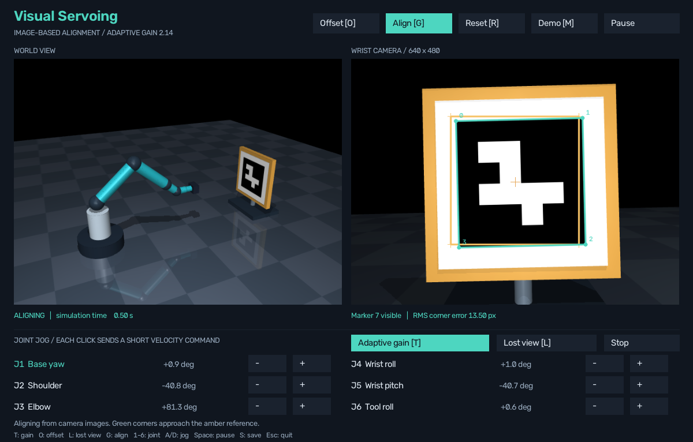

# Adaptive gain: stronger corrections far away, smaller corrections near alignment

**Implemented and evaluated in MuJoCo on Windows.** The app now lets you switch between fixed and adaptive image-based alignment. The underlying IBVS equations, speed limits and recovery mechanism are shared.

## Try it

1. Close an older simulator window and reopen **run.cmd**.
2. Press **T**, or click **Fixed gain [T]**, to select **Adaptive gain**.
3. Click **Offset [O]**, then **Align [G]**.
4. Watch the gain value below the title decrease as the image error gets smaller.
5. Switch back to fixed gain and repeat Offset/Align to compare the same start.

Switching mode stops the current movement. Both gain modes also work with **Lost view [L] → Align [G]** and remembered-view recovery.

## What the experiment found

Completed **600 trials: 200 identical randomized starting poses for each of three gain policies**, seed 20260906.

| Policy | Successful / detected starts | Median settling time | Median declared completion | Median final error |
|---|---:|---:|---:|---:|
| Fixed 1.2 | 86/86 | 3.55 s | 4.05 s | 0.974 px |
| Adaptive 0.8-2.4 | 86/86 | 2.58 s | 3.08 s | 0.978 px |
| Fixed high 2.4 | 86/86 | 1.73 s | 2.23 s | 0.941 px |

Times are simulated seconds, successful trials only. Settling is the beginning of the final sustained below-1-pixel streak. Declared completion includes the 0.5 s hold, followed by a further 1 s stopped check.

Each policy succeeded on 86/200 total starts. The other 114 starts had no initial marker detection: 112 were outside the view and 2 had tracking failure. They remain in the overall denominator. Search is disabled in this gain study and tested separately in the app.

- On the same 86 successful starts, adaptive gain reduced settling time by a median **26.8%** relative to fixed 1.2.
- Fixed high gain was faster still in this ideal simulation. Including it shows that adaptive gain is a tradeoff, not automatically the fastest setting.
- Median near-goal command RMS was **0.00370 rad/s** for adaptive, versus **0.00720 rad/s** for fixed high. Here, near-goal means image error between 1 and 5 px. This measures requested joint speeds.
- The original fixed baseline's near-goal command RMS was **0.00348 rad/s**. Adaptive mode is not gentler than the original baseline over that entire interval.
- No projected overshoot was observed with any of the three policies, so this study demonstrates no overshoot reduction. The generated report distinguishes goal crossing from small increases in RMS image error.
- Fixed lighting, accurate geometry and no sensor delay favor high gain. Noise and latency robustness have not yet been established.

[Full report, confidence intervals and metric definitions](results/gain/20260911-173457-385483-n200-seed20260906/REPORT.md) | [Per-trial results](results/gain/20260911-173457-385483-n200-seed20260906/trials.csv)

## How the new code works

**adaptive_gain.py / GainPolicy** turns the latest RMS image error into a proportional gain:

~~~python
gain = 0.8 + (2.4 - 0.8) * (1 - exp(-error_px / 8.0))
~~~

Large image errors give a gain near 2.4. Smaller errors bring it toward 0.8. The values are in **gain_config.json**; this is a deterministic gain schedule, not machine learning.

**AdaptiveIBVSController.update()** calculates that gain and then calls the existing **IBVSController.update()**. The latter still estimates depth, builds the image interaction matrix, chooses a camera velocity, maps it to joint velocities and enforces speed limits.

**app.py / Lab.toggle_gain()** stops the current movement and swaps the IBVS controller inside the existing recovery wrapper. The remembered viewpoint is kept.

**run_gain_study.py** evaluates all three policies using the shared trial loop in **compare_controllers.py**. The loop now accepts an optional controller factory and records gain at each frame.

**analyze_gain_study.py** checks the traces, verifies the recorded gain against the declared formula, checks stopping evidence and computes paired timing changes, projected overshoot and commands near the goal.

[Longer walkthrough of the whole project](CODE_GUIDE.md)

## Reproduction and checks

~~~powershell
.\run.cmd --gain-study
.\run.cmd --gain-report
.\run.cmd --verify
~~~

The first command creates a fresh 200-pose study. The second regenerates the latest report from saved logs. Existing experiments are preserved.

**51 tests passed**, including 10 added checks for gain bounds, invalid inputs, constant-gain equivalence, speed limits, tracking loss, metrics, paired statistics, stopping when changing modes and adaptive target recovery without pointer events. The scene/application acceptance check also passed.

All 600 records passed report validation. Gain parameters were declared before the study and were not tuned using its outcomes. The app opens in the original fixed mode; adaptive mode is available with T.

Next planned milestone: learned visual features on a textured target, followed by robustness experiments.
