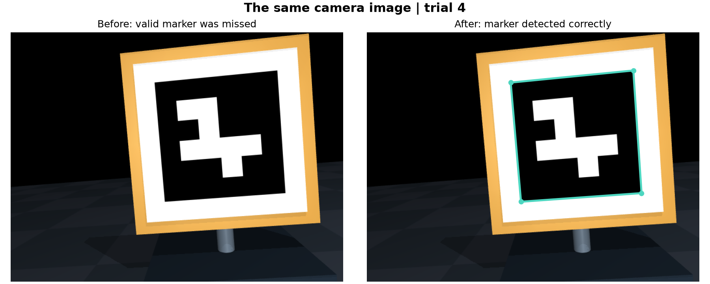

# Align detection fix

This is the earlier detector-fix report. The desktop app now also includes [stage 4 target reacquisition](RECOVERY.md); the measurements below remain the detector-only comparison.

The obsolete folder-renaming helper has been removed. The simulation now detects the marker through viewing angles where it previously stopped with tracking_loss.

Close an already-open simulator and double-click [run.cmd](run.cmd) to load the updated code. Start from Offset or jog the arm, then click Align. Mouse movement is not an input to the visual controller.

## What changed

The failure was reproduced on saved raw camera images, without any cursor or window interaction. OpenCV's default candidate-grouping distance suppressed a valid ID 7 marker. Setting the scene's minMarkerDistanceRate to 0.03 keeps nearby candidate contours separate long enough for the marker to be decoded.

This setting is recorded under marker_detection in [config.json](config.json) and applied in [simulation.py](simulation.py). The visual control equations, speed limits, stopping threshold, ArUco dictionary, expected marker ID and reference corners are unchanged. A missing marker still stops motion; the fix does not substitute guessed coordinates or continue blindly.

OpenCV documents the grouping distance as a fraction of candidate perimeter, with a default of 0.125. [Detector parameter documentation](https://docs.opencv.org/4.13.0/d1/dcd/structcv_1_1aruco_1_1DetectorParameters.html).

## Same 200 starting poses, before and after

The saved plans match exactly, and all 34 previously successful trials still succeed.

| Outcome | Before | After |
|---|---:|---:|
| Converged and stayed below 1 px after stopping | 34 | 86 |
| Marker outside view initially | 112 | 112 |
| Marker in frame but not detected initially | 13 | 2 |
| Detection lost during movement | 41 | 0 |

All 41 previous motion-loss cases now converge. Among the same 75 starts that the old detector could see initially, successful alignments increased from 34 to 75. The fixed detector also sees 11 additional starting poses, all of which converge.

Overall success increased from 17% to 43% across the unfiltered 200-pose plan. After the fix, all 86 initially detected starts converged. This observed 86/86 result has a 95% Wilson interval of 95.7-100%; it is a finite experiment, not a guarantee for every camera pose.

- [Original results](results/benchmark/20260906-155544-117220-n200-seed20260906/REPORT.md)
- [Results after the fix](results/benchmark/20260906-164904-307850-n200-seed20260906/REPORT.md)
- [Structured comparison and validation](results/alignment-fix/comparison.json)

## Separate check on new starting poses

After freezing the setting, another 100 poses were generated with seed 42. All 44 initially detected starts converged, with zero detection losses during movement. The other 56 starts had the marker outside view initially.

The 44/44 conditional result has a 95% Wilson interval of 92.0-100%. The same physics, controller and sampling ranges were used. [New-pose results](results/benchmark/20260906-165404-850153-n100-seed42/REPORT.md).

## Mouse and window checks

A formerly failing trial was run through the app's Align click handler in four conditions: no further events, mouse-motion callbacks over the picture, callbacks over the toolbar, and callbacks outside the canvas. All four joint trajectories matched exactly and finished below 1 pixel of error.

The actual OpenCV desktop window also ran this trial through its normal event loop without injected mouse or keyboard input. It converged to 0.967 px and stayed aligned for an additional second. [Window check record](results/alignment-fix/native-window-check.json).

Physical cursor position could not be read in this environment, so the position-specific checks are callback-level regression tests, not an OS mouse-position test.

## Verification and remaining scope

All 24 automated tests and the existing scene/app acceptance checks passed. Regression fixtures cover the original failed images, correct marker corners, blank frames, wrong marker IDs and partial occlusion. All 300 new trial traces were validated for completeness and stable successful stops.

To rerun checks:

~~~powershell
.\run.cmd --verify
~~~

Align still needs a detected marker to start. If jogging moves the marker outside the view, jog it back or use Reset. Automatic target searching, sensor noise, latency and physical hardware are outside this fix.
