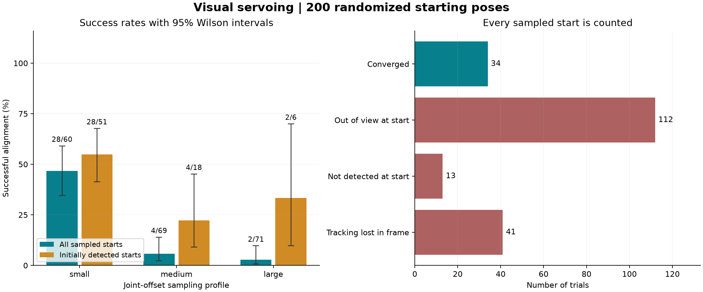

# Step 3: randomized alignment evaluation

The project can now test automatic alignment from 200 different robot starting poses and save a reproducible record of every attempt. It uses the same camera-based controller as the interactive Align button.

## What the new mode does

1. Save a seeded plan of random offsets from the home joint angles, with small, medium and large offset ranges.
2. Reset the simulated robot to each planned starting pose.
3. Run the existing visual feedback controller using rendered camera images.
4. Record errors, image corners, commands, joint motion, camera pose and the outcome.
5. For successful alignments, check that the error remains below 1 pixel for one additional second after stopping.
6. Generate the CSV, statistics, confidence intervals, plots and example images.

This is an automatic experiment mode. The normal desktop interface still opens through run.cmd, and Align can still be started after manual jogging.

## Measured results

Completed 200 trials with seed 20260906. Every sampled start is included.

| Outcome | Trials |
|---|---:|
| Successfully aligned and remained aligned after stopping | 34 |
| Marker geometry outside the camera view at the start | 112 |
| Marker inside the view but not detected at the start | 13 |
| Detection lost during movement while marker geometry remained in frame | 41 |
| Other outcomes | 0 |

Success was **34/200 = 17.0%** over all sampled starts (95% Wilson interval: 12.4-22.8%).
Among the **75 starts with a detected marker**, success was **34/75 = 45.3%** (95% interval: 34.6-56.6%).

Successful trials took a median **3.73 simulated seconds** to declare convergence, including the 0.5-second hold window. Median final RMS corner error was **0.973 pixels**. All 34 successful trials stayed below 1 pixel during the additional stopped observation.

| Offset profile | All trials | Initially detected | Successful |
|---|---:|---:|---:|
| Small | 60 | 51 | 28 |
| Medium | 69 | 18 | 4 |
| Large | 71 | 6 | 2 |

## What this means for Align

Align works from starting poses other than the Offset preset: this experiment recorded 34 such successes. It currently needs continuous marker detection and stops as soon as detection is lost. It does not automatically search for a marker outside the image.

The low overall score includes deliberately unfiltered random starts, many of which point the camera away from the target. The conditional score also shows that detection during movement needs improvement. Being geometrically in frame does not guarantee a successful OpenCV detection; the diagnostic alone does not identify its cause.

The results describe these declared joint-offset ranges, this marker, fixed lighting and idealized simulation dynamics. They do not establish arbitrary-pose or physical-robot reliability. The controller and detector were not tuned after seeing this dataset.

## Run it yourself

Open PowerShell in this project folder:

~~~powershell
.\run.cmd --benchmark
~~~

This runs a new 200-trial experiment in a new timestamped directory, preserving earlier runs. It uses the installed Python environment automatically.

~~~powershell
.\run.cmd --report
~~~

This rebuilds the latest run's report and plots from saved logs. To run checks:

~~~powershell
.\run.cmd --verify
~~~

The existing desktop controls are available by double-clicking run.cmd.

For custom trial counts or exact-pose replay, use the project environment's Python. On this computer:

~~~powershell
..\..\work\vservo-venv\Scripts\python.exe benchmark.py --trials 20 --seed 42
..\..\work\vservo-venv\Scripts\python.exe benchmark.py --replay-run "results/benchmark/20260906-155544-117220-n200-seed20260906" --trial-id 66
~~~

On another computer set up with setup.cmd, substitute .\.venv\Scripts\python.exe.

The sampling settings are in [benchmark_config.json](benchmark_config.json). Replay checks source hashes and uses the exact saved offsets. Numerical replay can depend on package versions, graphics driver and platform.

## Inspect the evidence

- [Detailed generated report, sampling bounds and per-profile confidence intervals](results/benchmark/20260906-155544-117220-n200-seed20260906/REPORT.md)
- [One row per trial (CSV)](results/benchmark/20260906-155544-117220-n200-seed20260906/trials.csv)
- [Summary statistics (JSON)](results/benchmark/20260906-155544-117220-n200-seed20260906/summary.json)
- [Source hashes, versions and configuration](results/benchmark/20260906-155544-117220-n200-seed20260906/manifest.json)
- [Verification record](results/benchmark/20260906-155544-117220-n200-seed20260906/verification.json)
- [First successful trial images](results/benchmark/20260906-155544-117220-n200-seed20260906/cases/converged/)
- [First detection-loss trial images](results/benchmark/20260906-155544-117220-n200-seed20260906/cases/tracking_loss/)
- [All 200 per-frame traces (NPZ)](results/benchmark/20260906-155544-117220-n200-seed20260906/traces/)

Verification passed: 20 automated tests; scene and app acceptance checks; 200 complete trace files; report regeneration; exact replay of successful trial 66 and failed trial 4, with every saved trace array matching on this computer.

A useful next development step is to diagnose the detection losses and compare an improved version on these same saved starting poses.
