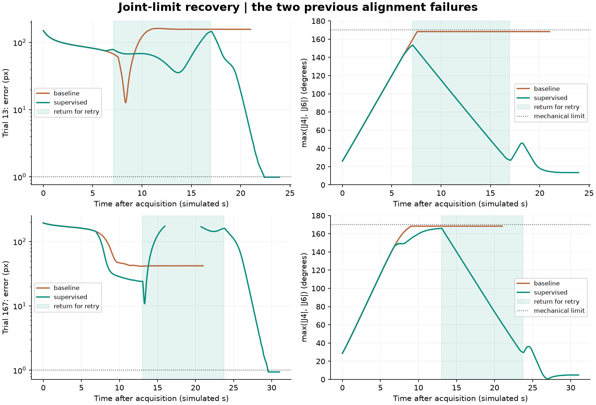

# Joint limits and stalled-alignment recovery

Startup search was subsequently extended with a [finer second pass](SEARCH_COVERAGE.md). The measurements below describe the earlier joint-limit update with its original coarse search.

The app now accounts for joint limits during visual alignment and makes one bounded retry when alignment stalls or reaches its per-attempt timeout. It works automatically with Auto mode, fixed gain and adaptive gain.

## What changed

Previously, the two alignment failures in the startup study kept pushing the wrist joints toward opposite mechanical stops. A missing marker was already handled by search, but a visible marker with an awkward arm configuration could still leave alignment stuck.

The new behavior is:

1. **Keep room at joint limits.** Outward joint speeds decrease as the arm approaches the inner limit, 0.06 radians inside each mechanical stop. The slowing region extends 25 degrees inward from that point.
2. **Reallocate the movement.** If the original command would exceed those bounds, solve for the closest achievable camera movement using the remaining joint motion. Normal feasible commands are preserved, with a small tolerance for floating-point roundoff.
3. **Watch actual image progress.** Above 3 px error, a two-second window compares the best error in its older and newer halves. Improvement must be at least 1 px or 2%, whichever is larger. A stalled window or the existing 20-second alignment timeout can request a retry.
4. **Brake and return toward an observed view.** Save the first valid alignment viewpoint during the run. On retry, command zero velocity, then use measured joints to return toward that viewpoint. The return is clipped to joint limits and a 140-degree per-joint excursion bound.
5. **Confirm and retry with a different joint calculation.** Require three fresh marker detections at the return point. Then use stronger joint damping and a mild preference for central joint positions to avoid excessive wrist rotation.

The retry does not change the reference image or increase the image-control gain. It changes how the requested camera motion is distributed among the joints.

## What you will see

No additional button is needed. Reopen **run.cmd** to load the update.

- **ALIGNING WITH JOINT LIMITS:** joint commands are being adjusted to remain within the available motion.
- **REPOSITIONING FOR RETRY:** the controller is returning toward an observed view.
- **CONFIRMING RETRY:** the robot is stationary while checking fresh detections.
- **RETRYING ALIGNMENT:** visual feedback is running with the alternative joint calculation.
- **CONVERGED:** the usual error-under-1-pixel hold condition passed.

Stop, Pause, manual jogging and changing gain cancel a retry just as they cancel normal alignment. Auto does not restart it from idle.

## Budgets and limits

There is at most **one alignment retry per run**. The return is capped at **0.25 rad/s per joint** and **12 seconds**, including confirmation. Alignment retains its **0.35 rad/s joint cap** and the existing camera-motion caps when solving a constrained command.

The existing **45-second post-startup overall budget includes the return and retry**. Each IBVS attempt still has a 20-second timeout. The new method can therefore use more alignment time than the previous controller, which stopped after its first timeout.

If the return cannot finish or confirm a marker in time, the controller reports **reposition_timeout**. If progress stalls again after the allowed retry, it reports **alignment_stalled**. Numerical solver failure reports **solver_failure**. These are terminal states with zero commanded velocity; they do not restart automatically.

Startup search and remembered-view recovery keep their existing paths and separate bounds. The two initial search misses are a different issue from these alignment failures.

## Important code

| Code | Responsibility |
|---|---|
| joint_limits.py / velocity_bounds | Calculate per-joint speed bounds from measured positions and the remaining distance to each limit. |
| joint_limits.py / bounded_least_squares | Solve the small constrained joint-motion problem with an active-set method. |
| joint_limits.py / limited_command | Preserve a feasible original command, or find a bounded alternative and enforce camera-motion caps. |
| joint_limits.py / JointLimitSupervisor.filter | Watch image-error progress, limit commands and request a bounded retry. |
| joint_limits.py / JointLimitSupervisor.reposition | Return toward the observed viewpoint, check the deadline and confirm detections. |
| recovery.py / ReacquiringIBVS._align_visible | Apply supervision to either fixed- or adaptive-gain IBVS, while retaining the existing search and tracking-loss state machine. |
| joint_limit_config.json | Configure the margin, slowing region, progress thresholds, retry limit and return budget. |
| run_joint_limit_study.py | Replay every scene from the original startup evaluation and compare against its saved baseline traces. |
| tests/test_joint_limits.py | Check the optimizer against an independent exhaustive search, stopping behavior, bounds and the two failed-start regressions. |

The joint calculation minimizes:

~~~text
|| J * joint_velocity - requested_camera_velocity ||^2
    + damping^2 * || joint_velocity - preferred_velocity ||^2

subject to lower_velocity <= joint_velocity <= upper_velocity
~~~

Normal constrained alignment uses the existing joint damping of 0.005 and zero preferred velocity. The retry uses damping 0.06 and a small velocity preference toward the middle of each joint's range. This is joint damping, not IBVS gain.

## Measured results

The completed replay improved alignment from **196/200 (98%) to 198/200 (99%)**, with no previously successful scene regressing. Both former alignment failures now converge after one retry. The same two startup-search misses remain.

| Result | Earlier controller | Updated controller |
|---|---:|---:|
| Aligned and stable for one second after stopping | 196/200 | 198/200 |
| Initially invisible, then aligned | 118/122 | 120/122 |
| Previously stuck cases recovered | 0/2 | 2/2 |

The updated controller took about **22.9 s** and **30.0 s** after marker acquisition in the two recovered cases, including the return and retry. This is a success-rate improvement with a time cost; the earlier controller timed out after its first alignment attempt.

All **91 automated tests passed**, and the scene/app acceptance check passed. The four negative controls also stopped within their budgets with zero final command. The GUI demo followed the full cold-start path through search, alignment, return, fresh confirmation and successful retry without pointer interaction.

A separate app check also recovered both difficult cases using adaptive gain, with error below 1 px after a one-second stop. The 99% figure above comes from the fixed-gain comparison.

Read the [full comparison report](results/joint-limits/20260912-131706-003699/REPORT.md) or inspect the [recorded GUI result](results/joint-limits/demo/final.png).

## Evaluation and reproduction

~~~powershell
.\run.cmd --joint-study
~~~

This reuses the completed baseline traces and runs the updated controller on the same 200 randomized target-present scenes and four negative controls. It checks that the physics, camera, reference and startup-search settings match. Every sampled scene stays in the comparison.

Results are saved under **results/joint-limits/** with a latest.json pointer. Each run includes a report, paired traces, image-error and wrist-angle plots, configuration, source hashes, first-detection/acquisition times and retry events. Report generation checks speed bounds, actual joint margins, stationary post-stop observations and every paired initial condition.

The two failed cases used during development belong to this regression set. Its success rate is not a held-out estimate or a guarantee for arbitrary poses.

The robot still uses a simulated ArUco marker. Robot collisions remain disabled in the teaching scene: a bounded joint return is not a collision-aware trajectory planner. No target world coordinates or saved goal joint pose are used by the controller.

The constrained least-squares formulation is described in the [SciPy documentation](https://docs.scipy.org/doc/scipy/reference/generated/scipy.optimize.lsq_linear.html); this project implements its own small NumPy active-set solver and does not add SciPy as a dependency.
