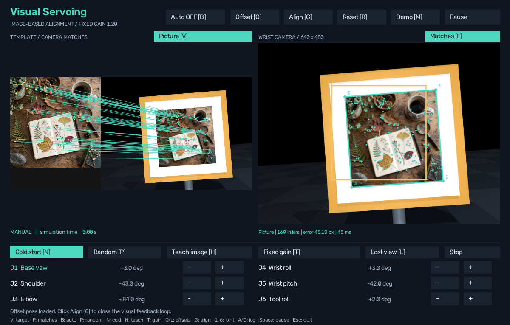

# Aligning to a normal picture

**Update:** the learned matcher is now available with **K** or `run.cmd --learned`. This page documents the original SIFT step and its recorded evaluation. [Current learned-matching controls and comparison](LEARNED_MATCHING.md).

The robot can now use a textured photograph on the board instead of the ArUco
marker. It finds distinctive details in the photograph, matches them to the wrist
camera image and estimates the picture outline. The existing visual controller
moves that outline toward the saved desired view.

This first marker-free implementation uses **classical SIFT and RANSAC**.
It is a working baseline toward the original project's learned-feature objective;
SuperPoint/LightGlue has since been added as a selectable backend; direct control
of a changing set of feature points is still future work. Everything still runs in MuJoCo on Windows.

## Try it

Close any older simulator window and reopen **run.cmd**.

1. Click **ArUco [V]** to switch to **Picture**. Pressing V does the same thing.
2. Click **Offset [O]**. With Auto ON, the robot immediately aligns the photograph.
3. Click **Matches [F]** to inspect corresponding details in the template and
   live camera. Click again to restore the world view.
4. Click **Cold start [N]** to begin with the picture outside the camera and no
   remembered viewpoint. The existing search finds it, confirms it in three
   consecutive frames, then aligns.
5. **Random [P]** chooses an unfiltered random starting pose. Stop cancels a run;
   Auto OFF lets you start alignment explicitly with G.

From PowerShell in this folder:

~~~powershell
.\run.cmd --natural
.\run.cmd --natural --cold-start
.\run.cmd --natural --random-start --seed 42
.\run.cmd --natural-study
.\run.cmd --verify
~~~

V keeps the current robot pose, stops the old command and clears the previous
target's remembered view. Auto ON starts a fresh camera check for the selected
target; Auto OFF leaves it stopped. F only changes the display.

The target modes have separate desired images:
**reference/goal.npz** for ArUco and **reference/natural_goal.npz** for the picture.
**Teach image [H]** changes only the selected mode's goal, after successful
detection. The reference contains RGB pixels, camera calibration and compatible
target metadata, including the picture hash; it contains no desired joint pose.

## How the pixels become movement

1. **Find and describe details.** SIFT locates distinctive textures in the known
   photograph and current camera image and describes each local patch.
2. **Match details.** A nearest-neighbour ratio test rejects ambiguous matches.
   Duplicate source or camera locations count only once.
3. **Check geometric agreement.** RANSAC fits a homography: a perspective mapping
   from the flat photograph to the camera image. Matches that agree with this
   mapping are called *inliers*. A final fit uses those inliers.
4. **Estimate stable features.** The mapping projects the photograph's four
   boundary corners into the camera image. These are virtual corners inferred
   from texture, rather than corners detected from a fiducial code.
5. **Align.** The existing IBVS controller compares the four current corners
   with the four desired corners and converts image error into bounded joint
   velocities. The known 0.24 m square and camera calibration provide depth.
6. **Handle missing evidence.** A rejected frame supplies no visual features.
   The existing controller brakes, confirms/reacquires or searches within its
   time, joint and speed limits. It stops once estimated outline error stays
   below 1 pixel for 0.5 simulated seconds.

Perception receives only the RGB frame and canonical picture. It does not receive
the target's simulator position, a visibility flag or an ArUco detection.
Search begins around the measured starting joints without first visiting home.

## What makes a detection acceptable?

Current settings are in **natural_feature_config.json**:

| Check | Setting |
|---|---:|
| Requested SIFT feature budget | 600 per image |
| Nearest-neighbour distance ratio | below 0.72 |
| Geometrically consistent matches | at least 12 |
| Fraction of matches that are inliers | at least 55% |
| Area spanned by inliers in the template | at least 18% |
| RANSAC reprojection threshold | 2.5 px |
| Final inlier RMS reprojection residual | at most 1.5 px |
| Estimated picture area in the camera | at least 1,600 px² |
| Full estimated outline inside camera | 2 px margin |

The outline must also be convex, correctly oriented and not excessively distorted.
Some partial occlusion is supported when enough well-distributed features remain.
This conservative version rejects a picture whose estimated boundary extends
outside the frame, even when some texture can already be matched.

The camera panel shows the estimated outline and matched inlier points. Amber is
the desired outline; teal is the accepted current estimate. The Matches panel
draws up to 60 geometric correspondences. Rejected estimates do not drive alignment.

## Important code

| File / function | Responsibility |
|---|---|
| perception.py / NaturalImagePerception.observe | Validate a frame, match its features and return corners plus evidence or a rejection reason |
| perception.py / NaturalImagePerception._detect | SIFT, ratio filtering, RANSAC, inlier quality and projected-outline checks |
| perception.py / NaturalImagePerception.match_view | Draw correspondence lines for inspection |
| app.py / Lab.detect_target | Provide the selected detector to alignment, search, teaching and display |
| app.py / Lab.toggle_perception | Stop and switch target, reference and controller state without moving/resetting the robot |
| simulation.py / Simulation.set_target_mode | Change only the board material, preserving physics and robot pose |
| control.py / IBVSController.update | Convert image error into robot motion; shared with the ArUco mode |
| recovery.py / ReacquiringIBVS | Coordinate alignment, loss recovery, startup search and bounded retry |
| reference_image.py | Save/load compatible image goals atomically without a goal joint configuration |
| run_natural_image_study.py | Run and validate the paired comparison, retaining every declared outcome |
| prepare_natural_reference.py | Explicit one-time reference preparation; never invoked during startup or search |
| record_natural_image_demo.py | Exercise actual app button handlers and record offset/cold-start evidence |

The controller still uses four stable point identities. The number of SIFT
matches may change frame to frame, but the four virtual boundary corners retain
their correspondence to the saved goal. This avoids changing the IBVS math in
the same step as introducing natural-image detection.

## Measured results and verification

The [initial paired study](results/natural-image/20260913-112323-280057/REPORT.md)
ran all 14 declared scenes with each mode: **28 runs**. Twelve scenes contained
the target; two were short missing/wrong-target controls. The same 12 positive
starts included eight seeded random draws, the fixed offset, two cold starts
and a shifted target. Seven began with no accepted detection in each mode.

| Measurement | ArUco | Picture / SIFT |
|---|---:|---:|
| Aligned and stable for a stopped second | 12/12 | 12/12 |
| Initially undetected cases that aligned | 7/7 | 7/7 |
| Missing/wrong targets rejected | 2/2 | 2/2 |
| Fixed-offset total simulated time | 3.70 s | 3.70 s |
| Fixed-offset final estimated outline error | 0.985 px | 0.948 px |
| Median of per-trial detector-call medians | 2.17 ms | 46.38 ms |

The fixed-offset picture run typically retained about 180 geometric inliers.
Detector timings include cache hits on identical RGB frames. The two negative
controls used a declared 3-second search timeout, so they test stopping and
rejection rather than exhaustive search coverage. Every outcome was retained.

**127 automated tests passed** (163.263 seconds). They include independently
specified image transforms, optional downsampling, partial occlusion, weak-match
rejection, absent/wrong pictures, automatic cold-start search, fixed/adaptive
alignment, braking/recovery, mode switching, separate teaching, and all previous
controller/search regressions. [Full test log](results/natural-image/full-test-suite.txt).
The original scene/application acceptance checks also passed.

The real application's button handlers were used to record an
[offset alignment](results/natural-image/demo/alignment.gif),
[match inspection view](results/natural-image/demo/matches.png), and
[cold-start final view](results/natural-image/demo/cold-final.png).
The demos verify a further second below 1 px after stopping, with zero commands.

## Scope and limitations

This is recognition of **one known, flat, textured photograph**, not arbitrary
object recognition. Blank walls, repeating texture, very small images, severe
perspective, heavy occlusion or a different picture can produce no usable estimate.
Wrong/absent-target controls check rejection; they do not establish a universal
false-positive rate.

The supplied picture is square and its physical size is known. Supporting a
different aspect ratio requires updating the geometry and depth model, not just
replacing a PNG. Changing the canonical picture also requires regenerating its
board texture and teaching a compatible reference.

Subpixel convergence refers to the **estimated outline error**, not independently
measured true physical pose accuracy. Synthetic image-transform tests separately
check corner localization against known geometry.

SIFT runs on the CPU. The control interval is 30 Hz in **simulated time**; the
application may run slower than real time because matching takes wall-clock time.
Identical RGB frames reuse their match result, while every changed image is
processed again. This cache neither supplies a remembered robot pose nor advances
search confirmation through drawing.

The earlier 200/200 search-coverage result belongs to its recorded ArUco experiment.
It is not a measured natural-picture success rate. Old source-pinned experiment
runners can reject this changed source tree; rebuild their historical reports with
their --analyze option, or use their saved source snapshots for exact replays.

## Picture asset and method sources

The botanical still-life photograph was generated using Codex's **built-in image
generation tool**. [Source photograph](assets/natural-target-source.png),
[384-pixel canonical target](assets/natural-target.png),
[MuJoCo board texture](assets/natural-board.png), and
[exact generation prompt and processing metadata](assets/natural-target-source.json)
are all saved in the project. The canonical target is unflipped; only the board
texture compensates for the existing MuJoCo face UV orientation.

Method references:
[OpenCV: feature matching and homography](https://docs.opencv.org/5.0/tutorials/features/feature_homography/feature_homography.html)
and [OpenCV: pose from image points](https://docs.opencv.org/4.13.0/d5/d1f/calib3d_solvePnP.html).

The learned-feature comparison now uses
[LightGlue's official implementation](https://github.com/cvg/LightGlue), with SIFT
and ArUco retained. [Implementation and measurements](LEARNED_MATCHING.md).
