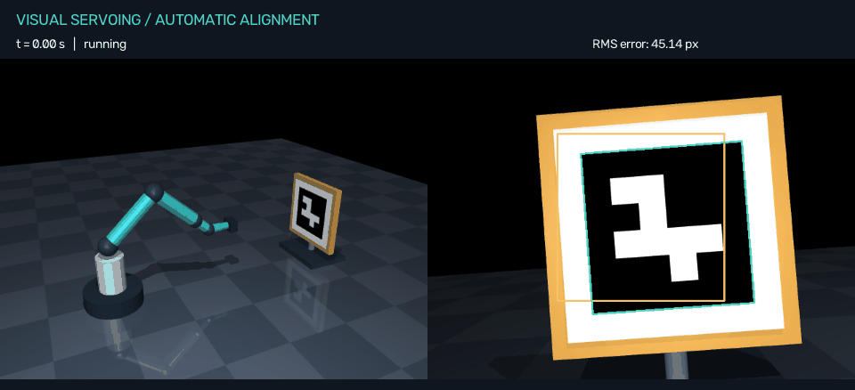
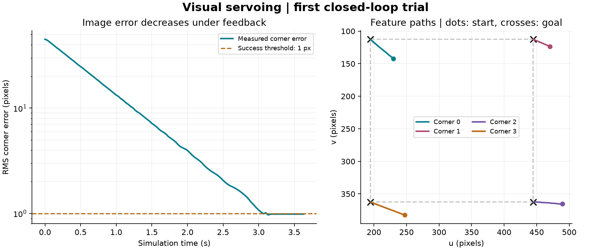

# Visual Servoing Simulation

See [precision stopping and pose sensitivity](PRECISION_STOPPING.md) for the default final-alignment checks and the `--legacy-stop` comparison option.

[Project overview](../../README.md) · [Documentation index](../../docs/README.md) · [Published results and raw-trace policy](results/README.md)

**Physical accuracy:** measure camera/tool-frame error in millimetres and degrees with **run.cmd --accuracy-study**. **Calibration [I]** cycles controller assumptions. [Definitions, paired experiments and measured results](PHYSICAL_ACCURACY.md).

**Collision-aware motion:** the guard checks clearance every physics tick and plans bounded search detours. Press **U** for the obstacle, or run **run.cmd --obstacle --cold-start --camera-delay-ms 100**. [Controls, implementation and validation](COLLISION_AWARE.md).

**Robustness experiment:** `run.cmd --robustness` tests seeded delay, jitter, packet loss and outages. [Plan, resume and report guide](CAMERA_ROBUSTNESS.md).

**Camera timing:** press **C** to select a simulated camera delay, or run `run.cmd --camera-delay-ms 100`. **X** interrupts the stream; stale feedback stops motion. [Timing model, controls and study](CAMERA_DELAY.md).

**New: pretrained SuperPoint + LightGlue matching.** Select Picture with **V**, then switch **SIFT / Learned [K]**. Or launch `run.cmd --learned`. Both use the same picture goal and automatic alignment/search flow. Learned now uses an available NVIDIA GPU automatically; install its CUDA runtime with `setup-learned.cmd --cuda`. The status shows Learned GPU or Learned CPU. CPU mode and SIFT remain available. [Controls, important code, installation and measured results](LEARNED_MATCHING.md).

**New: alignment to a normal picture.** Press **V** to switch between ArUco and the photograph, **F** to inspect feature matches, and **O** or **N** to try automatic alignment or an unseen start. Or launch `run.cmd --natural`. The new mode uses SIFT and RANSAC with the existing IBVS/search controller. [Usage, important code and evaluation](NATURAL_IMAGE.md).

**New: finer startup-search coverage.** If the original scan misses the marker, the robot adds a finer pass between its scan paths. It keeps the same range and speed, with a 180-second total search deadline. The original evaluation improved from **198/200 to 200/200** aligned starts, with no regressions. [How it works and evaluation](SEARCH_COVERAGE.md).

**New: joint-limit handling and bounded alignment retry.** The robot slows outward movement near joint limits, detects stalled image progress, and can return toward an observed view before retrying. This runs automatically in the existing Auto flow. [Explanation and evaluation](JOINT_LIMITS.md).

**New: automatic startup.** Reopen **run.cmd**: Auto is ON by default. The robot aligns if the marker is visible and searches if it has no remembered view. Try **Offset [O]**, **Cold start [N]**, or **Random [P]**; no Align click is needed. **Auto [B]** switches back to manual starts. [How it works and important code](STARTUP_SEARCH.md).

**New: adaptive gain.** Press **T** or click **Fixed gain [T]** to switch modes, then **Offset [O] → Align [G]**. The title area shows the current gain. [Measured results and explanation](ADAPTIVE_GAIN.md).

**New: three alignment methods.** Run `run.cmd --compare` for the paired benchmark, or `run.cmd --compare-report` to rebuild its report from saved logs. [Results and interpretation](COMPARISON.md) | [Code walkthrough](CODE_GUIDE.md).

A six-joint robot uses a simulated wrist camera to align an ArUco marker or a known flat photograph with a saved reference image. Runs locally on Windows using MuJoCo, OpenCV and Python. No robot, webcam, Arduino or Raspberry Pi is required.

**Completed:** scene and manual motion, marker-based IBVS, randomized evaluation, remembered-view recovery, controller comparison, adaptive gain, systematic startup search with a finer second pass, joint-limit-aware alignment and classical and pretrained learned natural-picture matching.

Close an older simulator window and reopen **run.cmd**. Click **Lost view [L]**, then **Align [G]** to try the new recovery flow. [How recovery works and measured results](RECOVERY.md).

**Alignment update:** fixed intermittent marker detection loss during motion. Close the older simulator window and reopen **run.cmd** to load the fix. [What changed and how it was checked](ALIGNMENT_FIX.md).

[Read the randomized benchmark results](BENCHMARK.md). The original benchmark tests pure IBVS. The new --recovery experiment tests the find-and-align controller used by the desktop app.



## Try automatic alignment

1. Double-click **run.cmd** in this folder. Close any older simulator window first so you load the new version.
2. Click **Offset [O]** to load a starting pose away from the goal.
3. Alignment starts automatically while Auto is ON. With Auto OFF, click **Align [G]**.
4. Watch the green detected corners approach the amber reference outline.
5. The status changes to **CONVERGED** once the error remains below 1 pixel for 0.5 simulated seconds. Joint velocity commands then remain zero.

You can also jog a joint manually, then click Align. If the marker is missing and a viewpoint has been observed, the arm pauses, moves toward its most recent visible viewpoint, and tries a local sweep if needed. Without a remembered viewpoint, it performs the bounded startup search. Three consecutive detections switch it back to IBVS. Reset instantly restores home; Align instead returns using the visual feedback loop. **Demo** remains a separate scripted joint-motion demonstration.

Install the base runtime with **setup.cmd**. The launcher prefers the application-local **.venv** and supports an existing legacy **../../work/vservo-venv** as a fallback. Root-level launchers delegate here. See the [repository quick start](../../README.md).

## Fixed-offset example (step 2)

One reproducible trial starts with joint offsets of **[3, -3, 4, 3, -2, 2] degrees** from home. This is the same pose loaded by the Offset button.

| Measurement | Result |
|---|---:|
| Initial RMS corner error | 45.14 px |
| Error when convergence was declared | 0.986 px |
| Time until convergence, including the hold window | 3.63 simulated seconds |
| Observed window below 1 px | 0.50 seconds |
| Error after a further second with zero command | 0.986 px |
| Control mathematics unit tests | 10 passed |
| App alignment, manual controls and tracking-loss stop | Passed |



Error is the root mean square of the four corners' Euclidean distances from their corresponding reference points, in pixels. It measures the complete marker configuration, including scale and rotation, rather than just its center. The supplied reference goal is the observed home image, stored across sessions. Teach image [H] can replace it with another detected view.

This is the original single-trial example. The separate [200-trial benchmark](BENCHMARK.md) measures successes and failures across randomized joint offsets; neither experiment implements marker-free perception.

## Reproduce and inspect

From PowerShell in this folder:

```powershell
.\run.cmd --verify
.\run.cmd --trial
.\run.cmd --benchmark
.\run.cmd --report
.\run.cmd --recovery
```

`--verify` runs the maths, benchmark, recovery, startup-search, natural-picture and integration suite, including learned tests when the optional models/runtime are installed, original scene checks and the app's Offset/Align click handlers. It also verifies a stable stopped result, immediate braking on lost detection, recovery deadlines and cancellation.

`--trial` regenerates the following files from a fresh physics simulation:

| Output | Contents |
|---|---|
| results/alignment/summary.json | Outcome, measured errors, timing, parameters and versions |
| results/alignment/trace.csv | Per-frame error, corners, depths, camera twist and joint commands |
| results/alignment/convergence.png | Log-scale error curve and image-plane feature paths |
| results/alignment/convergence.svg | Vector version of the same plots |
| results/alignment/alignment.gif | Actual rendered world and wrist-camera frames |
| results/alignment/reference.png | Unannotated desired camera image |
| results/alignment/initial.png | Unannotated offset camera image |
| results/alignment/final.png | Unannotated stopped camera image |
| verification/results.json | Scene and app-level acceptance measurements |

`--benchmark` runs 200 seeded trials, saves every sampled starting pose and its outcome in a new timestamped directory under `results/benchmark/`, then produces a report and plots. Previous runs are preserved. `--report` regenerates the latest run's report and plots from saved logs without running physics.

`--recovery` runs 200 seeded find-and-align trials in a new directory under `results/recovery/`. It uses the same recovery controller as the app. The older `--benchmark` and `--trial` remain pure-IBVS baselines, so their loss-stop behavior is preserved for comparison.

The verification, trial and benchmark commands run without the desktop control window but still render camera images through OpenGL. The GIF samples the trajectory at 10 frames/second and holds the stopped final image briefly for viewing.

## Controls

| Control | Result |
|---|---|
| V / Target | Switch between ArUco and Picture, using separate saved goals |
| K / Matcher | Switch the photograph between SIFT and learned SuperPoint + LightGlue |
| F / Matches | Show picture-template/camera correspondences |
| B / Auto | Enable or disable automatic starts after loading a pose |
| N / Cold start | Start out of view with no remembered viewpoint |
| P / Random | Load an unfiltered random starting pose without view memory |
| H / Teach image | Save the current detected view as this mode's desired image |
| O / Offset | Load the declared offset starting pose |
| G / Align | Find the selected target if needed, then align from the current pose |
| T / Gain mode | Stop current movement and switch between fixed and adaptive IBVS gain |
| L / Lost view | Load a declared out-of-view starting pose for the recovery demo |
| Joint - / + buttons | Send a 0.25 s joint velocity pulse |
| 1 through 6, then A / D | Select and jog a joint |
| R / Reset | Instantly restore home and reset simulation time |
| M / Demo | Toggle scripted motion, starting at home |
| Space / Pause | Pause or resume; cancels active motion commands |
| Stop | Cancel alignment or demo and command zero velocity |
| S | Save a raw camera image and metadata under captures/ |
| Esc / close window | Exit |

If the target disappears during Align, the arm immediately commands zero velocity for a short wait. It then uses measured joints to return toward a viewpoint where the marker was actually observed, followed by a bounded local sweep if necessary. Stable detection resumes image-based control. Stop, Pause and manual jogging cancel recovery.

Recovery has a cumulative 20 s limit, at most 3 episodes, and a 45 s overall deadline. Invalid depth also stops alignment. If the local search fails, jog to another viewpoint and start Align again. Recovery motion is limited in speed and joint excursion; the teaching scene has disabled robot collisions.

## How the controller works

1. At startup, load the selected mode's saved desired image and detect its four reference points. No live home view is taken.
2. Every camera frame, detect ArUco corners or estimate the photograph's four boundary corners from SIFT matches and a RANSAC homography.
3. Normalize current and desired image points using the camera calibration K.
4. Estimate each corner's optical depth from its image coordinates, known square size and OpenCV IPPE-square PnP. Reject invalid depth or excessive reprojection error.
5. Stack the point-feature interaction matrices L. Compute camera velocity as `v_c = -gain * damped_pinv(L) * (s - s_desired)`.
6. Obtain joint velocities with a damped inverse of the camera-origin robot Jacobian. Bound speeds, apply velocity actuators, then render the next image.

The following describes the IBVS phase. Recovery is a separate joint-feedback phase, explained in [RECOVERY.md](RECOVERY.md).

The feedback error is in the image: this is proportional IBVS. PnP supplies only depths for L. The control calculation does not use the simulator's target position or command the home joint angles. Simulator kinematics supply the calibrated robot Jacobian and camera axes.

For a normalized point (x, y) at optical depth Z, the two rows of L are:

```text
[-1/Z,     0, x/Z,       x*y, -(1+x*x),  y]
[    0, -1/Z, y/Z,   1+y*y,       -x*y, -x]
```

The damped inverse uses SVD gains `sigma / (sigma^2 + damping^2)`. Velocity vectors are scaled uniformly when saturated to preserve their direction.

Defaults in `config.json`: gain 1.2/s, interaction damping 0.0001, joint damping 0.005, camera limits 0.12 m/s and 0.4 rad/s, and joint limit 0.35 rad/s for alignment. The Jacobians mix linear and angular units; these damping values are for this model and SI unit convention.

## Numerical verification

The tests compare formulas with independently perturbed geometry:

- Interaction matrix versus central finite differences of camera motion, with 50 seeded random sets of eight points; tolerance 2e-8 absolute and relative.
- Camera-origin Jacobian versus perturbed robot joints at three poses, including the wrist-to-camera offset and optical-axis conversion.
- Complete `L * J_camera` chain versus direct projection after joint perturbations.
- Depth recovery from a known rotated marker projection.
- Bounded damped inverse at a manufactured singularity.
- Invalid-input rejection, tracking-loss stop, timeout, and an observed 0.5 s hold window before success.

App acceptance checks call the same click handlers used by Offset and Align, advance actual MuJoCo physics, and inspect images detected by OpenCV. Regression tests reproduce a previously failing trajectory with mouse-motion callbacks over the picture, toolbar, outside the canvas, and with no further events. All four trajectories match exactly. A native OpenCV window also completed the formerly failing trial without injected input; physical cursor position could not be read remotely.

## Files and conventions

| File | Purpose |
|---|---|
| scene.xml | Teaching arm, six joints, camera and selectable target materials |
| perception.py | ArUco wrapper and classical SIFT/RANSAC picture detector |
| natural_feature_config.json | Picture-match and geometric quality thresholds |
| NATURAL_IMAGE.md | Picture controls, algorithm, limitations and measured comparison |
| run_natural_image_study.py | Paired ArUco/picture trials, evidence and report |
| config.json | Camera, manual jog and IBVS parameters |
| simulation.py | Physics, rendering, image detection and camera Jacobian; measures every physical stop (`motion_log`) |
| actuator.py | Simulated actuator dynamics between the velocity command and the servos: acceleration, deceleration and jerk limits ([actuator model](../../docs/ACTUATOR_MODEL.md)) |
| actuator_config.json | Actuator profiles (`ideal` = no dynamics, `default`, `gentle`) and the standstill threshold; the limits are assumptions, not drive data |
| stop_response.py | Joins runtime stop/hold events with the measured physical stops: command stop latency, physical stopping time and distance |
| run_stop_response.py | Stop and resume study: speeds, joints, profiles, pause/resume cycles, realtime watchdog stops, paired accuracy check |
| tests/test_actuator.py | Acceleration, jerk and no-reversal limits, braking check, measured stops and pause/resume cycles in MuJoCo |
| control.py | Interaction matrix, damped inverse, depth estimation and pure IBVS |
| recovery.py | Remembered-view return, local scan, confirmation and IBVS handoff |
| recovery_config.json | Recovery bounds, deadlines and demo pose |
| run_recovery.py | Find-and-align experiment, traces and plots |
| record_recovery_demo.py | Record the actual recovery animation |
| tests/test_recovery.py | Recovery, cancellation, occlusion and moved-target tests |
| RECOVERY.md | Stage 4 usage, policy and measured results |
| app.py | Desktop views and controls |
| run_alignment.py | Reproducible trial, CSV export, plots and GIF |
| tests/test_control.py | Independent maths and controller behavior tests |
| tests/test_alignment_regression.py | Previously lost markers, occlusion rejection and cursor-event regression tests |
| ALIGNMENT_FIX.md | Detection fix, before/after comparison and validation |
| benchmark.py | Seeded trial generation, per-frame logging and exact-pose replay |
| benchmark_config.json | Sampling bounds, number of trials and evaluation thresholds |
| analyze_benchmark.py | Log validation, rates, confidence intervals, CSV and plots |
| binomial_ci.py | Exact (Clopper-Pearson) 95% intervals for every success rate, the lower-bound PASS rule and trials-needed helper ([statistics](../../docs/STATISTICS.md)) |
| tests/test_binomial_ci.py | Interval reference values, coverage, PASS rule and trials-needed tests |
| tests/test_benchmark.py | Sampling, statistics, failure classification and trial integration tests |
| BENCHMARK.md | Results and links to the completed 200-trial dataset |
| verify.py | Scene and app integration checks |
| requirements.txt | Pinned dependencies, including Matplotlib for plots |

Units are meters, radians and seconds. Camera twist ordering is `[vx, vy, vz, wx, wy, wz]`. Optical axes are +X right, +Y down, +Z forward. The Jacobian is evaluated at the camera origin and rotated into optical axes. Its lever arm is already included, so no second translation transform is applied.

Physics runs at 500 Hz in simulated time, with 30 Hz camera samples. If rendering is slow, wall-clock playback slows; 30 real-time FPS is not guaranteed. Normal motion is integrated through velocity actuators. Position assignments are used only to initialize/reset the scene and in isolated finite-difference tests.

The 640 x 480 camera sees a 0.32 m board containing a 0.24 m ArUco marker (DICT_4X4_50, ID 7). The scene texture compensates for mirrored box-face UVs; the sensor image is never mirrored to force detection.

## Setup on another computer

Install 64-bit Python 3.12, then run **setup.cmd** followed by **run.cmd**. Initial setup downloads dependencies into `.venv`. Subsequent runs work offline. An OpenGL-capable graphics driver is needed. Keep the entire project folder.

Equivalent commands:

```powershell
py -3.12 -m venv .venv
.\.venv\Scripts\python.exe -m pip install -r requirements.txt
.\.venv\Scripts\python.exe app.py
```

MuJoCo replaces the original Gazebo/ROS 2 stack for the agreed Windows version. ROS topics and ros2_control are not implemented.

## Scope and next step

This is a teaching-arm model with ideal gravity compensation, simple collision geometry and fixed lighting. Mapped collision clearance and physical robot contacts are enabled. Camera delay, jitter, packet loss and outages can be simulated. Controller calibration uncertainty is evaluated in the physical-accuracy study. Image noise, distortion, encoder uncertainty and broader learned-feature evaluation remain future work. The controller comparison now includes fixed-gain IBVS, PBVS and visually open-loop pose execution. No real-world performance claim is made.

**Step 3 is complete:** randomized evaluation, structured traces, failure diagnostics, confidence intervals and report generation.

**Alignment reliability update:** marker-candidate grouping has been corrected and evaluated on the original starting poses. See [the fix report](ALIGNMENT_FIX.md).

**Step 4 is complete:** target reacquisition using a remembered visible viewpoint, a bounded local sweep, and a return to image-based alignment.

**Controller comparison:** run the same 200 starting poses with IBVS, PBVS and look-once execution; evaluate target recovery separately. See [the comparison](COMPARISON.md) and [the important code explained](CODE_GUIDE.md).

**Adaptive gain:** the GUI now offers Fixed/Adaptive gain [T], with paired fixed, adaptive and fixed-high experiments. See [the gain study](ADAPTIVE_GAIN.md).

**Natural-picture baseline:** SIFT/RANSAC now estimates the outline of a known textured photograph and feeds the existing controller. See [the implementation and initial paired evaluation](NATURAL_IMAGE.md).

**Learned matching:** pretrained SuperPoint + LightGlue is now integrated and compared with SIFT. See [the learned-matching guide](LEARNED_MATCHING.md).

**Collision-aware control:** motion is guarded at physics ticks; search and recovery use checked bounded detours. See [the collision guide](COLLISION_AWARE.md).

**Next:** study varied targets, image noise, lens distortion and encoder errors, and assess controller behavior with uncertain obstacle geometry.

## Sources

- [Chaumette & Hutchinson, Visual Servo Control, Part I (2006)](https://web.mit.edu/amcp/OldFiles/drg/Chaumette_Part_I.pdf), equations 4 and 9-11.
- [MuJoCo Jacobian API](https://mujoco.readthedocs.io/en/stable/APIreference/APIfunctions.html#mj-jac).
- [OpenCV PnP and IPPE-square corner ordering](https://docs.opencv.org/4.x/d5/d1f/calib3d_solvePnP.html).


The current startup-study command includes the latest alignment supervision. Historical joint/coverage studies retain source snapshots and hashes. Their exact replay checks may reject the current changed source; use their --analyze option to rebuild recorded reports, or their archived source version for exact replays. The new **run.cmd --natural-study** evaluates the current ArUco and picture paths together.

## Actual camera processing latency

Run **run.cmd --realtime --learned --max-camera-age-ms 400** for wall-clock control with rendering and matching in a separate process. Press **O**, then **G** to align. The original 250 ms app default remains available; the explicit 400 ms budget includes processing and the interval between results. Run **run.cmd --latency-study** to measure alignment, transport and blocked-camera behavior.

[Runtime, controls and timing limits](REALTIME_CONTROL.md).

[Perception tail latency and the 50 ms transport comparison](PERCEPTION_LATENCY.md).
