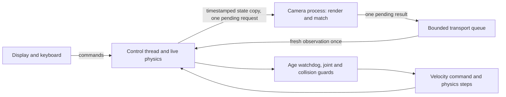

# Wall-clock camera and control

Run the new asynchronous mode from the repository root:

```powershell
.\run.cmd --realtime --learned --max-camera-age-ms 400
```

Press **O** for the usual offset, then **G** to align. **Space** stops,
**R** resets, **X** interrupts/restores capture, and **Esc** closes the runtime.
**1 / 2 / 3** select ArUco / SIFT / Learned. Selecting a matcher first stops the
old runtime, retains its stopped joint positions, loads the new worker and
requires **G** to start again. The live image and saved goal appear side by side.
Model initialization happens with zero commanded velocity.

`--natural`, `--cold-start`, `--random-start --seed N`, `--manual`, `--obstacle`,
`--calibration-profile`, and `--legacy-stop` also work in this mode. Teaching,
manual jogging, adaptive-gain selection and the world-view panel remain in the
original desktop lab. This runtime uses the same fixed-gain IBVS, precision
stopping, recovery and collision guard. It is not a new controller algorithm.

Add transport after image processing with, for example,
`--camera-delay-ms 50`. Omission means zero added transport in wall-clock mode.
The original synchronous desktop lab and deterministic experiment runners keep
their existing behavior when `--realtime` is absent.

## Why the freshness budget is explicit

The app still defaults to **250 ms**. That limit now includes actual processing
and the time spent waiting for the next result. On this host, the strict budget
stopped SIFT and Learned during initial tests even though typical individual
matches took much less than 250 ms. A 100 ms measurement can already be around
200 ms old just before the following 100 ms measurement arrives; queueing,
rendering, IPC and transport consume additional time.

The command above and the default latency experiment explicitly use **400 ms**
to evaluate nominal alignment. This is a tested simulation setting, not a robot
safety specification. A sufficiently slow frame or loaded host still causes a
latched stop. Increasing the age limit trades more tolerant operation for longer
exposure to outdated feedback. The measured experiment records the budget used
in every row and does not silently relax it after a failure.

## Ownership and timestamps



`realtime.py` implements this runtime. The control thread owns its headless
`Simulation`, live joint state, controller, transport queue and command lease.
The sensor process owns a separate model/data object, OpenGL context and matcher.
It renders the copied state and supplies only measured image features to control.
Its camera pose is not used as an alignment goal. Capture-time joints accompany
each observation; control uses the current robot Jacobian and joint feedback.

All timestamps use `time.perf_counter()`: state snapshot, render start, render
completion, inference completion, parent receipt and command application.
Capture time is recorded **before** queueing/rendering, so all subsequent work
counts toward age. Artificial transport begins after inference completes.
[Python documents the shared monotonic counter and Windows timer behavior](https://docs.python.org/3/library/time.html).

There is one pending state request, one pending result and at most eight results
awaiting transport. Receipt of each result acknowledges that the worker can take
a new snapshot. Busy capture slots are skipped until that acknowledgement arrives. Work older than 50 ms is discarded
before rendering and matching. A full mailbox replaces pending work when possible and never
blocks the control producer. A multiprocessing feeder race can discard the new
request too; its drop is counted. The worker processes one frame at a time.
There is no accumulating image backlog. Telemetry also has fixed bounds: 4096
accepted frames, 4096 received sensor frames, 256 events and 100000 loop gaps.
Long-run percentiles therefore describe the retained windows.

## Stopping and overload

The control loop requests a **2 ms** period. It checks the last accepted capture
age on every iteration, even when no frame arrives. A new result cannot revive
an expired lease. An Align action changes the generation number, rejecting any
frame captured by the previous run. Repeated or future timestamps are rejected.
Zero commands are retained until another explicit Align action.

The loop checks deadlines before control computation and again before advancing
physics. A control-loop gap or computation exceeding **50 ms** stops alignment
with `control_overrun`; a dead worker or worker exception stops with an error.
Full worker exception traces reach the console and the runtime log.
On shutdown, the control owner commands zero before joining the worker. A stuck
worker is terminated after a bounded join. Its private queues are then discarded.
Shutdown closes a dedicated pipe whose read endpoint belongs to the worker; EOF
wakes its wait without a shared condition lock. Readiness also uses result
acknowledgement, so killing a worker cannot strand a shared readiness event.

Physics integrates elapsed wall time in its usual 2 ms steps. A scheduler gap
larger than 50 ms is capped rather than replaying an arbitrarily long command;
`discarded_physics_s` records that loss. The collision guard continues checking
physics steps. A zero velocity command is a stop request to the simulated motor,
not a claim that physical joint velocity instantly becomes zero.

Python, Windows scheduling and this simulated actuator interface do not provide
hard real-time guarantees. In particular, a blocking operation in the control
thread itself can only be detected after it returns. The process separation
protects the watchdog from camera inference/rendering stalls; a physical robot
would additionally need an actuator-side command timeout.

## Automated evidence

```powershell
.\run.cmd --latency-study
.\run.cmd --latency-study --modes aruco natural learned --repeats 2 --max-camera-age-ms 400
.\run.cmd --latency-study --modes natural learned --profiles nominal --max-camera-age-ms 250
```

The experiment tests nominal operation, 50 ms added transport, an 800 ms inference
stall and an 800 ms rendering stall. It uses actual wall-clock waits in the worker,
not a simulated timestamp offset. Every trial starts at the same visible offset
and retains the precision stopping criteria. Stall trials must first move, stop
while the worker is still blocked, receive its late result and remain stopped.
They fail if forbidden contacts, motion without fresh feedback, or post-stop
commands are observed. Watchdog stop lateness must be at most 50 ms.

Output contains an immutable source/runtime manifest, atomic per-trial JSON,
summary, report and nominal-view screenshots. Existing output directories are
rejected to protect prior evidence. Completed rows survive interruption; this
wall-clock runner does not implement resume or deterministic replay. Accepted
latency percentiles exclude stale results, whose timestamps remain separately in
`sensor_frames`. Outcomes and exit status distinguish alignment from a safe but
unsuccessful timeout. The interactive mode writes its last session diagnostics to
`logs/realtime-last.json` when closed.

[Measured validation](results/latency/20260921-validation/REPORT.md) records the
observed limits. These visible-start trials do not replace the larger calibration,
physical-accuracy or cold-search campaigns.

The recorded sweep passed all three nominal alignments and all six injected-stall checks, with a maximum injected-stall stop lateness of 2.034 ms. SIFT and Learned failed the additional 50 ms transport trials by stopping on stale feedback: overall 10/12. [Detailed interpretation](results/latency/20260921-validation/VERIFICATION.md).

[Perception tail-latency optimization](PERCEPTION_LATENCY.md) measures the current
implementation against the preserved baseline above.

For sustained repetitions, per-stage diagnostics and session-based uncertainty,
see [Sustained latency testing](LATENCY_STRESS.md). This is a separate runner
with a predeclared sample-based stopping rule and resumable completed sessions.

The latest [reused-worker campaign](results/latency/20260923-reuse-after/COMPARISON.md)
preserves the queue bounds, 400 ms watchdog, 50 ms control deadline and latched
stops. It recorded no unsafe or post-stop motion ticks, but repeated Learned
freshness failures and control overruns remain. An accepted frame's own latency
does not bound held feedback age while the next frame is being processed.
The [diagnosis](results/latency/20260923-reuse-after/DIAGNOSIS.md) distinguishes
observed off-CPU intervals from proven GC pauses and unresolved scheduling causes.

## Windows scheduling and sustained validation

The owned control thread requests HighQoS and relative ABOVE_NORMAL priority;
the sensor process requests HighQoS with normal base priority. Previous policies
are restored on shutdown and errors are recorded. This does not provide a hard
real-time guarantee. The [40-session validation](results/latency/20260925-native-scheduling-after/COMPARISON.md)
reduced control misses but did not fix Learned freshness failures.
[Native scheduling and GC evidence](results/latency/20260925-native-scheduling-after/DIAGNOSIS.md).
