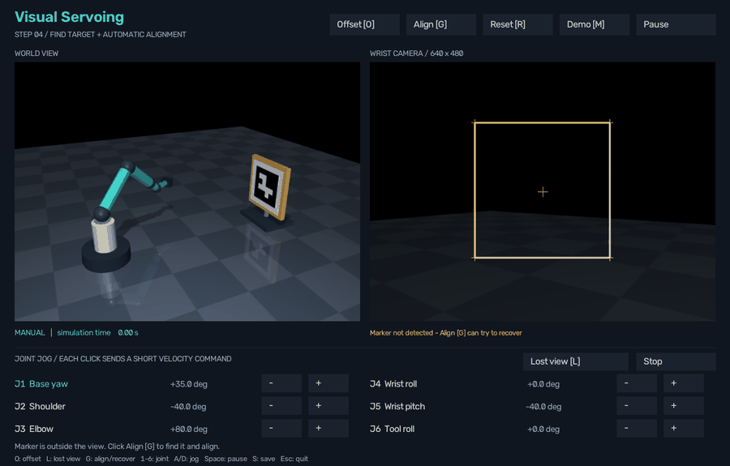

# Step 4: find the target and align

Align can now recover when the marker is missing at the start or disappears during motion. It first tries a viewpoint where the marker was previously observed. If needed, it scans nearby views. Once detection is stable, camera-based alignment resumes.

## Try it

1. Close the old simulator window and reopen [run.cmd](run.cmd).
2. Click **Lost view [L]**. This loads a pose with the marker outside the wrist-camera image.
3. Click **Align [G]**.
4. Watch **WAITING FOR MARKER → RETURNING TO LAST VIEW → CONFIRMING MARKER → ALIGNING → CONVERGED**.
5. **Stop**, **Pause**, or a manual joint jog cancels automatic recovery.

The local sweep appears as **SEARCHING** when returning to the remembered viewpoint is insufficient.

This recording starts 35 degrees away in base yaw. The marker is confirmed again at about 2.97 simulated seconds; alignment finishes at 7.80 seconds. Error remains at 0.982 px after another stopped second.

## How it works

The app remembers measured joint angles whenever the marker is detected. At startup, the taught home image supplies the first known visible viewpoint.

If detection disappears during Align, the arm immediately commands zero velocity and waits for 0.2 seconds. A short occlusion can clear during this pause. Otherwise, joint feedback moves toward the remembered viewpoint while every new camera frame is checked. If that view does not reveal the target, base yaw and wrist pitch sweep a small local pattern.

On detection, the arm brakes and requires three consecutive marker detections. Then the existing IBVS controller uses the four image corners to finish alignment. Joint positions are never reset or teleported during recovery.

Recovery uses remembered joint positions; it is a distinct joint-feedback phase while image features are missing. The subsequent alignment is image-based. Neither phase receives the simulated target pose or a ground-truth visibility flag.

## Bounds and stopping

Settings are in [recovery_config.json](recovery_config.json).

| Setting | Default |
|---|---:|
| Initial stationary wait | 0.2 s |
| Detection confirmation | 3 consecutive frames |
| Maximum recovery command per joint | 0.18 rad/s |
| Maximum excursion per joint from recovery entry | 60 degrees |
| Margin from joint limits | 0.06 rad |
| Cumulative recovery time limit | 20 s |
| Maximum recovery episodes per Align attempt | 3 |
| Overall find-and-align deadline | 45 s |

If the target cannot be found, the controller stops with a search outcome. It does not keep sweeping indefinitely. Pressing Align again explicitly starts another bounded attempt.

## Measured comparison

The same exact 200 starting poses were used before and after adding recovery. No invisible starts were rejected.

| Result | Fixed detector + pure IBVS | Find-and-align |
|---|---:|---:|
| Successful alignments | 86/200 | 200/200 |
| Starts without an initial detection | 114 | 114 |
| Initially undetected starts that converged | 0/114 | 114/114 |

The new run's median convergence time was **5.07 simulated seconds**, and median final RMS corner error was **0.974 px**. Every successful trial remained below 1 px during the additional stopped second. The observed 200/200 success rate has a 95% Wilson interval of **98.1–100%** for this sampling distribution.

The experiment provides a remembered viewpoint that was observed before each trial. The target is static, and the teaching model has ideal gravity compensation and disabled robot collisions. These results do not establish general exploration or collision-safe physical operation.

- [Full generated report](results/recovery/20260906-212540-109662-n200-seed20260906/REPORT.md)
- [One row per trial](results/recovery/20260906-212540-109662-n200-seed20260906/trials.csv)
- [Numeric per-frame traces](results/recovery/20260906-212540-109662-n200-seed20260906/traces/)
- [Configuration, source hashes and taught viewpoint](results/recovery/20260906-212540-109662-n200-seed20260906/manifest.json)
- [Validation and absent-target check](results/recovery/verification.json)
- [Previous pure-IBVS baseline](results/benchmark/20260906-164904-307850-n200-seed20260906/REPORT.md)

## Verification

All 33 automated tests passed. The new coverage checks immediate braking, consecutive detections, interrupted detections, recovery speed and excursion bounds, time limits, repeated losses, and cancellation with Stop/Pause/jog.

The real simulation checks also cover a brief occlusion during alignment, recovery from the Lost view button, and a target moved 0.25 m sideways from the taught view. In the moved-target case, the local scan found the target and alignment converged without providing the controller with the new target pose.

A separate rendered-scene check places the target out of reach of the local search. The app performs its scan, reaches the 20-second recovery limit and stops.

## Reproduce

From PowerShell in the simulation folder:

~~~powershell
.\run.cmd --verify
.\run.cmd --recovery
~~~

The second command runs 200 fresh trials in a new timestamped directory under results/recovery. The earlier --benchmark command retains the pure-IBVS baseline for comparison.

To regenerate this run's report from logs on this computer:

~~~powershell
..\..\work\vservo-venv\Scripts\python.exe run_recovery.py --analyze "results/recovery/20260906-212540-109662-n200-seed20260906"
~~~

To regenerate the demonstration:

~~~powershell
..\..\work\vservo-venv\Scripts\python.exe record_recovery_demo.py
~~~

On a machine set up with setup.cmd, use .\.venv\Scripts\python.exe instead.

