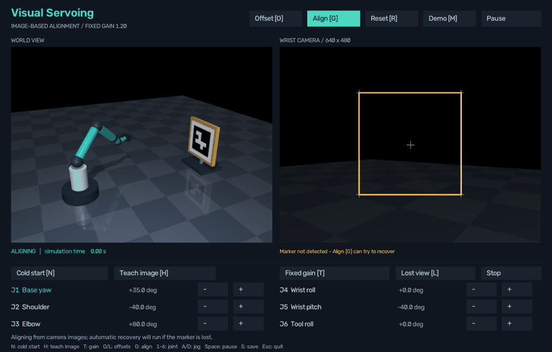

# Systematic startup search

The robot can now start with the marker outside the camera image and **no remembered target viewpoint**. It searches using joint motion, confirms a real detection, and then switches to the existing image-based alignment controller.

## Automatic startup

**Auto is ON by default.** When the app opens, the camera decides what to do:

- Marker visible: begin aligning automatically.
- Marker missing with no remembered viewpoint: begin systematic startup search, confirm detection, then align.
- Marker lost after an earlier detection: use the existing remembered-view recovery.

At the normal home start, the marker already matches the reference, so the app will usually confirm convergence without moving.

1. Close an older simulator window and reopen **run.cmd**.
2. Click **Offset [O]** for a visible starting error; alignment begins automatically.
3. Click **Cold start [N]** for an out-of-view start; search begins automatically.
4. Click **Random [P]** to sample a new joint configuration and discard viewpoint memory. The camera chooses whether alignment or search is needed. Invisible starts are not rejected.

**Auto [B]** switches this behavior on or off. With Auto OFF, starting poses remain stationary until you click Align [G]. Turning Auto ON starts from the current pose.

**Stop**, **Pause**, manual jogging, teaching a reference and changing gain cancel the current run. Resuming from Pause stays stationary. Auto starts only when opening the app, turning Auto on, or explicitly loading a new pose; it does not repeatedly restart after Stop, convergence, or failure. Align [G] always allows an explicit restart. Scripted Demo remains separate.

These launch commands choose the initial behavior:

~~~powershell
.\run.cmd
.\run.cmd --cold-start
.\run.cmd --random-start
.\run.cmd --random-start --seed 42
.\run.cmd --manual
~~~

Random and cold starting poses are applied before the app renders any live camera image. The app reads the alignment goal from disk; it does not look at home to find the target first. Random starts use the same small/medium/large joint-offset mixture as the benchmark. The seed reproduces the starting pose.

Search works with both fixed and adaptive gain. Search speed has its own limit; changing IBVS gain changes alignment after acquisition.

This earlier recording uses actual rendered simulation frames and shows the manual Align step. The current Auto mode starts that same search without the extra click. In this demonstration, detection was confirmed after 24.47 simulated seconds and alignment finished around 29.3 seconds.

## A saved image and a remembered viewpoint serve different purposes

- **Saved reference image:** “What should the marker look like when alignment is finished?” The file contains RGB pixels, camera calibration and marker settings. It contains no robot joint positions or target world coordinates. It survives restarting the application.
- **Remembered viewpoint:** “Where were the joints when the camera last detected the marker?” This is temporary runtime memory for recovering a target that was visible earlier.

The supplied reference was taken from the project's existing alignment example. **Teach image [H]** replaces it with the current camera image, provided the complete configured marker is detected. Failed teaching preserves the previous file and stops movement. Use Teach only when the current view is the new desired final view. To restore the supplied home framing in the original scene, use Reset [R], then Teach image [H]. Reset alone does not change the saved image.

**Lost view [L]** demonstrates the older remembered-view recovery. **Cold start [N]** demonstrates searching without that memory. Normal Align also uses startup search automatically when no viewpoint has yet been observed. Once a target is acquired, later tracking losses can use the newly observed viewpoint.

## What moves during search

The scan starts from the actual measured joint positions. J1 (base yaw) and J5 (wrist pitch) trace expanding rectangles with radii **12, 24, 36 and 48 degrees**. If that coarse pass finds no marker, the robot returns toward the measured start and scans additional rectangles at **6, 18, 30 and 42 degrees**. These radii bisect the gaps between the original paths. The maximum range stays 48 degrees. The app labels the two stages **coarse** and **refined**.

The remaining joints hold their initial positions. Rectangles are clipped to the joint limits, leaving a **0.06 radian** margin. [Why refinement was added and its measured results](SEARCH_COVERAGE.md).

The camera runs at **30 Hz** throughout movement. Detection can interrupt a sweep between waypoints. A detection immediately commands zero velocity; three consecutive detected frames permit alignment. If detection flickers before confirmation, scanning resumes toward the same waypoint.

Search is limited to **0.25 rad/s per joint** and **180 simulated seconds for both passes together**, or completion of the configured path, whichever comes first. The earlier coarse-only path finished in about 76 simulated seconds. The finer pass extends how long the robot checks an absent marker; it never restarts the deadline. A failure reports **TARGET_NOT_FOUND** and leaves zero commanded velocity.

After acquisition, ordinary IBVS compares the four detected marker corners with the reference corners. Its existing damped calculations turn pixel error into camera motion and then six joint velocities. Its alignment/recovery time budget starts separately from startup search, so a late acquisition still has time to align.

The scan's 48-degree excursion bounds apply during startup search. Subsequent alignment and remembered-view recovery have their own existing bounds and deadlines.

## Original startup-search results

[Joint-limit handling and bounded alignment retry](JOINT_LIMITS.md) were added after this baseline study. See that guide for the current controller and follow-up evaluation.

The completed [200-scene paired report](results/startup/20260911-184428-897577-n200-seed20260911/REPORT.md) used seed 20260911:

| Result | Direct IBVS | Search + IBVS |
|---|---:|---:|
| Aligned and remained stable after stopping | 78/200 (39%) | 196/200 (98%) |
| Initially undetected scenes | 122 | 122 |
| Initially undetected, then acquired | 0 | 120 |
| Initially undetected, then aligned | 0 | 118 |

Of the four failures in this baseline, two exhausted the search without acquiring the marker and two found it but reached the alignment timeout. All initially visible scenes still aligned.

For the 120 initially undetected targets that were acquired, median acquisition time was **4.98 simulated seconds**. Across all successful search runs, median alignment time after acquisition was **4.70 seconds** and median total time was **6.50 seconds**. These medians refer to different groups and are not added together.

Both absent-marker controls completed the search and stopped with TARGET_NOT_FOUND at about **76.2 simulated seconds**. The two unreachable-target controls detected a marker but stopped through the existing recovery-limit/timeout rules. Every run included a one-second observation with zero command after termination; every reported success stayed below 1 pixel throughout it.

## Evaluation

The saved evaluation compares **direct fixed-gain IBVS** with **startup search followed by the same fixed-gain IBVS**, using identical scenes for each pair.

- 200 randomized starting configurations, using the previous small/medium/large joint-offset distributions.
- Independently randomized target translations: +/- 6 cm in X, 18 cm in Y, and 10 cm in Z.
- No discarded invisible or difficult starts.
- One saved reference image for every scene; no fresh reference capture or remembered viewpoint supplied to startup search.
- Separate measurements of first detection, confirmed acquisition, alignment after acquisition and total time.
- A further second with zero velocity command to check every stopped result.
- Two absent-marker controls and two distant, unreachable-target controls, reported separately.

Run the experiment with:

~~~powershell
.\run.cmd --startup-study
~~~

For custom trial counts or seeds, use the configured Python environment:

~~~powershell
..\..\work\vservo-venv\Scripts\python.exe run_startup_search.py --trials 200 --seed 20260911
~~~

Results are saved under **results/startup/**, with a latest.json pointer. Each run contains a report, plots, every sampled scene, every outcome, per-frame traces and a copy of the exact reference file. The manifest records configuration, source hashes and library versions.

## Important code

| File / function | Responsibility |
|---|---|
| startup_search.py / StartupSearch.__init__ | Build expanding scan waypoints around the measured starting joints and clip them to limits. |
| startup_search.py / StartupSearch.update | Read each new detection, confirm it, or command the next bounded search movement; stop on exhaustion or deadline. |
| reference_image.py / save_reference, load_reference | Persist and validate the desired image and its calibration without storing a robot pose. |
| recovery.py / ReacquiringIBVS.update | Select startup search when no viewpoint is known, then hand control to IBVS; recover later losses using newly observed views. |
| app.py / Lab._start_if_auto, Lab.toggle_auto | Start one run at explicit startup events; allow switching Auto off without an idle-loop restart. |
| app.py / Lab.random_start, Lab.cold_start, Lab.align | Load a starting pose, clear memory for a fresh start, and let the controller select alignment or search. |
| app.py / Lab.teach_reference | Save the detected image as the goal for future sessions. |
| control.py / IBVSController.update | Turn current-versus-desired corner error into velocity commands after detection. |
| run_startup_search.py / trial, validate_run | Run paired randomized scenes and verify the saved results and stopped commands. |
| startup_search_config.json | Adjust scan radii, speed, confirmation length and acquisition deadline. |

## Scope

This is a bounded two-joint scan with one refinement pass in the existing static simulation. It does not cover every robot configuration or guarantee that any target will be found or reached. A target may be too far away, occluded, behind the camera's accessible views, or outside the scan.

Robot collisions remain disabled in the teaching scene. Joint limits and motion budgets do not make this a collision-aware planner. The project still uses an ArUco marker; marker-free perception is a later stage.
