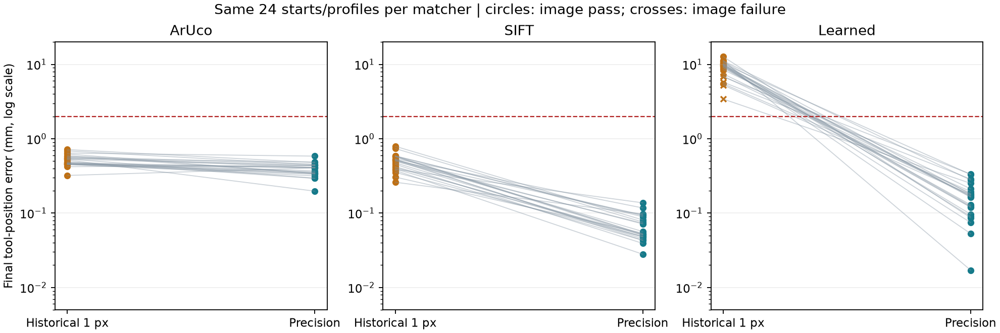

# Stopping-rule comparison

The historical and precision runs use the same 72 planned trials, teaching images, calibration profiles, 100 ms transport delay, 2 mm / 1 degree physical limits and 30 post-stop captures. The original result files are preserved.

| Matcher | Historical image / physical passes | Precision image / physical passes | Historical median tool mm | Precision median tool mm | Precision max tool mm |
|---|---:|---:|---:|---:|---:|
| ArUco | 24/24 / 24/24 | 24/24 / 24/24 | 0.505 | 0.406 | 0.585 |
| SIFT | 24/24 / 24/24 | 24/24 / 24/24 | 0.512 | 0.053 | 0.138 |
| Learned | 16/24 / 0/24 | 24/24 / 24/24 | 9.917 | 0.168 | 0.334 |

Error statistics in the table are conditional on image convergence. Every planned trial remains in the pass counts and outcome lists. The plot includes all endpoints, including failures.

## Outcomes and convergence time

- ArUco: historical {'converged': 24}; precision {'converged': 24}. Median simulated time among image passes: 4.486 s → 5.186 s. Precision safety violations: 0.
- SIFT: historical {'converged': 24}; precision {'converged': 24}. Median simulated time among image passes: 4.470 s → 5.503 s. Precision safety violations: 0.
- Learned: historical {'timeout': 7, 'converged': 16, 'invalid_depth': 1}; precision {'converged': 24}. Median simulated time among image passes: 11.603 s → 5.820 s. Precision safety violations: 0.

## What changed

SIFT and Learned acquire the target with their selected matcher, then refine its image alignment against the saved camera image. ArUco retains its own subpixel corners. All modes require the tighter per-corner/RMS limits plus a small image-derived camera correction and sufficient local sensitivity for a full hold. A valid-depth fallback also handles the exactly frontal IPPE initialization failure.

This comparison measures the combined implementation change; it does not isolate one threshold or attribute improvement to a single component. The local estimates are not ground truth. The physical scores use independent simulated poses.

The [45 pose probes](POSE_SENSITIVITY.md) show why translation and rotation together can pass a 1 px gate while missing the physical limits. Calibration error, noise, target geometry and real hardware remain separate sources of uncertainty. Two starting poses per profile are a small validation sample, not a reliability bound.

[Per-profile results](REPORT.md) · [Comparison data and hashes](comparison.json) · [Method and usage](../../../PRECISION_STOPPING.md)

[Independent processing-cost measurement](TIMING.md) · [Regression and physical verification](VERIFICATION.md)
