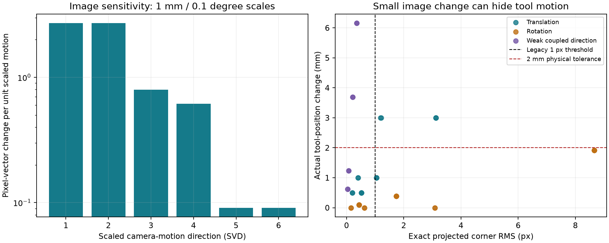

# Sensitivity to physical pose changes

45 independent projection probes; 4 legacy stopping candidates lie outside the physical limits, versus 0 precision candidates.

These are instantaneous eligibility checks at fixed simulated poses, not closed-loop success rates. Exact depths and true K are used only in this evaluator; the application estimates depths from images and uses its configured calibration.

The numerical pixel Jacobian is differentiated from exact projection. Translation columns are scaled by 1 mm and rotation columns by 0.1 degree before SVD. The weakest direction combines translation and rotation.

A hypothetical feature-error vector with L2 norm 0.05 px can amplify to 0.351 mm of local translation error or 0.042 degrees of rotation error. These are separate worst-direction linear sensitivities, not confidence intervals or measured sensor noise.

| Perturbation | Exact px | Tool mm | Camera degrees | Legacy candidate | Precision candidate | Physical tolerance |
|---|---:|---:|---:|---|---|---|
| identity | 0.000 | 0.000 | 0.000 | True | True | True |
| translation-x--0.0005 | 0.521 | 0.500 | 0.000 | True | False | True |
| translation-x-0.0005 | 0.521 | 0.500 | 0.000 | True | False | True |
| translation-x--0.001 | 1.042 | 1.000 | 0.000 | False | False | True |
| translation-x-0.001 | 1.042 | 1.000 | 0.000 | False | False | True |
| translation-x--0.003 | 3.126 | 3.000 | 0.000 | False | False | False |
| translation-x-0.003 | 3.126 | 3.000 | 0.000 | False | False | False |
| translation-y--0.0005 | 0.521 | 0.500 | 0.000 | True | False | True |
| translation-y-0.0005 | 0.521 | 0.500 | 0.000 | True | False | True |
| translation-y--0.001 | 1.042 | 1.000 | 0.000 | False | False | True |
| translation-y-0.001 | 1.042 | 1.000 | 0.000 | False | False | True |
| translation-y--0.003 | 3.126 | 3.000 | 0.000 | False | False | False |
| translation-y-0.003 | 3.126 | 3.000 | 0.000 | False | False | False |
| translation-z--0.0005 | 0.200 | 0.500 | 0.000 | True | True | True |
| translation-z-0.0005 | 0.200 | 0.500 | 0.000 | True | True | True |
| translation-z--0.001 | 0.399 | 1.000 | 0.000 | True | False | True |
| translation-z-0.001 | 0.401 | 1.000 | 0.000 | True | False | True |
| translation-z--0.003 | 1.191 | 3.000 | 0.000 | False | False | False |
| translation-z-0.003 | 1.207 | 3.000 | 0.000 | False | False | False |
| rotation-x--0.000872665 | 0.433 | 0.096 | 0.050 | True | False | True |
| rotation-x-0.000872665 | 0.433 | 0.096 | 0.050 | True | False | True |
| rotation-x--0.00349066 | 1.732 | 0.384 | 0.200 | False | False | True |
| rotation-x-0.00349066 | 1.732 | 0.384 | 0.200 | False | False | True |
| rotation-x--0.0174533 | 8.661 | 1.920 | 1.000 | False | False | True |
| rotation-x-0.0174533 | 8.659 | 1.920 | 1.000 | False | False | True |
| rotation-y--0.000872665 | 0.433 | 0.096 | 0.050 | True | False | True |
| rotation-y-0.000872665 | 0.433 | 0.096 | 0.050 | True | False | True |
| rotation-y--0.00349066 | 1.732 | 0.384 | 0.200 | False | False | True |
| rotation-y-0.00349066 | 1.732 | 0.384 | 0.200 | False | False | True |
| rotation-y--0.0174533 | 8.660 | 1.920 | 1.000 | False | False | True |
| rotation-y-0.0174533 | 8.660 | 1.920 | 1.000 | False | False | True |
| rotation-z--0.000872665 | 0.154 | 0.000 | 0.050 | True | True | True |
| rotation-z-0.000872665 | 0.154 | 0.000 | 0.050 | True | True | True |
| rotation-z--0.00349066 | 0.617 | 0.000 | 0.200 | True | False | True |
| rotation-z-0.00349066 | 0.617 | 0.000 | 0.200 | True | False | True |
| rotation-z--0.0174533 | 3.087 | 0.000 | 1.000 | False | False | True |
| rotation-z-0.0174533 | 3.087 | 0.000 | 1.000 | False | False | True |
| weak-direction--5mm | 0.357 | 6.156 | 0.602 | True | False | False |
| weak-direction--3mm | 0.214 | 3.693 | 0.361 | True | False | False |
| weak-direction--1mm | 0.071 | 1.231 | 0.120 | True | False | True |
| weak-direction--0.5mm | 0.036 | 0.616 | 0.060 | True | True | True |
| weak-direction-0.5mm | 0.036 | 0.616 | 0.060 | True | True | True |
| weak-direction-1mm | 0.071 | 1.231 | 0.120 | True | False | True |
| weak-direction-3mm | 0.214 | 3.693 | 0.361 | True | False | False |
| weak-direction-5mm | 0.357 | 6.156 | 0.602 | True | False | False |

[Inputs and all scores](pose-sensitivity.json). This covers one teaching view and planar geometry; it does not prove observability for every target, or remove calibration/noise uncertainty.

Reproduce from the repository root:

~~~powershell
.\outputs\visual-servoing-simulation\.venv\Scripts\python.exe -B tools/analyze_pose_sensitivity.py --baseline outputs/visual-servoing-simulation/results/accuracy/20260921-validation --output <result-directory>
~~~
