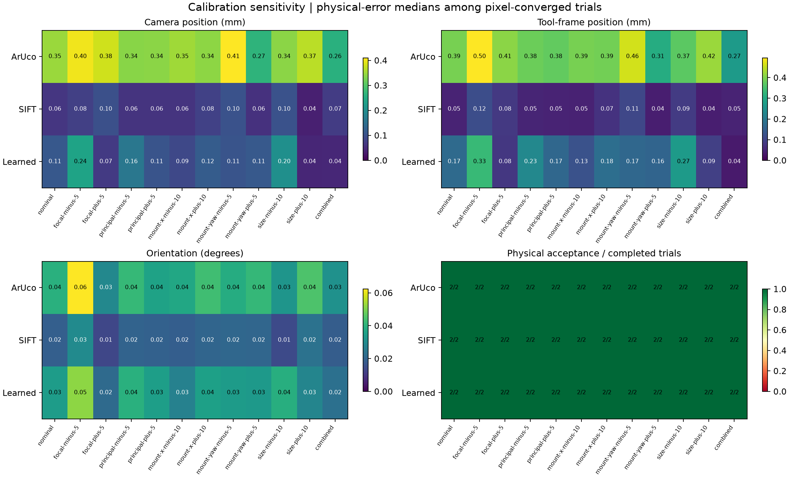
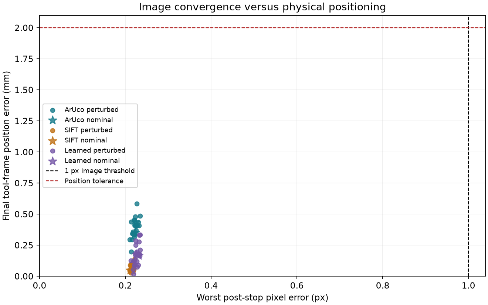

# Physical accuracy and calibration sensitivity

Reference-image refinement and local sensitivity checks are enabled. Stopping requires all configured pixel and estimated-camera-correction limits for the hold window, and every post-stop capture is rechecked. These estimates are not physical ground truth.

Completed 72/72 predeclared trials; 72 passed image convergence and 72 also met the declared physical tolerances.

Physical acceptance requires both camera and tool-frame position errors ≤ 2 mm and orientation errors ≤ 1° through 30 post-stop captures. These are illustrative experiment thresholds, not a certified robot specification.

| Matcher | Profile | Pixel / done | Physical / done | Camera mm | Tool mm | Angle ° | Time s | Paired Δtool mm |
|---|---|---:|---:|---:|---:|---:|---:|---:|
| ArUco | nominal | 2/2 | 2/2 | 0.348 | 0.393 | 0.040 | 5.253 | 0.000 |
| ArUco | focal-minus-5 | 2/2 | 2/2 | 0.402 | 0.495 | 0.062 | 5.186 | 0.102 |
| ArUco | focal-plus-5 | 2/2 | 2/2 | 0.381 | 0.410 | 0.029 | 5.286 | 0.017 |
| ArUco | principal-minus-5 | 2/2 | 2/2 | 0.337 | 0.384 | 0.042 | 5.269 | -0.009 |
| ArUco | principal-plus-5 | 2/2 | 2/2 | 0.339 | 0.375 | 0.036 | 5.236 | -0.017 |
| ArUco | mount-x-minus-10 | 2/2 | 2/2 | 0.351 | 0.394 | 0.037 | 5.270 | 0.001 |
| ArUco | mount-x-plus-10 | 2/2 | 2/2 | 0.340 | 0.390 | 0.043 | 5.236 | -0.003 |
| ArUco | mount-yaw-minus-5 | 2/2 | 2/2 | 0.410 | 0.461 | 0.039 | 5.253 | 0.068 |
| ArUco | mount-yaw-plus-5 | 2/2 | 2/2 | 0.266 | 0.306 | 0.041 | 5.186 | -0.087 |
| ArUco | size-minus-10 | 2/2 | 2/2 | 0.338 | 0.371 | 0.033 | 5.519 | -0.022 |
| ArUco | size-plus-10 | 2/2 | 2/2 | 0.368 | 0.421 | 0.045 | 5.086 | 0.029 |
| ArUco | combined | 2/2 | 2/2 | 0.261 | 0.270 | 0.032 | 5.020 | -0.123 |
| SIFT | nominal | 2/2 | 2/2 | 0.064 | 0.049 | 0.019 | 5.520 | 0.000 |
| SIFT | focal-minus-5 | 2/2 | 2/2 | 0.078 | 0.117 | 0.030 | 5.452 | 0.068 |
| SIFT | focal-plus-5 | 2/2 | 2/2 | 0.100 | 0.083 | 0.013 | 5.552 | 0.033 |
| SIFT | principal-minus-5 | 2/2 | 2/2 | 0.062 | 0.052 | 0.020 | 5.536 | 0.002 |
| SIFT | principal-plus-5 | 2/2 | 2/2 | 0.062 | 0.050 | 0.019 | 5.503 | 0.001 |
| SIFT | mount-x-minus-10 | 2/2 | 2/2 | 0.062 | 0.047 | 0.019 | 5.520 | -0.003 |
| SIFT | mount-x-plus-10 | 2/2 | 2/2 | 0.079 | 0.072 | 0.020 | 5.503 | 0.023 |
| SIFT | mount-yaw-minus-5 | 2/2 | 2/2 | 0.104 | 0.106 | 0.021 | 5.470 | 0.057 |
| SIFT | mount-yaw-plus-5 | 2/2 | 2/2 | 0.058 | 0.041 | 0.021 | 5.453 | -0.008 |
| SIFT | size-minus-10 | 2/2 | 2/2 | 0.103 | 0.087 | 0.014 | 5.786 | 0.038 |
| SIFT | size-plus-10 | 2/2 | 2/2 | 0.036 | 0.041 | 0.024 | 5.369 | -0.009 |
| SIFT | combined | 2/2 | 2/2 | 0.073 | 0.050 | 0.018 | 5.286 | 0.001 |
| Learned | nominal | 2/2 | 2/2 | 0.112 | 0.171 | 0.034 | 5.836 | 0.000 |
| Learned | focal-minus-5 | 2/2 | 2/2 | 0.238 | 0.333 | 0.052 | 5.670 | 0.162 |
| Learned | focal-plus-5 | 2/2 | 2/2 | 0.069 | 0.081 | 0.022 | 5.969 | -0.090 |
| Learned | principal-minus-5 | 2/2 | 2/2 | 0.162 | 0.231 | 0.040 | 5.836 | 0.060 |
| Learned | principal-plus-5 | 2/2 | 2/2 | 0.106 | 0.166 | 0.035 | 5.852 | -0.005 |
| Learned | mount-x-minus-10 | 2/2 | 2/2 | 0.089 | 0.125 | 0.027 | 5.786 | -0.046 |
| Learned | mount-x-plus-10 | 2/2 | 2/2 | 0.120 | 0.178 | 0.036 | 5.836 | 0.008 |
| Learned | mount-yaw-minus-5 | 2/2 | 2/2 | 0.107 | 0.166 | 0.034 | 5.836 | -0.005 |
| Learned | mount-yaw-plus-5 | 2/2 | 2/2 | 0.114 | 0.160 | 0.034 | 5.753 | -0.011 |
| Learned | size-minus-10 | 2/2 | 2/2 | 0.205 | 0.269 | 0.039 | 5.869 | 0.099 |
| Learned | size-plus-10 | 2/2 | 2/2 | 0.044 | 0.094 | 0.028 | 5.819 | -0.077 |
| Learned | combined | 2/2 | 2/2 | 0.045 | 0.035 | 0.023 | 5.836 | -0.136 |

Physical columns and time are medians over pixel-converged trials; all failures remain in the denominators and outcome counts below. Paired deltas use the same starting pose and matcher, where both nominal and perturbed cases passed pixel convergence. Negative Δ means a smaller error than nominal, not a statistical finding.

## Outcomes

- ArUco / nominal: {'converged': 2}; pixel-only passes 0; safety failures 0; paired successes 2.
- ArUco / focal-minus-5: {'converged': 2}; pixel-only passes 0; safety failures 0; paired successes 2.
- ArUco / focal-plus-5: {'converged': 2}; pixel-only passes 0; safety failures 0; paired successes 2.
- ArUco / principal-minus-5: {'converged': 2}; pixel-only passes 0; safety failures 0; paired successes 2.
- ArUco / principal-plus-5: {'converged': 2}; pixel-only passes 0; safety failures 0; paired successes 2.
- ArUco / mount-x-minus-10: {'converged': 2}; pixel-only passes 0; safety failures 0; paired successes 2.
- ArUco / mount-x-plus-10: {'converged': 2}; pixel-only passes 0; safety failures 0; paired successes 2.
- ArUco / mount-yaw-minus-5: {'converged': 2}; pixel-only passes 0; safety failures 0; paired successes 2.
- ArUco / mount-yaw-plus-5: {'converged': 2}; pixel-only passes 0; safety failures 0; paired successes 2.
- ArUco / size-minus-10: {'converged': 2}; pixel-only passes 0; safety failures 0; paired successes 2.
- ArUco / size-plus-10: {'converged': 2}; pixel-only passes 0; safety failures 0; paired successes 2.
- ArUco / combined: {'converged': 2}; pixel-only passes 0; safety failures 0; paired successes 2.
- SIFT / nominal: {'converged': 2}; pixel-only passes 0; safety failures 0; paired successes 2.
- SIFT / focal-minus-5: {'converged': 2}; pixel-only passes 0; safety failures 0; paired successes 2.
- SIFT / focal-plus-5: {'converged': 2}; pixel-only passes 0; safety failures 0; paired successes 2.
- SIFT / principal-minus-5: {'converged': 2}; pixel-only passes 0; safety failures 0; paired successes 2.
- SIFT / principal-plus-5: {'converged': 2}; pixel-only passes 0; safety failures 0; paired successes 2.
- SIFT / mount-x-minus-10: {'converged': 2}; pixel-only passes 0; safety failures 0; paired successes 2.
- SIFT / mount-x-plus-10: {'converged': 2}; pixel-only passes 0; safety failures 0; paired successes 2.
- SIFT / mount-yaw-minus-5: {'converged': 2}; pixel-only passes 0; safety failures 0; paired successes 2.
- SIFT / mount-yaw-plus-5: {'converged': 2}; pixel-only passes 0; safety failures 0; paired successes 2.
- SIFT / size-minus-10: {'converged': 2}; pixel-only passes 0; safety failures 0; paired successes 2.
- SIFT / size-plus-10: {'converged': 2}; pixel-only passes 0; safety failures 0; paired successes 2.
- SIFT / combined: {'converged': 2}; pixel-only passes 0; safety failures 0; paired successes 2.
- Learned / nominal: {'converged': 2}; pixel-only passes 0; safety failures 0; paired successes 2.
- Learned / focal-minus-5: {'converged': 2}; pixel-only passes 0; safety failures 0; paired successes 2.
- Learned / focal-plus-5: {'converged': 2}; pixel-only passes 0; safety failures 0; paired successes 2.
- Learned / principal-minus-5: {'converged': 2}; pixel-only passes 0; safety failures 0; paired successes 2.
- Learned / principal-plus-5: {'converged': 2}; pixel-only passes 0; safety failures 0; paired successes 2.
- Learned / mount-x-minus-10: {'converged': 2}; pixel-only passes 0; safety failures 0; paired successes 2.
- Learned / mount-x-plus-10: {'converged': 2}; pixel-only passes 0; safety failures 0; paired successes 2.
- Learned / mount-yaw-minus-5: {'converged': 2}; pixel-only passes 0; safety failures 0; paired successes 2.
- Learned / mount-yaw-plus-5: {'converged': 2}; pixel-only passes 0; safety failures 0; paired successes 2.
- Learned / size-minus-10: {'converged': 2}; pixel-only passes 0; safety failures 0; paired successes 2.
- Learned / size-plus-10: {'converged': 2}; pixel-only passes 0; safety failures 0; paired successes 2.
- Learned / combined: {'converged': 2}; pixel-only passes 0; safety failures 0; paired successes 2.

## Method and limits

The study pairs 2 seeded starts across every selected profile/matcher, at 100 ms simulated transport delay. Camera rendering, target geometry and collision supervision remain nominal. Only controller intrinsics, camera-mount Jacobian and assumed target size change.

Each target has a private reference capture at a known simulated teaching pose. The controller receives only the reference image and its detected features. Ground-truth camera and tool poses stay in evaluation records; saved application goals are preserved. Position is the Euclidean displacement of the defined frame origin; orientation is the SO(3) geodesic angle. Signed position components use the corresponding taught frame's axes. The tool frame is the tool_roll body origin, not an unmodelled gripper TCP.

Image and physical success are scored separately. All post-stop checks require zero commanded motion. Collision clearance and forbidden contacts are audited every physics step. Physical scores are evaluated at the stop and on fresh current captures, never on delayed PnP pose estimates.

These deterministic, small samples measure sensitivity for one static planar target and fixed scene. Their endpoint spread is across initial poses, not an ISO repeatability test. No real hardware, distortion, encoder error, moving-obstacle uncertainty, or change of true camera calibration after teaching is modelled. A perturbed control model can change transients without causing systematic endpoint bias because the image goal remains the same.

The [plan](plan.json), [manifest](manifest.json), [all outcomes](trials.json), [summary metrics](summary.json) and [evaluation goals](goals.json) are saved. Per-frame traces are generated locally and ignored by Git. Reports can be rebuilt from saved JSON without them.

Run from the project root:

~~~powershell
.\run.cmd --accuracy-study
.\run.cmd --accuracy-study --report-only <saved-run-directory>
~~~
