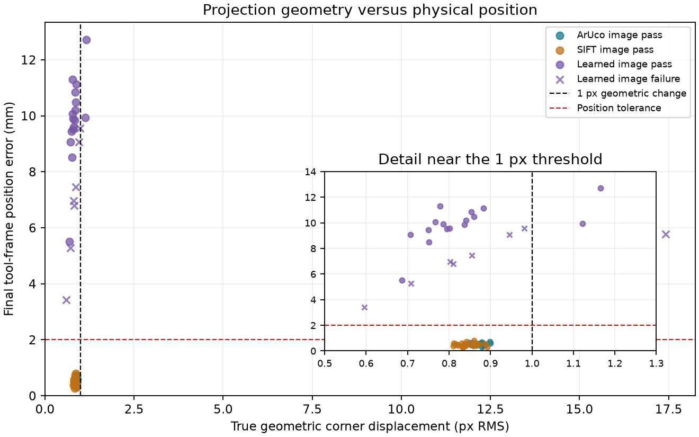

# Independent projection-geometry check

This follow-up uses exact simulated camera poses, the real camera intrinsics and the physical square's corners on the board's front face. It compares ideal pinhole projections at the final and taught poses. It does not use the matcher, PnP or assumed controller calibration.

The result measures geometric change in the image; it does not model rasterization or prove that a detector's corner errors are unbiased. Detected error below is the worst of the post-stop captures; geometric error uses the final pose.

**Example: learned-combined-0001.** Detected image error is 0.722 px; true geometric image change is 0.778 px. Tool-frame position error is 11.291 mm and orientation error is 1.132°.

Thus even true sub-pixel corner agreement can coexist with a physical-tolerance miss in this viewing geometry. Coupled camera translation and rotation can preserve a very similar image of this planar target. This observation does not establish that calibration bias alone caused the endpoint difference, or that all targets/viewpoints behave this way.

| Trial | Outcome | Detected px | Geometric px | Camera mm | Tool mm | Angle ° |
|---|---|---:|---:|---:|---:|---:|
| aruco-nominal-0000 | converged | 0.883 | 0.882 | 0.583 | 0.533 | 0.055 |
| aruco-nominal-0001 | converged | 0.919 | 0.888 | 0.471 | 0.458 | 0.075 |
| aruco-focal-minus-5-0000 | converged | 0.879 | 0.879 | 0.379 | 0.321 | 0.082 |
| aruco-focal-minus-5-0001 | converged | 0.889 | 0.849 | 0.472 | 0.643 | 0.125 |
| aruco-focal-plus-5-0000 | converged | 0.901 | 0.898 | 0.739 | 0.717 | 0.042 |
| aruco-focal-plus-5-0001 | converged | 0.899 | 0.856 | 0.642 | 0.624 | 0.046 |
| aruco-principal-minus-5-0000 | converged | 0.887 | 0.885 | 0.525 | 0.463 | 0.060 |
| aruco-principal-minus-5-0001 | converged | 0.903 | 0.867 | 0.461 | 0.465 | 0.079 |
| aruco-principal-plus-5-0000 | converged | 0.883 | 0.879 | 0.609 | 0.564 | 0.051 |
| aruco-principal-plus-5-0001 | converged | 0.907 | 0.868 | 0.487 | 0.464 | 0.067 |
| aruco-mount-x-minus-10-0000 | converged | 0.898 | 0.900 | 0.626 | 0.581 | 0.052 |
| aruco-mount-x-minus-10-0001 | converged | 0.920 | 0.882 | 0.466 | 0.450 | 0.072 |
| aruco-mount-x-plus-10-0000 | converged | 0.871 | 0.866 | 0.529 | 0.478 | 0.062 |
| aruco-mount-x-plus-10-0001 | converged | 0.891 | 0.853 | 0.470 | 0.473 | 0.077 |
| aruco-mount-yaw-minus-5-0000 | converged | 0.842 | 0.870 | 0.604 | 0.547 | 0.042 |
| aruco-mount-yaw-minus-5-0001 | converged | 0.885 | 0.862 | 0.526 | 0.557 | 0.090 |
| aruco-mount-yaw-plus-5-0000 | converged | 0.900 | 0.875 | 0.566 | 0.536 | 0.075 |
| aruco-mount-yaw-plus-5-0001 | converged | 0.920 | 0.869 | 0.475 | 0.453 | 0.068 |
| aruco-size-minus-10-0000 | converged | 0.891 | 0.879 | 0.711 | 0.687 | 0.039 |
| aruco-size-minus-10-0001 | converged | 0.902 | 0.858 | 0.520 | 0.492 | 0.061 |
| aruco-size-plus-10-0000 | converged | 0.859 | 0.865 | 0.483 | 0.422 | 0.067 |
| aruco-size-plus-10-0001 | converged | 0.897 | 0.860 | 0.438 | 0.455 | 0.082 |
| aruco-combined-0000 | converged | 0.883 | 0.854 | 0.557 | 0.519 | 0.076 |
| aruco-combined-0001 | converged | 0.920 | 0.875 | 0.618 | 0.592 | 0.049 |
| natural-nominal-0000 | converged | 0.819 | 0.822 | 0.489 | 0.421 | 0.060 |
| natural-nominal-0001 | converged | 0.855 | 0.838 | 0.609 | 0.573 | 0.040 |
| natural-focal-minus-5-0000 | converged | 0.808 | 0.833 | 0.336 | 0.260 | 0.083 |
| natural-focal-minus-5-0001 | converged | 0.860 | 0.840 | 0.431 | 0.388 | 0.068 |
| natural-focal-plus-5-0000 | converged | 0.816 | 0.831 | 0.629 | 0.589 | 0.046 |
| natural-focal-plus-5-0001 | converged | 0.864 | 0.842 | 0.749 | 0.739 | 0.024 |
| natural-principal-minus-5-0000 | converged | 0.833 | 0.835 | 0.482 | 0.410 | 0.063 |
| natural-principal-minus-5-0001 | converged | 0.860 | 0.859 | 0.618 | 0.576 | 0.041 |
| natural-principal-plus-5-0000 | converged | 0.843 | 0.859 | 0.472 | 0.393 | 0.065 |
| natural-principal-plus-5-0001 | converged | 0.860 | 0.851 | 0.575 | 0.530 | 0.043 |
| natural-mount-x-minus-10-0000 | converged | 0.823 | 0.832 | 0.434 | 0.353 | 0.064 |
| natural-mount-x-minus-10-0001 | converged | 0.868 | 0.862 | 0.562 | 0.511 | 0.044 |
| natural-mount-x-plus-10-0000 | converged | 0.814 | 0.818 | 0.564 | 0.520 | 0.059 |
| natural-mount-x-plus-10-0001 | converged | 0.884 | 0.875 | 0.561 | 0.497 | 0.046 |
| natural-mount-yaw-minus-5-0000 | converged | 0.812 | 0.842 | 0.567 | 0.512 | 0.058 |
| natural-mount-yaw-minus-5-0001 | converged | 0.921 | 0.888 | 0.601 | 0.539 | 0.052 |
| natural-mount-yaw-plus-5-0000 | converged | 0.797 | 0.836 | 0.512 | 0.453 | 0.065 |
| natural-mount-yaw-plus-5-0001 | converged | 0.833 | 0.816 | 0.565 | 0.527 | 0.040 |
| natural-size-minus-10-0000 | converged | 0.842 | 0.864 | 0.630 | 0.582 | 0.044 |
| natural-size-minus-10-0001 | converged | 0.886 | 0.860 | 0.796 | 0.792 | 0.031 |
| natural-size-plus-10-0000 | converged | 0.805 | 0.810 | 0.440 | 0.376 | 0.072 |
| natural-size-plus-10-0001 | converged | 0.885 | 0.892 | 0.392 | 0.305 | 0.064 |
| natural-combined-0000 | converged | 0.821 | 0.812 | 0.620 | 0.588 | 0.061 |
| natural-combined-0001 | converged | 0.837 | 0.867 | 0.541 | 0.475 | 0.038 |
| learned-nominal-0000 | timeout | 1.381 | 0.802 | 5.661 | 6.967 | 0.700 |
| learned-nominal-0001 | converged | 0.528 | 0.786 | 7.983 | 9.896 | 1.003 |
| learned-focal-minus-5-0000 | converged | 0.492 | 0.842 | 8.201 | 10.201 | 1.046 |
| learned-focal-minus-5-0001 | timeout | 1.163 | 0.810 | 5.523 | 6.794 | 0.684 |
| learned-focal-plus-5-0000 | converged | 0.960 | 0.802 | 7.703 | 9.586 | 0.982 |
| learned-focal-plus-5-0001 | converged | 0.947 | 1.165 | 10.280 | 12.723 | 1.289 |
| learned-principal-minus-5-0000 | timeout | 1.617 | 0.855 | 6.060 | 7.462 | 0.750 |
| learned-principal-minus-5-0001 | converged | 0.707 | 0.883 | 8.961 | 11.130 | 1.135 |
| learned-principal-plus-5-0000 | timeout | 2.068 | 0.946 | 7.358 | 9.063 | 0.909 |
| learned-principal-plus-5-0001 | converged | 0.830 | 0.751 | 6.843 | 8.508 | 0.873 |
| learned-mount-x-minus-10-0000 | converged | 0.319 | 0.707 | 7.300 | 9.067 | 0.923 |
| learned-mount-x-minus-10-0001 | converged | 0.751 | 0.750 | 7.605 | 9.433 | 0.957 |
| learned-mount-x-plus-10-0000 | converged | 0.588 | 0.854 | 8.709 | 10.833 | 1.109 |
| learned-mount-x-plus-10-0001 | timeout | 1.370 | 0.708 | 4.306 | 5.272 | 0.526 |
| learned-mount-yaw-minus-5-0000 | timeout | 1.358 | 0.982 | 7.759 | 9.559 | 0.958 |
| learned-mount-yaw-minus-5-0001 | converged | 0.706 | 1.122 | 8.034 | 9.939 | 1.016 |
| learned-mount-yaw-plus-5-0000 | converged | 0.994 | 0.837 | 7.906 | 9.847 | 1.015 |
| learned-mount-yaw-plus-5-0001 | converged | 0.595 | 0.686 | 4.396 | 5.505 | 0.587 |
| learned-size-minus-10-0000 | invalid_depth | 18.085 | 17.409 | 5.758 | 5.770 | 1.789 |
| learned-size-minus-10-0001 | timeout | 2.304 | 0.595 | 2.877 | 3.421 | 0.316 |
| learned-size-plus-10-0000 | converged | 0.523 | 0.861 | 8.440 | 10.491 | 1.072 |
| learned-size-plus-10-0001 | converged | 0.835 | 0.795 | 7.662 | 9.511 | 0.969 |
| learned-combined-0000 | converged | 0.656 | 0.767 | 8.122 | 10.075 | 1.020 |
| learned-combined-0001 | converged | 0.722 | 0.778 | 9.123 | 11.291 | 1.132 |

All outcomes remain in this table. Missing projections are marked —.
[Recorded calculation inputs and results](geometry-check.json) · [Main sensitivity report](REPORT.md)

Reproduce from the repository root:

~~~powershell
.\outputs\visual-servoing-simulation\.venv\Scripts\python.exe -B tools/analyze_accuracy_geometry.py <completed-run-directory>
~~~
