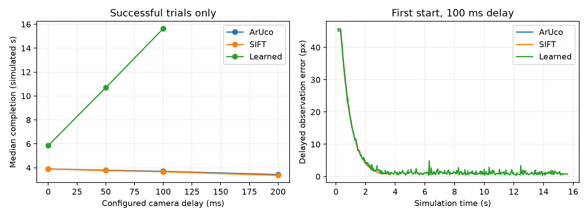

# Camera delay study

The same three declared starting offsets were evaluated through the desktop
application's timed-camera path at each delay. All failure outcomes are retained.
These are simulated transport delays; host inference duration is recorded separately.
The loop is not a wall-clock real-time scheduler.

| Matcher | Delay, ms | Stable successes | Median completion, simulated s | Maximum final current-image error, px |
|---|---:|---:|---:|---:|
| ArUco | 0 | 3/3 | 3.900 | 0.992 |
| ArUco | 50 | 3/3 | 3.800 | 0.957 |
| ArUco | 100 | 3/3 | 3.700 | 0.912 |
| ArUco | 200 | 3/3 | 3.432 | 0.855 |
| SIFT | 0 | 3/3 | 3.900 | 0.977 |
| SIFT | 50 | 3/3 | 3.766 | 0.937 |
| SIFT | 100 | 3/3 | 3.666 | 0.854 |
| SIFT | 200 | 3/3 | 3.366 | 0.705 |
| Learned | 0 | 3/3 | 5.866 | 0.975 |
| Learned | 50 | 3/3 | 10.700 | 0.730 |
| Learned | 100 | 3/3 | 15.632 | 0.778 |
| Learned | 200 | 0/3 | — | 1.612 |

Completion means the controller declared convergence and 30 subsequent fresh
current-image observations stayed below 1 px with zero joint commands.
Fresh-current-image checks use the selected detector; they are not independent
physical pose ground truth. Missing completion points mean no successful trials.

## Stream interruption

One additional 100 ms trial per matcher interrupts capture after 0.75 simulated
seconds. Queued images can still arrive, but the last capture must expire
within the 250 ms budget (plus at most one 2 ms physics tick).

| Matcher | Outcome | Stop minus last capture, ms | Commands stayed zero |
|---|---|---:|---|
| ArUco | stale_camera | 250.0 | True |
| SIFT | stale_camera | 250.0 | True |
| Learned | stale_camera | 250.0 | True |

## Interpretation

These small static offsets test implementation and local convergence; they do
not establish a stability bound over arbitrary scenes. A shorter completion
time with delay can result from commands continuing while a newer image is
in flight. It is not evidence that delay generally improves the controller.
No prediction or latency-dependent retuning was applied.

[All trial outcomes](trials.json) · [Configuration](manifest.json) · [Measured source and runtime](source_manifest.json)

The full local traces are generated under traces/ and are excluded from Git.
Rerun the study to regenerate those traces. Displaying the app never generates
extra feedback in timed mode.

## Trials without stable convergence

| Matcher | Delay, ms | Start index | Outcome | Final current-image error, px |
|---|---:|---:|---|---:|
| Learned | 200 | 0 | timeout | 1.390 |
| Learned | 200 | 1 | timeout | 1.612 |
| Learned | 200 | 2 | timeout | 1.437 |
## Validation and provenance

ArUco and SIFT each converged in 12/12 tested starts and delays. Learned converged
in 9/12: all three 200 ms cases timed out. Its median completion time grew from
5.87 simulated seconds at zero delay to 10.70 at 50 ms and 15.63 at 100 ms.
Reducing delayed-feedback sensitivity is the next controller improvement.

The [source snapshot](source/) and [runtime manifest](source_manifest.json)
preserve the code used for these 39 trials. The final application additionally
records capture-time camera transforms in saved-image metadata and clears old
frames and viewpoint memory after unexpected simulation-clock resets. Those
refinements are covered by the regression checks; the trial outcomes above
remain from the preserved measured source.

The full local suite passed 187 tests and the scene/application check. After the
final clock-reset refinement, all 25 camera tests passed again.
[Verification details](verification.json), [full test output](full-verification.txt)
and [final camera test output](final-camera-tests.txt).
