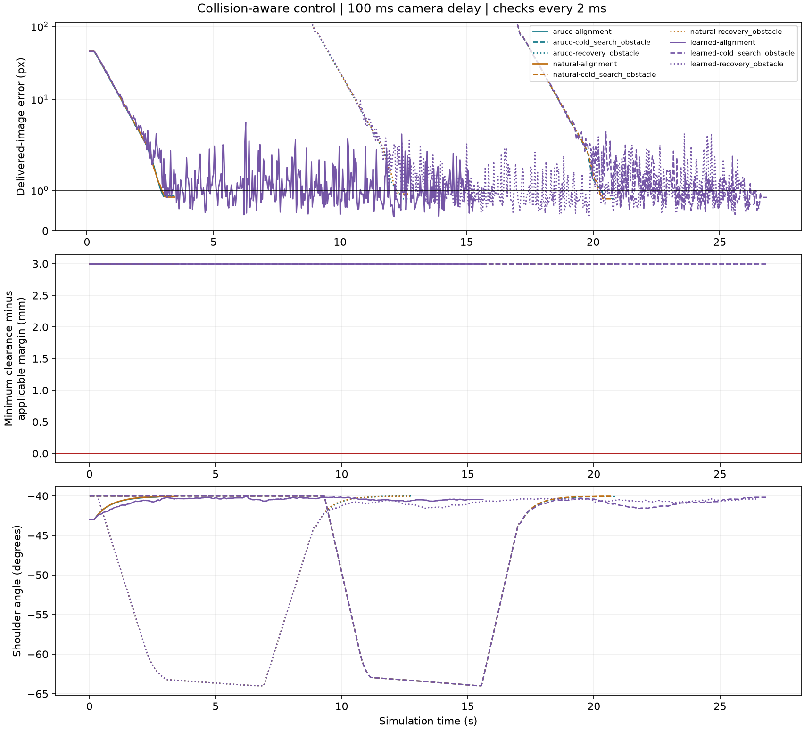

# Collision-aware motion validation

9/9 cases converged and stayed below 1 px in 30 new current images after stopping.

All cases use the same production guard, bounded planner, controller and 100 ms simulated camera delay. Clearance and forbidden contacts are checked at every 2 ms physics step, including the stopped interval. Slack is the smallest signed distance minus its applicable 12 mm environment or 6 mm self margin.

| Matcher | Case | Outcome | Time (s) | Min distance (mm) | Min slack (mm) | Detours | Skipped | Contacts |
|---|---|---|---:|---:|---:|---:|---:|---:|
| aruco | alignment | converged | 3.44 | 15.00 | 3.00 | 0 | 0 | 0 |
| aruco | cold_search_obstacle | converged | 20.84 | 15.00 | 3.00 | 1 | 8 | 0 |
| aruco | recovery_obstacle | converged | 12.80 | 15.00 | 3.00 | 1 | 0 | 0 |
| natural | alignment | converged | 3.47 | 15.00 | 3.00 | 0 | 0 | 0 |
| natural | cold_search_obstacle | converged | 20.77 | 15.00 | 3.00 | 1 | 8 | 0 |
| natural | recovery_obstacle | converged | 12.70 | 15.00 | 3.00 | 1 | 0 | 0 |
| learned | alignment | converged | 15.60 | 15.00 | 3.00 | 0 | 0 | 0 |
| learned | cold_search_obstacle | converged | 26.87 | 15.00 | 3.00 | 1 | 8 | 0 |
| learned | recovery_obstacle | converged | 26.44 | 15.00 | 3.00 | 1 | 0 | 0 |

## Reproduce

From the repository root:

~~~powershell
.\run.cmd --collision-study
~~~

Baseline starts at offsets [3, -3, 4, 3, -2, 2] degrees. Both obstacle cases start at +35 degrees yaw. Cold search has no remembered view. Recovery first remembers a real delivered home image, then the Lost view action explicitly loads the lost-view pose and flushes queued camera images.

The straight joint-space return crosses the column despite clear endpoints. The unit suite separately checks this swept segment, a three-segment detour, maximum-speed braking, manual-axis preservation, invalid placement/reset rollback, and bounded failure.

The planner searches a finite family of joint detours; a feasible path elsewhere may be missed. These deterministic cases are regression evidence, not a success-rate estimate over arbitrary scenes or a hardware safety certification. Host timing is diagnostic; it is not included in simulated delay.

Source, asset, reference and dependency fingerprints are saved in [manifest.json](manifest.json). Every trial, including failures, is retained in [trials.json](trials.json). Raw per-frame traces are generated locally and ignored by Git.
