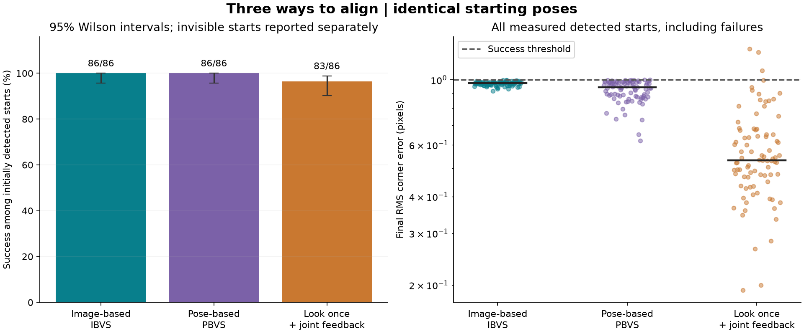
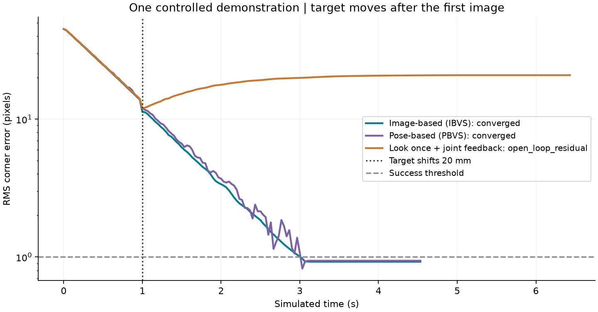

# Alignment controller comparison

> Published snapshot: bulk per-frame traces remain local. See the [dataset policy](../../README.md) before regenerating this report.

**600 static trials: 200 identical starting poses per controller**, seed 20260906. Three additional target-step runs are a separate demonstration.

| Controller | Success, all starts | Success, detected starts (95% Wilson CI) | Median convergence (s)* | Median final error (px)* | Median final error, all measured detected starts (px) |
|---|---:|---|---:|---:|---:|
| Image-based (IBVS) | 86/200 | 86/86 (100.0%; 95.7-100.0%) | 4.05 | 0.974 | 0.974 |
| Pose-based (PBVS) | 86/200 | 86/86 (100.0%; 95.7-100.0%) | 4.27 | 0.943 | 0.943 |
| Look once + joint feedback | 83/200 | 83/86 (96.5%; 90.2-98.8%) | 5.47 | 0.530 | 0.532 |

*Successful trials only; these groups can differ. Convergence includes the 0.5 s hold, and excludes the additional stopped second. A dash means no successful trials.

On the **83 starts where all three succeeded**, median convergence times are: Image-based (IBVS) 4.07 s, Pose-based (PBVS) 4.27 s, Look once + joint feedback 5.47 s.

## What is compared

- IBVS: unchanged fixed-gain controller; image-point error determines velocity.
- PBVS: IPPE marker pose estimated each frame; camera translation and axis-angle error determine velocity. Image error determines the shared stop/hold criterion.
- Look once: estimate the target once, freeze a world-frame camera goal, follow it using robot forward kinematics. Later images are evaluation-only; they never update its movement or stopping rule.
- Open-loop position/rotation tolerances are in comparison_config.json. Completion of that pose move alone is not success: the evaluator independently checks the same image threshold and hold.

## Fairness and limitations

- Same reference image, marker detector, intrinsics, gain, speed limits, damped joint inverse, actuator model, 20 s horizon and initial poses. Search/recovery is disabled.
- All randomized starts are retained, including initially invisible targets. The plan is generated before any trial; no visibility rejection or score-based reruns.
- Success requires RMS corner error below 1 px for 0.5 s, followed by 1 s at zero command with every image still below 1 px.
- Robot forward kinematics is available to open-loop motion execution. Simulator target position and the home joint goal are never supplied to controllers.
- Fixed lighting, ideal kinematics and a static planar marker favor open-loop execution. These results do not establish a universally best controller or real-robot performance.
- Planar PnP ambiguity and pixel discretization can affect pose-based methods. Gains are shared, not independently optimized.
- Joint-space sampling is the mixture of boxes in benchmark_config.json, not a uniform distribution of camera positions.

## Outcomes

| Outcome | IBVS | PBVS | Look once |
|---|---:|---:|---:|
| converged | 86 | 86 | 83 |
| initial_out_of_view | 112 | 112 | 112 |
| initial_tracking_loss | 2 | 2 | 2 |
| open_loop_residual | 0 | 0 | 3 |

An open_loop_residual means the frozen pose goal was reached but the independent image success test failed. A stall is descriptive, not proof of a mathematical local minimum.

## Target movement demonstration

The target shifts 20 mm along world Y at 1 s, while each controller is aligning from the same fixed GUI Offset pose. The desired image stays the same. This is one controlled example per method, not a randomized robustness study.

| Controller | Outcome | Final error (px) |
|---|---|---:|
| Image-based (IBVS) | converged | 0.924 |
| Pose-based (PBVS) | converged | 0.939 |
| Look once + joint feedback | open_loop_residual | 20.854 |

## Reproduction and records

- Run all comparisons: run.cmd --compare
- Regenerate the latest report without physics: run.cmd --compare-report
- Custom size: python compare_controllers.py --trials 12 --seed 42
- This report: python analyze_comparison.py PATH_TO_THIS_RUN
- plan.json saves the exact randomized offsets. manifest.json saves source hashes, package versions, configuration and reference features.
- trials.jsonl / trials.csv contain every result. traces/*.npz contain numeric frame-by-frame images' corners, commands, actual joint motion, error, camera poses and FOV diagnostics.
- cases/ saves the first example of each method/scenario/outcome, including initial and final camera images.

Equations and conventions: [Chaumette & Hutchinson (2006)](https://web.mit.edu/amcp/OldFiles/drg/Chaumette_Part_I.pdf); [OpenCV PnP](https://docs.opencv.org/4.x/d5/d1f/calib3d_solvePnP.html).
