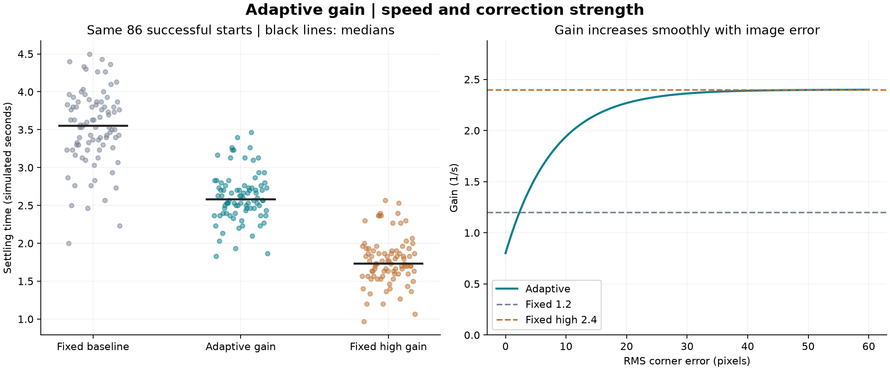
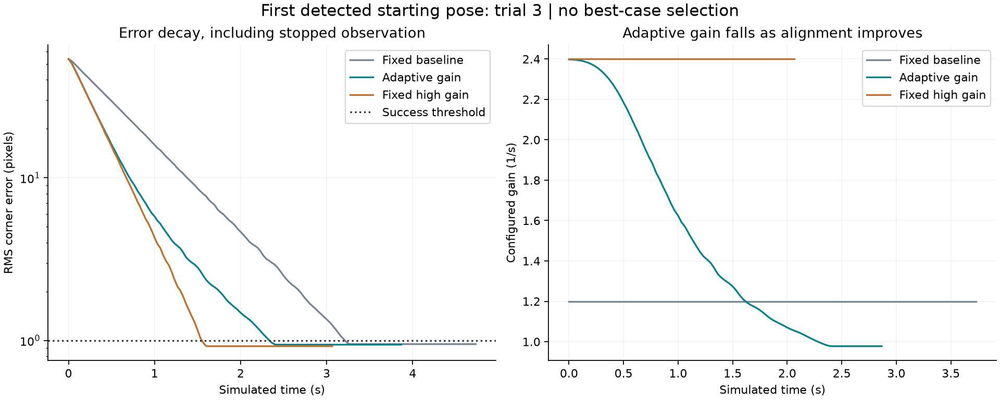

# Adaptive-gain IBVS study

**600 trials: 200 identical starting poses per gain policy**, seed 20260906. Search/recovery disabled.

| Policy | Success/all starts | Success/detected starts (95% Wilson CI) | Median settling (s)* | Median completion (s)* | Median final error (px)* |
|---|---:|---|---:|---:|---:|
| Fixed baseline | 86/200 | 86/86 (100.0%; 95.7-100.0%) | 3.55 | 4.05 | 0.974 |
| Adaptive gain | 86/200 | 86/86 (100.0%; 95.7-100.0%) | 2.58 | 3.08 | 0.978 |
| Fixed high gain | 86/200 | 86/86 (100.0%; 95.7-100.0%) | 1.73 | 2.23 | 0.941 |

*Successful trials only. Settling is the start of the final sustained below-threshold streak. Completion includes the hold window; stopped observation adds another second.

## Paired timing changes

| Policy versus fixed baseline | Common successes | Median settling change (s; negative is faster) | Median per-trial settling reduction |
|---|---:|---:|---:|
| Adaptive gain | 86 | -0.98 | 26.8% |
| Fixed high gain | 86 | -1.80 | 51.0% |

## Overshoot and commands near the goal

| Policy | Maximum projected overshoot (%) | Maximum RMS error growth above initial (%) | Median near-goal joint-command RMS (rad/s)* |
|---|---:|---:|---:|
| Fixed baseline | 0.000 | 0.032 | 0.00348 |
| Adaptive gain | 0.000 | 0.000 | 0.00370 |
| Fixed high gain | 0.000 | 0.000 | 0.00720 |

Projected overshoot measures how far the feature-error vector crosses the goal along its initial direction, divided by the initial error magnitude. It is distinct from RMS error growth and does not detect every individual corner crossing.
*Near-goal command RMS is measured during control frames with error between 1 and 5 px, successful trials only. It describes requested joint speeds, not a general smoothness guarantee.

**No projected overshoot was observed with any policy. This experiment therefore demonstrates no overshoot reduction from adaptive gain.**

## Declared policy and common conditions

lambda(e) = 0.8 + (2.4 - 0.8) * (1 - exp(-e/8)), where e is RMS image error in pixels. This is an error-based gain schedule; it does not train a model.
Fixed baseline gain: 1.2/s. Fixed-high gain: 2.4/s.
The high fixed gain is included to distinguish adaptation from simply turning up the proportional gain.
Every method uses the existing IBVS equations, the same camera/Jacobian, actuator model, speed limits, reference and exact starting offsets.
Success requires error below 1 px for 0.5 s, then a further 1 s stopped below threshold. Timeout: 20 s.
Initially invisible starts are retained. Parameters were frozen before the run; no gains were selected by optimizing these results.
Fixed lighting, ideal dynamics and no sensor latency make this a limited gain study. A faster high fixed gain here is not evidence of robustness to noise or delay. The GUI starts in the existing fixed mode.

## Example trajectory

## Outcomes

| Outcome | Fixed | Adaptive | Fixed high |
|---|---:|---:|---:|
| converged | 86 | 86 | 86 |
| initial_out_of_view | 112 | 112 | 112 |
| initial_tracking_loss | 2 | 2 | 2 |

## Reproduction

- run.cmd --gain-study: create a fresh study.
- run.cmd --gain-report: regenerate the latest report without physics.
- python run_gain_study.py --trials 12 --seed 42: custom smaller study.
- python analyze_gain_study.py PATH_TO_RUN: analyze a particular saved run.
- plan.json and manifest.json: exact starting offsets, configurations, versions and source hashes.
- traces/*.npz: numeric per-frame image error, features, gain, commands, measured joints, camera pose and FOV diagnostics.
- trials.jsonl / trials.csv and summary.json: individual metrics and aggregate results.

Background on the proportional IBVS law: [Inria visual-servoing course](https://vdrevell.gitlabpages.inria.fr/istic-robm/asservissement-visuel.html). The increasing-with-error gain schedule here is our explicit design choice, not a claim that all adaptive visual-servoing methods use that schedule.
