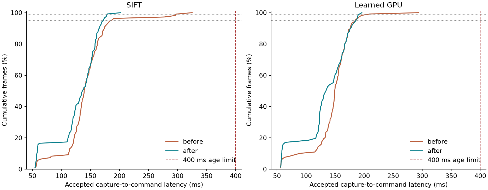

# Perception tail latency: paired transport comparison

Three runs per method, same visible starting offset, 50 ms added transport and an unchanged 400 ms capture-age budget. The same Python/library versions, scene, references, controller and calibration are verified by the comparison script. Each run includes model warm-up before arming and a 1.1 s observation period after stopping.

| Method | Version | Aligned | Commands | Mean (ms) | p95 | p99 | Maximum | Freshness trips | Control misses |
|---|---|---:|---:|---:|---:|---:|---:|---:|---:|
| SIFT | before | 0/3 | 109 | 142.8 | 185.6 | 297.1 | 325.1 | 3 | 0 |
| SIFT | after | 3/3 | 121 | 128.6 | 172.1 | 178.8 | 202.3 | 0 | 0 |
| Learned GPU | before | 1/3 | 119 | 145.8 | 184.8 | 207.4 | 294.2 | 2 | 0 |
| Learned GPU | after | 2/3 | 76 | 133.0 | 186.1 | 191.5 | 196.3 | 0 | 1 |

The latency table measures actual capture-to-command time for accepted observations. A rejected frame has no command latency. Failed baseline runs stop earlier, so the sample counts and trajectories differ. Percentiles pool frame samples across all three runs; they are measurements on this host, not worst-case execution-time guarantees. Freshness trips count latched camera-age watchdog stops; control misses count loop/computation overruns above 50 ms.

The optimized runs aligned 5/6 times. Freshness trips: 0; control deadline misses: 1. Higher measured command latencies after optimization: Learned GPU p95 (184.8 to 186.1 ms). This batch does not establish an improvement in every percentile. Percentiles from these short trials need longer deployment measurements; all-active sensor timings below also retain frames completed after a watchdog stop.

## Feedback age between commands

| Method | Before maximum age bound (ms) | After maximum age bound (ms) |
|---|---:|---:|
| SIFT | 401.6 | 346.4 |
| Learned GPU | 401.0 | 365.8 |

A command uses its observation until the next accepted update or stop. These bounds use the preceding capture timestamp and the next command application/stop timestamp, including initial waiting from arming. They include the interval between deliveries, which explains why a run can trip the 400 ms freshness watchdog even when every accepted command age is less than 400 ms.

## Bounded work and dropped frames

| Method | Version | Capture slots | Acquired | Busy slots skipped | Pending replaced | Expired before inference | Expired results | Transport replaced |
|---|---|---:|---:|---:|---:|---:|---:|---:|
| SIFT | before | 353 | 353 | 0 | 154 | 0 | 0 | 0 |
| SIFT | after | 439 | 223 | 216 | 0 | 0 | 0 | 0 |
| Learned GPU | before | 377 | 377 | 0 | 166 | 0 | 0 | 0 |
| Learned GPU | after | 327 | 171 | 156 | 0 | 0 | 0 | 0 |

Counters cover each full trial, including its observation period after stopping. Before optimization every capture slot enqueues a copied state; full mailboxes replace pending states. After optimization a busy worker suppresses acquisition at that slot, and the next accepted slot takes a new state snapshot. A skipped slot is not a processed/dropped camera image. The old queued-work drop counter alone therefore is not a fair throughput comparison. There remains at most one pending request, one result and eight transport entries. The baseline did not separately count result-mailbox replacement or in-flight work discarded on session shutdown; zero values refer only to the listed counters.

## Include the frames that missed control

| Method | Version | All active sensor frames | Processing mean / p95 / p99 / max (ms) | Capture to delivery mean / p95 / p99 / max (ms) |
|---|---|---:|---:|---:|
| SIFT | before | 115 | 72.0 / 104.3 / 231.7 / 236.9 | 140.7 / 182.4 / 292.4 / 322.3 |
| SIFT | after | 124 | 68.9 / 113.5 / 121.1 / 146.8 | 123.3 / 167.9 / 175.3 / 200.2 |
| Learned GPU | before | 123 | 73.2 / 109.1 / 235.1 / 292.3 | 144.1 / 186.6 / 296.2 / 357.7 |
| Learned GPU | after | 79 | 71.5 / 126.8 / 133.4 / 134.1 | 126.7 / 183.3 / 188.8 / 192.5 |

This second table includes every received sensor frame captured before the stop, including results completed after the watchdog tripped. Delivery time is the later of IPC receipt and scheduled transport completion; it is not a command application timestamp.

Stage distributions are in comparison.json. GPU stage clocks measure host submission/wait time, not independent CUDA kernel durations. Total processing and capture-to-command times use wall-clock timestamps and include necessary device completion. Cached identical images are marked cache_hit instead of inheriting previous expensive-stage durations.

[Optimization and validation](VERIFICATION.md).
