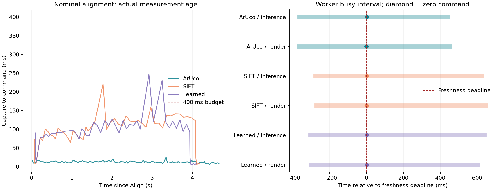

# Validation and observed limits

All 12 planned trials completed with the source/runtime fingerprint in manifest.json;
the current files and runtime match it exactly. The normal project scene check passed,
and **276 regression tests passed** (full-tests.txt).

- **3/3 nominal alignments passed:** ArUco, SIFT and Learned (CUDA), using the explicit 400 ms age budget.
- **6/6 injected stalls passed:** rendering or inference blocked for 800 ms; zero commands were issued while the worker was still busy and remained zero after the late result arrived.
- **1/3 transport alignments passed:** adding 50 ms transport caused SIFT and Learned to stop on stale feedback. The experiment correctly returned exit code 1; overall success was **10/12**, not an unconditional pass.

The largest watchdog lateness in the injected-stall tests was **2.034 ms**.
The requested loop period was 2 ms; the largest measured gap over all trials was
**21.035 ms**, and per-trial 99th percentiles ranged from 6.07 to 7.54 ms.
There were no forbidden contacts, nonzero commands after stopping, or control-overrun
stops. All workers exited. Every accepted frame's latency components reconcile with
its measured capture-to-command duration; no accepted command was applied after its
run stopped. These checks do not imply zero scheduler jitter or instantaneous
physical braking.

The two transport failures illustrate why average inference duration is insufficient.
Just before the SIFT stop, one frame required **277.5 ms** of processing; the analogous
Learned frame required **227.5 ms**. Their added transport meant they could not renew
the previous observation's lease before it expired. The watchdog stopped at the
declared bound even though the next result would itself still be less than 400 ms
old when delivered. It cannot retroactively repair the gap.

Further work should target these processing-time bursts or explicitly design and
validate control with a larger delay budget. This change does not assert that 400 ms
is suitable for physical hardware, that every start works, or that the timing is
repeatable under arbitrary host load.

[Per-trial outcomes](REPORT.md) and [runtime/controls](../../../REALTIME_CONTROL.md).
