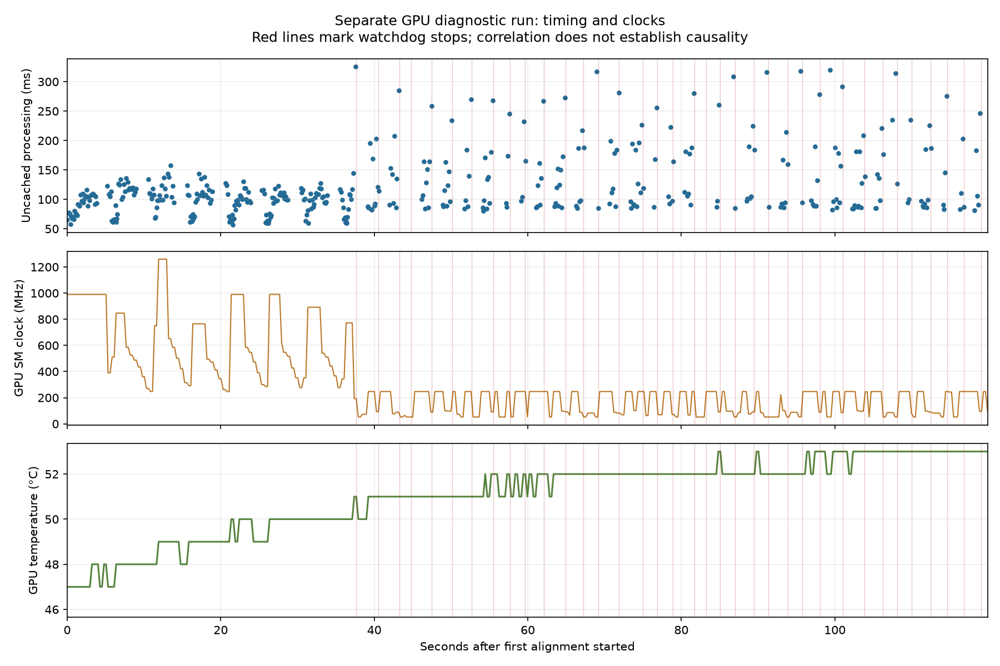

# Sustained-run diagnosis and remaining limits

The longer test **does not validate uninterrupted operation within the 400 ms
feedback-age budget**. SIFT aligned 480/487 times, with one freshness stop and
six control overruns. Learned GPU aligned 55/849 times, with 793 freshness stops
and one control overrun. The [complete statistical report](REPORT.md) includes
all attempts and late results.

The 40 sessions occupied about 86 minutes from the first manifest timestamp to
completion. They contain 82.2 minutes after worker readiness, including the
unchanged post-stop observation windows, and 56.1 minutes with alignment armed.
The target was 10,000 uncached active frames per method with a predeclared
20-session cap. SIFT collected 16,195; Learned collected 8,687 and reached the
cap. The sample target shortfall is retained in `completion.json`.

## Newly reproduced Learned control overrun

In `learned-session-009`, generation 7, a 57.992 ms control cycle exceeded the
unchanged 50 ms limit. The physics/collision interval took **55.014 ms**. Its
thread CPU counter advanced 15.625 ms and its raw cycle counter advanced
50,391,898 cycles. No recorded parent or worker GC pause overlapped it.

The concurrent sensor result took 111.004 ms to process and completed near the
start of that control interval. It remained unreceived for about 57.6 ms while
the control thread was occupied. This event therefore localizes the immediate
failure to the control-side physics/collision interval, with a substantial
off-CPU component. It does not establish that inference itself blocked the
control thread.

SIFT's six overruns occurred in sleep/wakeup (two), physics/collision (three)
and controller computation (one). Several long wall intervals consumed few
CPU cycles. None coincided with recorded GC. The evidence supports investigating
host scheduling or native waits as well as control work duration; it does not
identify the responsible OS thread, driver or wait primitive.

Windows thread CPU accounting was observed in 15.625 ms increments. Raw cycles
are retained without conversion to elapsed time, following the
[QueryThreadCycleTime documentation](https://learn.microsoft.com/en-us/windows/win32/api/realtimeapiset/nf-realtimeapiset-querythreadcycletime).

The **historical 65.9 ms miss remains unattributed**. Its saved 40.5 ms command
application interval lacks CPU/scheduler evidence, and the new miss occurred
in a different stage. It would be incorrect to call them the same root cause.

## Windows native trace limitation

A separate attempt checked that WPR had no existing recording, then requested
its CPU context-switch/sampling profile. Windows refused with error
`0xc5585011`: “Failed to enable the policy to profile system performance.”
The recorder never started. No existing recording or system policy was changed.
[Exact recorder output](../20260922-native-diagnostic/metadata.json).

The remaining distinction between scheduler preemption, a native lock/device
wait and other off-CPU causes requires kernel scheduling evidence on a host
where the profiling policy permits it. The current data cannot supply that
exact attribution.

## Reused-worker degradation and probe check

Both methods passed **20/20 first alignments** in freshly initialized processes.
Learned passed only **35/829 later alignments** using those workers. Its uncached
processing p99 increased from 141.0 ms on first attempts to 313.4 ms on later
attempts; first-attempt maximum was 156.9 ms versus 369.7 ms later.

Two additional two-minute Learned sessions disabled the new CPU/GC/CUDA-event
probes. They aligned **16/79** times and recorded **63 freshness stops**, with
zero control overruns. Thus the same degradation also occurs without those
probes. These later diagnostic runs are separate from the 40-session campaign;
they do not form a randomized estimate of probe overhead.
[Probe-disabled plan and outcomes](../20260922-probes-off/sessions.json).

An isolated empty-cycle microbenchmark measured approximately 34.8 microseconds
for the control probe's start, nine marks and finish. That is not a bound on
instrumentation overhead under contention and is not subtracted from any
reported latency.

## GPU clocks and long perception frames

A separate run sampled NVIDIA state every nominal 250 ms without changing
clocks, power limits, priority, affinity or controller/model settings. It
reproduced **36 freshness stops in 43 attempts**, with seven alignments and no
control overruns. It is excluded from the main statistical totals.

The GPU clock dropped markedly after approximately 38 seconds, coinciding with
the start of repeated slow frames and watchdog stops. In the 270 samples taken
while alignment was armed, the median SM clock was **247 MHz**. The GPU-idle
limiting reason was active in **254/270** samples; software power limiting was
active once. Thermal and hardware power-brake reasons were never active in
those samples. GPU temperature peaked at **53°C**. The machine reported AC
power connected before and after the run.

NVIDIA defines these as clock-limiting reasons, including a GPU-idle condition
that lowers clocks. [NVIDIA clock-event definitions](https://docs.nvidia.com/deploy/nvml-api/api/group__nvmlClocksEventReasons.html).
This data does not establish sustained GPU thermal or power-brake throttling.
It does not measure CPU temperature or prove which driver/firmware policy
produced the low clocks.

| Nearest sampled SM clock | Uncached frames | Processing mean / p95 / p99 / max (ms) |
|---|---:|---|
| Below 300 MHz | 237 | 137.7 / 276.0 / 317.8 / 325.4 |
| 300–799 MHz | 90 | 101.2 / 136.0 / 144.8 / 158.1 |
| At least 800 MHz | 95 | 95.7 / 126.9 / 137.2 / 143.2 |

This is an **observational association**, not a causal clock-control experiment.
Frames are matched to their nearest sample at inference midpoint; the measured
sample interval averaged 262.2 ms. Temporal correlation, pose changes and host
submission gaps remain possible confounders. CUDA stream timing is not a sum
of GPU kernel times.

[GPU samples](../20260922-gpu-diagnostic/gpu-samples.csv),
[correlation data](../20260922-gpu-diagnostic/gpu-correlation.json),
[diagnostic session](../20260922-gpu-diagnostic/session.json).
NVIDIA timestamps use the recorded host's UTC+02:00 offset. The wall/monotonic
clock-pair drift over the run was 0.112 ms.

## Why accepted-command latency alone misses the failure

In the first Learned freshness failure, the last accepted observation became
400.8 ms old while the next image was still processing. That image took 292.8 ms
to process and finished 76.0 ms after the stop. The last accepted command's
capture-to-command latency was only 212.3 ms. A command can be fresh when applied
and become stale while waiting for the next result.

Across the main campaign, 653 Learned results completed after freshness stops;
four SIFT results completed after control stops. They remain in the processing
statistics. All stops stayed latched, and no unsafe-motion, post-stop-motion or
forbidden-contact ticks were recorded. Every acquired request reconciles with
completion, expiry or drop accounting; the bounded queues did not accumulate
unmeasured work.

## Next work justified by the evidence

Investigate the repeated low-clock Learned regime with supported application
GPU performance controls or a more consistent GPU submission path, and use
permitted native scheduling traces to identify control-thread off-CPU stalls.
Any change needs a new sustained campaign with the same controller, scene,
calibration and age budget. Keep the current failed campaign as the comparison
baseline. More short first-alignment runs would not validate either fix.
