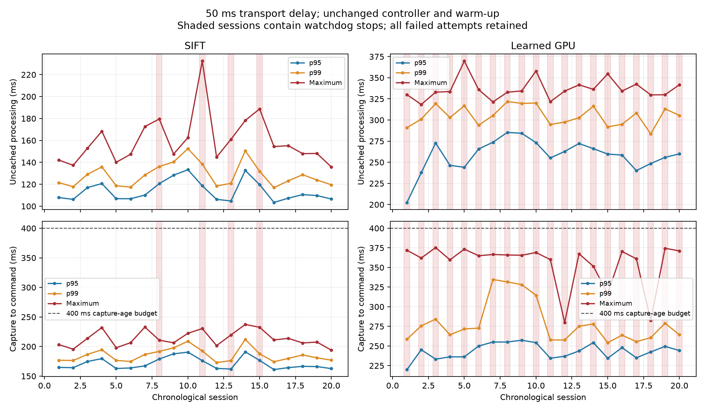

# Sustained perception latency validation

The same starting offset, 50 ms added transport, 400 ms capture-age budget, 50 ms control-loop deadline, controller, calibration, scene, model settings and dependency versions as the preceding three-run comparison. Each process uses the same initial model warm-up. Explicit offset/align cycles then reuse that worker; the stopping criterion and 1.1 s post-stop observation window are unchanged.

Predeclared stopping rule: at least 12 sessions and 10,000 uncached active frames per method, or 20 sessions maximum. Each session runs for at least 120 s after ready and ends at an attempt boundary. Modes alternate in each complete round; all failures remain included.

| Method | Sessions | Aligned / attempts | First attempt in each process | Subsequent attempts | Active / ready minutes | Uncached active frames |
|---|---:|---:|---:|---:|---:|---:|
| SIFT | 20 | 480/487 | 20/20 | 460/467 | 31.8 / 41.3 | 16,195 |
| Learned GPU | 20 | 55/849 | 20/20 | 35/829 | 24.2 / 40.9 | 8,687 |

Observed 801 unsuccessful alignment attempts, 7 control deadline misses and 794 freshness watchdog trips. Sample target met: False. Source unchanged throughout the campaign: True.

## Processing latency

| Method | Cohort | Samples | Mean / p95 / p99 / p99.9 / maximum (ms) |
|---|---|---:|---|
| SIFT | All active captures | 20,204 | 67.5 / 115.5 / 131.1 / 154.4 / 232.3 |
| SIFT | Uncached active captures | 16,195 | 84.2 / 117.7 / 133.4 / 155.4 / 232.3 |
| Learned GPU | All active captures | 12,053 | 91.2 / 239.3 / 299.6 / 334.7 / 369.7 |
| Learned GPU | Uncached active captures | 8,687 | 126.4 / 262.0 / 312.4 / 337.4 / 369.7 |

Processing is the complete wall interval from image acquisition completion to the finished perception result. It includes refinement, host/device waits and preemption. Active captures remain counted when processing completes after a stop. Idle captures are excluded. Cache hits are shown in the all-active distribution and excluded explicitly in the second distribution.

## Capture to command and held feedback age

| Method | Accepted commands | Mean / p95 / p99 / maximum (ms) | Maximum held feedback age bound (ms) |
|---|---:|---|---:|
| SIFT | 19,715 | 127.4 / 175.1 / 191.3 / 237.4 | 405.2 |
| Learned GPU | 10,911 | 137.6 / 245.4 / 275.1 / 375.4 | 419.2 |

Capture-to-command uses actual accepted command application timestamps. Rejected results have no command timestamp; their processing remains in the preceding table and their capture-to-delivery distribution is in summary.json. The held-age bound uses the preceding capture through the next application or stop, and includes initial waiting after arming. It is evaluated separately for every attempt and includes the interval between accepted updates.

## Watchdogs, bounded work and completeness

| Counter | SIFT | Learned GPU |
|---|---:|---:|
| Acquisition slots | 71429 | 70737 |
| Captured requests | 36495 | 31861 |
| Skipped busy acquisition slots | 34934 | 38876 |
| Pending request replacements | 0 | 0 |
| Transport results replaced | 3 | 1 |
| Result mailbox drops | 0 | 0 |
| Pending transport entries cancelled at stops | 1248 | 1832 |
| Obsolete generation results | 354 | 639 |
| Expired requests before inference | 1 | 0 |
| Expired results | 0 | 6 |
| Completed but unreceived results | 0 | 0 |
| Requests never started | 0 | 0 |
| Control deadline misses | 6 | 1 |
| Unsafe motion ticks | 0 | 0 |
| Motion ticks after stop | 0 | 0 |
| Forbidden contacts | 0 | 0 |
| Freshness watchdog trips | 1 | 793 |
| Late completions after freshness stop | 0 | 653 |
| Late completions after control stop | 4 | 0 |
| All stops stayed latched | True | True |
| Frame/command/loop telemetry complete | True | True |
| Extended diagnostics enabled | True | True |
| Control-cycle/parent-GC buffers complete | True | True |

Counters cover entire sessions, including post-stop observation and draining. Skipped slots do not acquire an image. Pending cancellation at a stop and obsolete generations after an explicit reset are intentional cleanup, not evidence of growing queues. Worker expiry acknowledgments and worker expiry totals are two views of the same events and must not be summed. Request/result mailboxes are bounded to one and transport buffering to eight. Capture-slot counts refer to actual runtime acquisition opportunities; busy skips count opportunities suppressed by an occupied worker. Control scheduling can also reduce the rate of those opportunities below the nominal 30 Hz. Every acquired request and runtime capture slot is reconciled against completion, expiry and drop counters.

## Statistical uncertainty and stability

95% percentile bootstrap intervals resample whole sessions (2,000 replicates, fixed seed); they do not treat correlated frames within an alignment or session as independent. These intervals assume sessions are sufficiently exchangeable. Chronological host/thermal effects can still limit that assumption. The observed maximum is not a worst-case execution-time guarantee.

| Method | Metric | Estimate (ms) | Session bootstrap 95% interval (ms) |
|---|---|---:|---:|
| SIFT | Uncached processing mean | 84.2 | 82.0–87.0 |
| SIFT | Uncached processing p95 | 117.7 | 112.5–121.7 |
| SIFT | Uncached processing p99 | 133.4 | 127.0–139.2 |
| SIFT | Uncached processing p99.9 | 155.4 | 148.0–169.1 |
| SIFT | Capture to command mean | 127.4 | 125.6–129.7 |
| SIFT | Capture to command p95 | 175.1 | 169.2–180.0 |
| SIFT | Capture to command p99 | 191.3 | 184.5–197.1 |
| Learned GPU | Uncached processing mean | 126.4 | 123.3–129.4 |
| Learned GPU | Uncached processing p95 | 262.0 | 255.0–268.5 |
| Learned GPU | Uncached processing p99 | 312.4 | 305.4–316.4 |
| Learned GPU | Uncached processing p99.9 | 337.4 | 333.8–347.8 |
| Learned GPU | Capture to command mean | 137.6 | 136.3–138.7 |
| Learned GPU | Capture to command p95 | 245.4 | 240.9–248.3 |
| Learned GPU | Capture to command p99 | 275.1 | 265.4–283.8 |

SIFT p99.9 has only approximately 16.2 uncached observations in its upper 0.1% tail. It is much better sampled than three short trials but remains sensitive to rare events.


Learned GPU p99.9 has only approximately 8.7 uncached observations in its upper 0.1% tail. It is much better sampled than three short trials but remains sensitive to rare events.

| Method | Worker cohort | Uncached processing mean / p95 / p99 / p99.9 / maximum (ms) |
|---|---|---|
| SIFT | First alignment | 79.9 / 115.5 / 132.9 / 143.9 / 145.8 |
| SIFT | Subsequent alignments | 84.4 / 117.7 / 133.4 / 155.9 / 232.3 |
| Learned GPU | First alignment | 95.5 / 129.9 / 141.0 / 152.9 / 156.9 |
| Learned GPU | Subsequent alignments | 128.8 / 266.6 / 313.4 / 339.6 / 369.7 |

| Method | Half of session sequence | Processing p95 / p99 / max (ms), uncached | Command p95 / p99 / max (ms) |
|---|---|---|---|
| SIFT | first | 119.6 / 135.0 / 179.5 | 177.7 / 193.6 / 233.0 |
| SIFT | second | 114.9 / 131.1 / 232.3 | 171.7 / 188.6 / 237.4 |
| Learned GPU | first | 265.7 / 317.2 / 369.7 | 247.7 / 291.0 / 375.4 |
| Learned GPU | second | 258.9 / 308.6 / 354.6 | 243.6 / 263.5 / 374.5 |



## Spike attribution

See diagnostics.json for every watchdog event, overlapping control cycle, parent/worker GC activity, concurrent sensor work and nearby commands. The ten slowest processing frames, oldest commands and longest active control cycles are retained per method.

| Method | Session / sequence | Processing (ms) | Coarse / refinement (ms) | Extract / match / transfer host (ms) |
|---|---|---:|---|---|
| SIFT | natural-session-010 / 168 | 232.3 | 179.7 / 52.4 | — / — / — |
| SIFT | natural-session-014 / 467 | 188.7 | 147.4 / 41.2 | — / — / — |
| SIFT | natural-session-007 / 1321 | 179.5 | 111.8 / 67.5 | — / — / — |
| Learned GPU | learned-session-004 / 372 | 369.7 | 312.5 / 56.9 | 104.7 / 203.7 / 0.3 |
| Learned GPU | learned-session-009 / 346 | 358.0 | 303.0 / 54.8 | 133.2 / 164.0 / 0.4 |
| Learned GPU | learned-session-014 / 663 | 354.6 | 304.8 / 49.6 | 132.1 / 167.0 / 0.4 |

**SIFT, natural-session-010, generation 3: control_overrun.** Nearby control cycle 57.78 ms; largest interval `sleep_or_descheduled` 55.07 ms, thread CPU 0.000 ms and 482090 raw CPU cycles. Overlapping parent GC events: 0; worker GC events: 0.

**SIFT, natural-session-010, generation 16: control_overrun.** Nearby control cycle 91.07 ms; largest interval `physics_collision` 88.54 ms, thread CPU 15.625 ms and 21643232 raw CPU cycles. Overlapping parent GC events: 0; worker GC events: 0.

**SIFT, natural-session-012, generation 4: control_overrun.** Nearby control cycle 51.81 ms; largest interval `sleep_or_descheduled` 51.26 ms, thread CPU 0.000 ms and 269682 raw CPU cycles. Overlapping parent GC events: 0; worker GC events: 0.

**SIFT, natural-session-014, generation 7: control_overrun.** Nearby control cycle 80.91 ms; largest interval `controller_compute` 75.51 ms, thread CPU 0.000 ms and 7856061 raw CPU cycles. Overlapping parent GC events: 0; worker GC events: 0.

**SIFT, natural-session-014, generation 8: control_overrun.** Nearby control cycle 51.06 ms; largest interval `physics_collision` 48.06 ms, thread CPU 0.000 ms and 5486953 raw CPU cycles. Overlapping parent GC events: 0; worker GC events: 0.

**SIFT, natural-session-014, generation 11: control_overrun.** Nearby control cycle 58.63 ms; largest interval `physics_collision` 56.29 ms, thread CPU 0.000 ms and 4327055 raw CPU cycles. Overlapping parent GC events: 0; worker GC events: 0.

**SIFT, natural-session-007, generation 18: stale_camera.** Nearby control cycle 13.21 ms; largest interval `physics_collision` 10.21 ms, thread CPU 0.000 ms and 17617347 raw CPU cycles. Overlapping parent GC events: 0; worker GC events: 0.

**Learned GPU, learned-session-009, generation 7: control_overrun.** Nearby control cycle 57.99 ms; largest interval `physics_collision` 55.01 ms, thread CPU 15.625 ms and 50391898 raw CPU cycles. Overlapping parent GC events: 0; worker GC events: 0.

**Learned GPU, learned-session-000, generation 13: stale_camera.** No retained preceding control stage. Overlapping parent GC events: 0; worker GC events: 0.

CUDA event intervals are recorded on the existing stream and read only after the existing required device-to-host copy. No global CUDA synchronization is added. They measure stream elapsed intervals, including host submission gaps/idle periods, not the sum of GPU kernel execution times. Host extraction/matching and transfer intervals are reported separately. Coarse and refinement timings contain their respective child stages and must not be added to those children. Process CPU time sums work across threads and can exceed wall time.

Windows thread CPU time on this host was empirically quantized to 15.625 ms. A zero sub-tick CPU reading does not prove a wait. Control-stage raw QueryThreadCycleTime counters provide finer evidence but are not converted to milliseconds because clock frequency varies. A large wall interval with few CPU cycles points to off-CPU delay; distinguishing scheduler preemption from a lock/device wait requires native scheduling traces. GC callbacks record observed pauses; worker frames carry the last eight GC events as bounded context.

The historical 65.9 ms Learned control miss had no CPU/scheduler trace. Its exact historical cause cannot be reconstructed from the saved 40.5 ms command-application interval alone. A recurring stage can be localized by this campaign; it should not be retroactively asserted to be the cause of the old event without matching evidence.

## Reproduction and evidence

Run from the repository root with the existing environment:

```powershell
.\outputs\visual-servoing-simulation\.venv\Scripts\python.exe -B outputs/visual-servoing-simulation/run_latency_stress.py --output outputs/visual-servoing-simulation/results/latency/NEW-CAMPAIGN --min-sessions 12 --max-sessions 20 --session-seconds 120 --target-uncached-frames 10000
.\outputs\visual-servoing-simulation\.venv\Scripts\python.exe -B tools/analyze_latency_stress.py outputs/visual-servoing-simulation/results/latency/NEW-CAMPAIGN
```

[Plan, runtime versions and source hashes](manifest.json), [completion checks](completion.json), [pooled distributions and session results](summary.json), [failure/spike evidence](diagnostics.json), [individual session summaries](sessions.json). Raw per-frame gzip traces remain local under `traces/`; every trace has a SHA-256 in its session summary. Source files and runtime are checked at every session boundary and completion.

[Diagnostic follow-up and attribution limits](DIAGNOSIS.md).

[Implementation verification](VERIFICATION.md).
