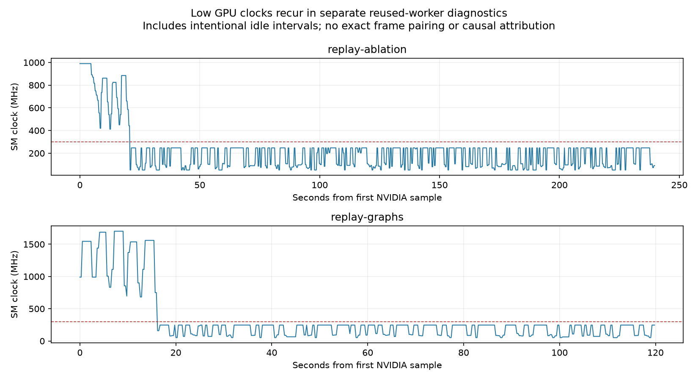

# Reused Learned GPU worker: findings and remaining instability

**The sustained stability requirement was not met.** The candidate reduces CPU
conversion/submission work and improves average Learned latency, but it still
degrades across repeated alignments. AC power was observed at all 80 session
boundaries. The complete 40-session run lasted 81.7 ready minutes and 56.4 armed
minutes and met both 10,000-uncached-frame targets. All failures are retained.

Learned aligned 119/796 times versus 55/849 before. First attempts were 19/20
versus 20/20; subsequent attempts were 100/776 versus 35/829. Uncached mean fell
126.435 → 104.469 ms, p99 fell 312.376 → 298.735 ms and p99.9 fell
337.424 → 334.157 ms, but the maximum rose 369.704 → 382.230 ms. Later-attempt
p99 remains 300.308 ms versus 119.981 ms on first attempts. This is still a
large repeatability failure, despite a better average.

Learned freshness stops fell 793 → 663, while control misses rose 1 → 14.
SIFT also worsened (480/487 → 454/498 alignments; 1 → 34 freshness stops;
6 → 10 control misses) although its algorithm was unchanged in this candidate.
The before/after campaigns are sequential observations on one shared Windows
laptop, not a randomized isolation of software from host/device conditions.
Identical input hashes and AC snapshots do not establish identical scheduling,
CPU/GPU power policy or other host activity. Do not attribute all outcome
differences to the code change.

The [complete comparison](COMPARISON.md) reports all processing, command-age,
held-age and work-accounting metrics. [REPORT.md](REPORT.md) adds whole-session
bootstrap intervals and per-session trends. [verification.json](verification.json)
confirms source/runtime integrity, all 80 before/after raw checksums, and zero
recorded unsafe motion ticks, post-stop motion ticks or forbidden contacts.
Every stop stayed latched. These safety observations do not turn missed timing
deadlines into successful alignments or establish a physical hard-real-time
guarantee.

## What changed, and what stayed fixed

The production Learned worker now transfers a contiguous uint8 image before
converting to float32 on the GPU. The previous combined device/dtype conversion
could perform the cast on the host, repeatedly activating its eight-thread
native pool. The new route preserves every normalized input value. It does not
change the configured thread count, image sizes, feature limit or precision.

Nine fixed-shape LightGlue transformer blocks are captured at initialization.
Their buffers and graphs are reused, with an eager fallback for another feature
shape. Adaptive stopping, model weights and matching thresholds are unchanged.
Graph capture adds initialization work; the existing single-camera-image
warm-up and the 1.1-second stopped interval are unchanged. No keepalive workload,
per-alignment restart, power-plan change, clock lock, priority or affinity
change was used. The worker remains reusable.

There is no new per-frame CUDA-wide synchronization. The existing final
device-to-host copy still supplies the matched coordinates to the CPU geometry
code; timing events are queried only after that required transfer. The control,
collision, acquisition and bounded-queue algorithms are unchanged. Changes in
`realtime.py` expose execution metadata only. The watchdog remains 400 ms and
the control deadline remains 50 ms.

## Worker state and execution evidence

[REUSE_PROBES.json](REUSE_PROBES.json) contains compact state checks, unprofiled
timings, source/tool provenance and profiler summaries for the separate replay
experiments. These replay samples do not enter the sustained campaign's
statistics. Replays bypass the identical-image cache and cycle through recorded
poses, with explicit 1.1-second idle intervals. Variants ran sequentially under
changing host conditions; their timings are not randomized treatment effects.

In the original replay, model and template hashes stayed unchanged, both models
remained in evaluation mode, the current stream remained the default stream,
and live/reserved GPU memory stayed at 61,406,208/186,646,528 bytes at every
unprofiled frame. Allocation retries and OOMs stayed at zero. The graph replay
used 81,731,584/251,658,240 bytes, also stable. A separate-stream variant reserved
more bounded workspace and still became slow. These observations found no
accumulating weights, template mutation or growing CUDA allocation pool in the
measured replays. They cannot exclude every form of driver/context state.

The same-worker ablation verified the native pool's default block time as
200 ms. Alternating the original route with a zero-block-time variant and the
GPU-cast route reduced process CPU consumption sharply, while the low-clock
slow frames persisted. For example, the later original-route phase consumed
955.1 ms of aggregate process CPU per 136.6 ms wall frame; the following GPU-cast
phase consumed 148.1 ms per 153.5 ms wall frame. The phase order and changing
GPU state prevent attributing the wall-time difference to the cast alone.

Profiler samples also distinguish host submission from elapsed GPU work. One
slow eager sample spent 155.7 ms inside 20 stream-synchronization calls and
23.3 ms in 930 host kernel-launch calls. Its recorded GPU kernels summed to
207.4 ms over a 240.5 ms span, compared with 42.6 ms over 75.2 ms in an earlier
fast sample. Thus host launch gaps alone do not explain the observed difference.
GPU kernel durations can include GPU scheduling/preemption; these measurements
do not establish pure computation time or a clock-induced causal mechanism.

A graph sample reduced host kernel-launch calls from 930 to 301, plus seven
graph-launch calls. This confirms reduced submission work. It did not eliminate
every severe tail: the separate graph replay still had later-frame p99 305.2 ms
and maximum 348.9 ms. Host API waits, GPU event spans and kernel-duration sums
overlap and must not be added together.

Other measured alternatives did not resolve the degraded regime: a dedicated
stream, passive native-pool waiting, cuDNN benchmarking, prerecorded images
without recurring OpenGL submissions, and channels-last layout. The attempted
cuBLASLt override was explicitly unsupported on this Windows build, so it is
not evidence about a working cuBLASLt implementation. cuDNN benchmarking also
changed the template-feature hash numerically and was not adopted. No model
settings or software versions were changed to obtain the reported campaign.

## Clock and power interpretation

The earlier [GPU diagnostic](../20260922-gpu-diagnostic/gpu-correlation.json)
and new replays again observed low SM clocks alongside slow frames. Neither
establishes why the clock changed. Sampled event-reason bits did not substantiate
thermal or power-brake throttling; absence at 250 ms sampling cannot exclude
short unsampled events. CPU temperature could not be read with the available
permissions. No thermal or power-brake root cause is claimed.

There is an important power-source confound. The initial new diagnostic passed
24/24 on battery (28% to 26%), whereas the earlier failing GPU diagnostic ran
on AC. It is excluded from the controlled AC comparison. After AC power was
confirmed, unchanged code passed 21/24 with three freshness stops; the candidate
passed 23/23 with none in a short check. These are diagnostic observations,
not a sufficient sustained validation or proof that the code caused the
difference. See the AC baseline and candidate timing/clock evidence below.

- [AC baseline samples](../20260923-ac-baseline/gpu-correlation.json) and
  [timeline](../20260923-ac-baseline/gpu-timeline.png).
- [AC candidate samples](../20260923-ac-optimized/gpu-correlation.json) and
  [timeline](../20260923-ac-optimized/gpu-timeline.png).
- [Battery diagnostic, excluded from the AC comparison](../20260923-baseline-gpu/gpu-correlation.json).

The main campaign queries GPU/power status only before and after each session,
outside armed intervals. It does not contain continuous GPU-clock or AC-state
sampling. Its frame timings cannot be assigned exact GPU clocks by extrapolating
those boundary snapshots. Continuous clock sampling and native profiling remain
separate diagnostic experiments to avoid contaminating the main latency sample.

## Why processing below 400 ms can still trigger the watchdog

The held command's age continues increasing until a newer command is accepted.
For consecutive commands, its peak age is approximately the first command's
capture-to-command delay plus the interval until the next command. With serial
uncached processing taking P ms and 50 ms transport, this can approach
2P + 50 ms before acquisition, scheduling and control overhead. This is an
illustration, not the timing model used by the analyzer. A 300 ms processing
frame is therefore not automatically compatible with continuous feedback inside
400 ms, even when that frame itself is accepted before it expires. The report
measures actual capture timestamps, held age and stop events.

## Native scheduling access and attribution limits

The earlier Learned control overrun was 57.992 ms, with 55.014 ms in
physics/collision and 15.625 ms of quantized thread CPU time. A perception result
finished near the start of that interval and waited 57.576 ms to be received.
There was no recorded GC overlap. This supports a substantial off-CPU component
but does not show that inference blocked the control owner.

Native WPR CPU/context-switch tracing was attempted again in a separate run.
Windows refused to start it with error `0xc5585011`, "Failed to enable the policy
to profile system performance." The available token lacks
`SeSystemProfilePrivilege`. No recording was started and no system policy was
changed. The [exact native trace metadata](../20260923-native-diagnostic/metadata.json)
preserves the failure. This is a host permission limitation, not an automatic
approval-review rejection.

The available wall/thread-CPU/cycle measurements can locate an overrun in the
control pipeline, but cannot reliably separate scheduler preemption from native
lock/device waiting. The report does not label an off-CPU interval as a lock or
inference blockage without a context-switch/wait trace. The next attribution
step requires a permitted WPR CPU/GPU trace during a separate reproduction;
it does not require weakening the watchdog or allowing stale motion.

## Implementation references

The implementation follows the static-buffer and stream-lifetime constraints
documented in [PyTorch CUDA graph notes](https://docs.pytorch.org/docs/main/notes/cuda.html)
and [NVIDIA graph guidance](https://docs.nvidia.com/dl-cuda-graph/torch-cuda-graph/best-practices.html).
The native-pool ablation used the documented
[Intel OpenMP waiting controls](https://www.intel.com/content/www/us/en/docs/dpcpp-cpp-compiler/developer-guide-reference/2023-2/supported-environment-variables.html).
These references explain mechanisms; measured project evidence, rather than
documentation alone, supports the observations above.

## Control overruns in the new campaign

The new Learned campaign's longest associated control cycle reached 119.094 ms
in `learned-session-005`, generation 1. Its physics/collision interval was
116.247 ms, with 15.625 ms of quantized thread CPU time and 26,610,547 raw thread
CPU cycles. No GC overlapped it. This again supports a large off-CPU component,
without identifying preemption versus a native wait or proving inference blocked
the control thread. Other Learned overruns include a 68.591 ms
`sleep_or_descheduled` interval with only 325,818 CPU cycles and no recorded GC.

Two SIFT misses have more direct evidence: generation-2 GC callbacks occupied
44.639 ms of a 44.944 ms receive/deserialize interval, and 49.964 ms of a
50.460 ms receive/deserialize interval. These recorded GC pauses explain most
of those two intervals; they do not explain the Learned physics overruns.

The report's automatically selected *nearby* cycle is not always the entire
deadline interval. Three Learned and two SIFT misses have a selected cycle
shorter than 50 ms. In particular, gaps around probe finalization/start and
rearming are not fully attributed by the retained slow-cycle samples. A short
nearby `supervision` interval must not be called the cause of a 50 ms deadline
miss. Their stop events and raw traces remain included. Native scheduling
evidence is still required for precise attribution of the unexplained cases.

## Replay clock evidence

[Replay clock summary](replay-clock-summary.json) reports first-30-second and
later clock distributions, temperatures, power-source snapshots and event-reason
counts. These are whole replay recordings including the intentional idle
intervals. The graph replay still entered low-clock intervals. The ablation
returned to the original execution route in the same process and remained
affected. Neither fresh versus reused context nor a specific clock mechanism
is established as the root cause by these sequential observations.

The AC short checks had maximum sampled GPU temperatures of 47°C before and
48°C after. Neither recorded an active software-power-cap, software/hardware
thermal-slowdown or hardware-power-brake event reason in its active samples.
This is limited sampled evidence, not a guarantee that an unsampled limiting
event never occurred. One earlier battery diagnostic contains unavailable NVML
samples; the analyzer records them explicitly instead of treating them as zero.

## What remains necessary

The reusable implementation and bounded safety behavior are preserved, but this
host has not demonstrated dependable 400 ms feedback or a 50 ms control loop.
Further attribution needs a permitted native CPU/context-switch/GPU scheduling
trace during the reproduced degraded state, with CPU performance/power telemetry
alongside GPU clocks. That trace would distinguish a device-execution slowdown,
submission starvation, OS preemption and native waits before choosing another
mitigation. A restart-per-alignment policy, artificial GPU keepalive or relaxed
watchdog is not validated by this evidence and was not installed.
