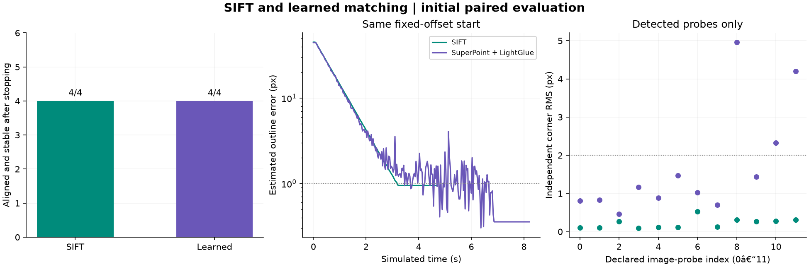

# Learned matching: initial comparison

Both matchers see the same natural photograph and use the same saved RGB goal,
four virtual boundary corners, geometry gates, fixed-gain IBVS, startup search,
recovery and joint-limit handling. SuperPoint and LightGlue use pretrained weights;
there is no training on these scenes and no fallback to SIFT or ArUco.

Four target-present cases are declared explicitly: the fixed offset, its opposite,
a shifted picture, and a complete unseen start at +35 degrees of base yaw.
The missing/wrong-target controls each use a declared 3-second search deadline.
This is a small functional comparison, with no random-sampling success-rate claim.
All 12 runs and all 24 image-probe measurements are retained.

| Measurement | SIFT | SuperPoint + LightGlue |
|---|---:|---:|
| Aligned and stable after stopping | 4/4 | 4/4 |
| Initially undetected positive cases | 1 | 1 |
| Median successful total simulated time (s) | 3.77 | 6.33 |
| Median of per-trial detector-call medians (ms) | 41.62 | 476.18 |

| Case | SIFT | Learned | SIFT time (s) | Learned time (s) |
|---|---|---|---:|---:|
| 1: fixed_offset | converged | converged | 3.70 | 7.20 |
| 2: opposite_offset | converged | converged | 3.80 | 5.47 |
| 3: shifted_picture | converged | converged | 3.73 | 4.70 |
| 4: cold_right | converged | converged | 29.27 | 30.00 |
| 5: absent_marker | target_not_found | target_not_found | 3.00 | 3.00 |
| 6: wrong_target | target_not_found | target_not_found | 3.00 | 3.00 |

## Independent image probes

Three predetermined perspective transforms are each tested clean, dimmed to 40%,
blurred with a 5x5 Gaussian (sigma 1.2), and with a fixed partial occlusion.
These are offline image probes, separate from robot runs. Corners are compared
to independently specified transform geometry, rather than each detector's
own estimate of a goal. Both backends use the same input pixels.

{
  "natural": {
    "cases": 12,
    "accepted": 12,
    "median_corner_rms_px": 0.19414053857326508,
    "within_2px": 12
  },
  "learned": {
    "cases": 12,
    "accepted": 12,
    "median_corner_rms_px": 1.0953063368797302,
    "within_2px": 9
  }
}

## Interpretation and reproducibility

This is a small functional comparison of one known flat photograph. Neither
4/4 robot success nor these twelve image conditions establish that a matcher
is generally better. Rejected probes remain in the denominator. The plot shows
corner errors only where a detection was accepted; the counts above include misses.

Robot success is estimated outline error below 1 px for 0.5 simulated seconds,
followed by a full stopped second below 1 px. It is not a subpixel guarantee of
true physical pose accuracy. The two detected goal outlines differ by
1.274 px despite sharing the same RGB goal.

Timing measures CPU detector calls, including identical-frame cache hits.
The camera loop advances at 30 simulated Hz; wall-clock playback can be slower.
No claim of GPU performance is made. The manifest records configs, versions,
model/source/asset hashes and the unmodified goal image. Raw traces include every
matching decision, inlier count, error, joint command and terminal observation.
Trace validation: PASS; negative controls made no false acquisition.

Reproduce: python run_learned_study.py
Rebuild report: python run_learned_study.py --analyze "PATH_TO_RUN"
