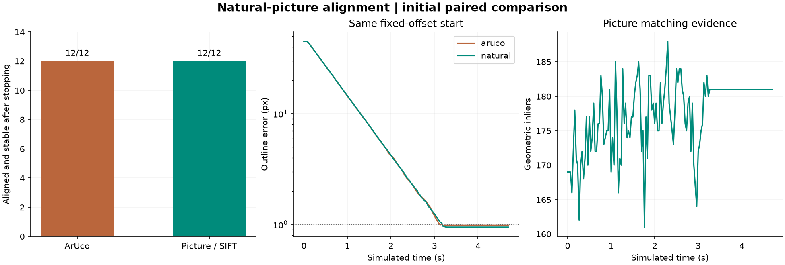

# Initial natural-picture comparison

> Published snapshot: bulk per-frame traces remain local. See the [dataset policy](../../README.md) before regenerating this report.

The same fixed-gain IBVS, startup search, recovery and joint-limit handling are used
with two perception backends: ArUco corners or SIFT matches plus a RANSAC homography
that estimates the four corners of a flat picture. This is classical feature matching,
not learned SuperPoint/LightGlue or direct control of a changing keypoint set.

There are **12 target-present cases**: eight seeded random joint/target placements
(seed 20260913), the normal offset, two cold starts and one declared target translation.
Every sampled case is retained. Two negative controls (absent target and wrong target)
use an explicitly shortened **3-second search deadline**, followed by the same
one-second stopped observation. This is an initial functional comparison, not a
200-trial success-rate study or a test across many different natural pictures.

| Measurement | ArUco | Picture / SIFT |
|---|---:|---:|
| Aligned and stable for 1 s after stopping | 12/12 | 12/12 |
| Initially undetected | 7 | 7 |
| Median total simulated time, successful cases | 7.165999999999729 | 7.132999999999726 |
| Median of per-trial detector-call medians (ms) | 2.172674998291768 | 46.38057500415016 |

Detector timings measure actual calls, including cache hits on identical RGB frames;
they are recorded separately from simulated time. They are machine-dependent.
The camera/control loop advances at 30 simulated Hz; this does not establish
30 frames per second of real-time picture matching on this computer.

| Case | ArUco | Picture / SIFT | ArUco time (s) | Picture time (s) |
|---|---|---|---:|---:|
| 1: small | converged | converged | 3.73 | 3.73 |
| 2: small | converged | converged | 9.33 | 9.30 |
| 3: large | converged | converged | 5.00 | 4.97 |
| 4: large | converged | converged | 26.40 | 26.40 |
| 5: small | converged | converged | 4.83 | 4.83 |
| 6: large | converged | converged | 26.57 | 26.50 |
| 7: medium | converged | converged | 4.83 | 4.83 |
| 8: large | converged | converged | 16.93 | 16.93 |
| 9: fixed_offset | converged | converged | 3.70 | 3.70 |
| 10: cold_right | converged | converged | 29.27 | 29.27 |
| 11: cold_left | converged | converged | 39.90 | 39.83 |
| 12: shifted_picture | converged | converged | 3.57 | 3.73 |
| 13: absent_marker | target_not_found | target_not_found | 3.00 | 3.00 |
| 14: wrong_target | target_not_found | target_not_found | 3.00 | 3.00 |

The printed inner square is 0.24 m for both targets. Each uses its own saved image
of the same nominal desired view. The RMS difference between the detected desired
outlines is 0.215 px; differences in
perception localization are part of this comparison. Depth comes from the observed
square and its known physical size, not the simulator's target pose.

The generated botanical still-life picture contains no fiducial code. Its canonical
image supplies SIFT descriptors. Ambiguous and duplicate matches are removed,
RANSAC rejects inconsistent correspondences, and minimum inliers, spatial coverage,
residual, convexity and full-outline visibility gates decide whether a measurement
is usable. A rejected frame supplies no control features; the existing bounded
search/recovery behavior then applies. No target world pose or saved goal joint
configuration enters perception or the visual error.

Success is RMS error below 1 px in the **estimated outline**, held for 0.5 s, then
remaining below 1 px for a further stopped second. This is not a measured guarantee
of subpixel true physical pose accuracy. Separate synthetic-warp tests compare
outline estimates against known image transforms.

Trace validation: PASS. Starts, scene parameters, search/velocity/deadline bounds,
matching thresholds and stopped observations are checked. No negative control
acquired a false target. Both mode references, source snapshots/hashes, target-asset
hashes, configurations, raw per-frame matching metrics and every outcome are saved.

Reproduce: python run_natural_image_study.py
Rebuild report: python run_natural_image_study.py --analyze "PATH_TO_THIS_RUN"
