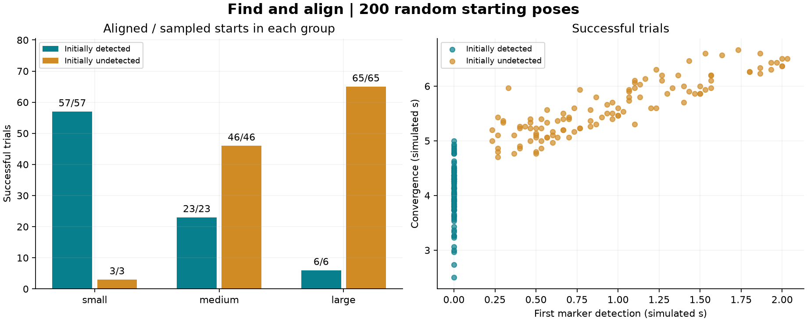

# Find-and-align evaluation

Completed 200 trials with seed 20260906. Every sampled start is counted.

- Converged and stayed below 1 px after stopping: **200/200 (100.0%)**.
- 95% Wilson interval for the declared distribution: 98.1-100.0%.
- Starts without a detected marker: **114**; of those, **114** converged.
- Median convergence time, successful trials only: 5.065999999999664 simulated seconds.
- Median final error, successful trials only: 0.9735262989997864 px.

## Recovery policy and its scope

Each trial is given the measured joint configuration of the taught camera view, where the marker was observed before the trial. During recovery, joint feedback moves toward the most recent observed viewpoint. This is an explicit joint-space recovery phase; it is not pure image-based control while the marker is absent. Once the detector returns three consecutive valid marker frames, unchanged IBVS resumes.

A 0.2-second stationary wait handles brief loss. Recovery commands are bounded to 0.18 rad/s per joint, with a 60-degree per-joint excursion bound, joint-limit margins, a 20-second cumulative recovery budget and a 45-second overall deadline. A local yaw/pitch scan follows if the remembered viewpoint does not reveal the marker. Stop, Pause and manual jogging cancel automatic recovery in the desktop app.

No target pose, ground-truth visibility flag or marker-corner prediction is used for control. Ground-truth joint state supplies the simulated encoder measurements and kinematics. Motion is through velocity actuators; initialization is the only trial reset.

The scene is static, has ideal gravity compensation and disabled robot collisions. The remembered viewpoint is valid in this experiment; this is not evidence for searching an arbitrary environment or collision-safe physical motion.

## Reproduction and saved data

The plan, configuration, taught viewpoint, source hashes and versions are in plan.json and manifest.json. Per-frame traces are numeric NPZ files (load with allow_pickle=False); missing pixel measurements are NaN. trials.jsonl and trials.csv record each outcome and state transitions. summary.json includes all outcomes and confidence intervals. Example images are saved from the first occurrence of each case category.

From the configured project Python environment:

    python run_recovery.py --trials 200 --seed 20260906
    python run_recovery.py --analyze "PATH_TO_THIS_RUN"

