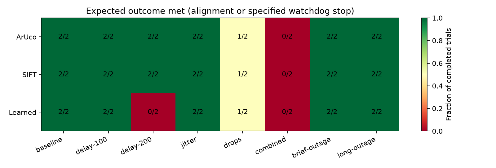

# Automated camera robustness experiment

Seed: 20260920. Completed 48/48 planned trials. Partial runs retain their full planned denominator.

The same starting poses and per-capture random draws are paired across matchers. Offsets are sampled without filtering for visibility or success. Jitter and loss are simulated transport effects; host inference duration is measured separately.

## Disturbances

| Profile | Delay / uniform jitter, ms | Independent packet loss | Capture outages, s | Expected |
|---|---:|---:|---|---|
| baseline | 0 / ±0 | 0% | [] | converged |
| delay-100 | 100 / ±0 | 0% | [] | converged |
| delay-200 | 200 / ±0 | 0% | [] | converged |
| jitter | 100 / ±80 | 0% | [] | converged |
| drops | 100 / ±0 | 20% | [] | converged |
| combined | 150 / ±80 | 20% | [] | converged |
| brief-outage | 100 / ±0 | 0% | [[0.75, 0.83]] | converged |
| long-outage | 100 / ±0 | 0% | [[0.75, 1.35]] | stale_camera |

| Matcher | Profile | Completed / planned | Aligned | Expected outcome met | Safety violations | Median / p95 successful time, simulated s | p95 final image error, px |
|---|---|---:|---:|---:|---:|---:|---:|
| ArUco | baseline | 2/2 | 2 | 2 | 0 | 4.186 / 4.740 | 0.969 |
| ArUco | delay-100 | 2/2 | 2 | 2 | 0 | 3.903 / 4.413 | 0.895 |
| ArUco | delay-200 | 2/2 | 2 | 2 | 0 | 3.569 / 3.989 | 0.786 |
| ArUco | jitter | 2/2 | 2 | 2 | 0 | 4.030 / 4.516 | 0.929 |
| ArUco | drops | 2/2 | 1 | 1 | 0 | 4.436 / 4.436 | 0.902 |
| ArUco | combined | 2/2 | 0 | 0 | 0 | — / — | 148.717 |
| ArUco | brief-outage | 2/2 | 2 | 2 | 0 | 3.886 / 4.381 | 0.918 |
| ArUco | long-outage | 2/2 | 0 | 2 | 0 | — / — | 50.573 |
| SIFT | baseline | 2/2 | 2 | 2 | 0 | 4.219 / 4.774 | 0.962 |
| SIFT | delay-100 | 2/2 | 2 | 2 | 0 | 3.936 / 4.417 | 0.836 |
| SIFT | delay-200 | 2/2 | 2 | 2 | 0 | 3.603 / 4.023 | 0.695 |
| SIFT | jitter | 2/2 | 2 | 2 | 0 | 4.086 / 4.522 | 0.886 |
| SIFT | drops | 2/2 | 1 | 1 | 0 | 4.502 / 4.502 | 0.796 |
| SIFT | combined | 2/2 | 0 | 0 | 0 | — / — | 148.730 |
| SIFT | brief-outage | 2/2 | 2 | 2 | 0 | 3.920 / 4.415 | 0.863 |
| SIFT | long-outage | 2/2 | 0 | 2 | 0 | — / — | 50.580 |
| Learned | baseline | 2/2 | 2 | 2 | 0 | 9.136 / 10.247 | 0.855 |
| Learned | delay-100 | 2/2 | 2 | 2 | 0 | 11.453 / 11.918 | 0.958 |
| Learned | delay-200 | 2/2 | 0 | 0 | 0 | — / — | 1.254 |
| Learned | jitter | 2/2 | 2 | 2 | 0 | 7.138 / 7.795 | 0.890 |
| Learned | drops | 2/2 | 1 | 1 | 0 | 15.370 / 15.370 | 0.749 |
| Learned | combined | 2/2 | 0 | 0 | 0 | — / — | 148.691 |
| Learned | brief-outage | 2/2 | 2 | 2 | 0 | 12.386 / 13.871 | 0.685 |
| Learned | long-outage | 2/2 | 0 | 2 | 0 | — / — | 50.177 |

## Outcome definitions

Aligned means the controller stopped as converged, then all configured fresh current-image checks remained below the configured pixel threshold with zero commands. The checks use the selected detector; they are not independent physical pose ground truth.

A specified outage passes only with a stale-camera stop at the observation-age deadline, stationary commands afterwards, and observed capture restoration. A safe watchdog stop in a convergence profile remains an alignment failure. Safety checks sample commands and actual joint limits on every 2 ms physics tick.

Completion quantiles include successful trials only. Error quantiles include every available terminal measurement. Small samples are descriptive, not a stability guarantee. No gain retuning or delay compensation is applied.

## Outcomes retained

| Matcher | Profile | Outcome counts |
|---|---|---|
| ArUco | baseline | {'converged': 2} |
| ArUco | delay-100 | {'converged': 2} |
| ArUco | delay-200 | {'converged': 2} |
| ArUco | jitter | {'converged': 2} |
| ArUco | drops | {'converged': 1, 'stale_camera': 1} |
| ArUco | combined | {'stale_camera': 2} |
| ArUco | brief-outage | {'converged': 2} |
| ArUco | long-outage | {'stale_camera': 2} |
| SIFT | baseline | {'converged': 2} |
| SIFT | delay-100 | {'converged': 2} |
| SIFT | delay-200 | {'converged': 2} |
| SIFT | jitter | {'converged': 2} |
| SIFT | drops | {'converged': 1, 'stale_camera': 1} |
| SIFT | combined | {'stale_camera': 2} |
| SIFT | brief-outage | {'converged': 2} |
| SIFT | long-outage | {'stale_camera': 2} |
| Learned | baseline | {'converged': 2} |
| Learned | delay-100 | {'converged': 2} |
| Learned | delay-200 | {'timeout': 2} |
| Learned | jitter | {'converged': 2} |
| Learned | drops | {'converged': 1, 'stale_camera': 1} |
| Learned | combined | {'stale_camera': 2} |
| Learned | brief-outage | {'converged': 2} |
| Learned | long-outage | {'stale_camera': 2} |

[Plan](plan.json) · [All trials](trials.json) · [Summary](summary.json) · [Source and runtime manifest](manifest.json)

Per-frame traces and exception logs remain local under traces/. Resume uses the saved plan and requires matching source, reference, asset and runtime fingerprints. The report can be regenerated from the JSON files without raw traces.
