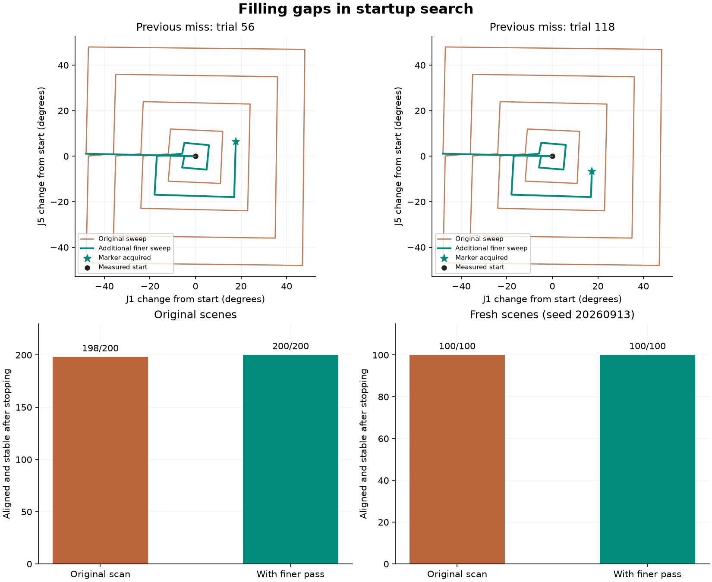

# Search coverage comparison

Both missed targets were visible within the existing +/-48-degree yaw/pitch box,
between the original coarse scan paths. The new policy preserves the original
12/24/36/48-degree rectangles, then scans the midpoint rings 6/18/30/42 degrees
if no marker was confirmed. It returns toward the measured start between passes.
No target world coordinates, home pose or remembered target view guide the search.

The regression comparison reuses 204 recorded baseline rows from the completed
joint-limit study and runs the refined policy anew. The fresh comparison runs both
policies on 100 newly sampled target-present scenes
(seed 20260913), plus four negative controls per policy.
The fresh plan is saved before any fresh results are inspected. No sampled starts
are discarded. The two known misses were used during development; the original
200-scene result is a regression result, not a held-out estimate.

| Measurement | Original scan | With finer pass |
|---|---:|---:|
| regression: Aligned and stable | 198/200 | 200/200 |
| regression: Initially invisible, then acquired | 120/122 | 122/122 |
| regression: Initially invisible, then aligned | 120/122 | 122/122 |
| holdout: Aligned and stable | 100/100 | 100/100 |
| holdout: Initially invisible, then acquired | 59/59 | 59/59 |
| holdout: Initially invisible, then aligned | 59/59 | 59/59 |

- regression: improved [56, 118]; regressed []; outcomes {'converged': 200}; negative controls {'target_not_found': 2, 'recovery_limit': 1, 'reposition_timeout': 1}.
- holdout: improved []; regressed []; outcomes {'converged': 100}; negative controls {'target_not_found': 2, 'recovery_limit': 1, 'reposition_timeout': 1}.

## Time and motion tradeoff

The total search deadline is now 180 simulated seconds instead of 90. The old scan
usually finished in about 76 seconds. The extra pass receives the remaining shared
budget; its transition never resets the clock. It stops earlier if its path completes.
Speed remains 0.25 rad/s per joint, maximum startup excursion remains 48 degrees,
and mechanical margins remain 0.06 radians. Other joints hold the initial position.

Every camera detection interrupts movement immediately. Three consecutive detections
hand off to the unchanged joint-aware IBVS controller. Its separate 45-second budget
still includes any tracking recovery or alignment retry. Overall bounds therefore
permit up to 225 simulated seconds before termination.

- regression trial 56: converged; acquisition 91.33199999996855 s; total 96.67 s.
- regression trial 118: converged; acquisition 90.46599999997056 s; total 95.43 s.

## Verification and scope

Trace validation: PASS. Paired initial images/joints and all commands along the
original search prefix match exactly. Every scene acquired by the original scan
retains its entire trace and outcome. Search commands, requested steps, measured
bounds (0.005 rad actuator tolerance), deadlines, braking, terminal zero commands
and one-second stopped observations are checked. Every reported success remains
below 1 pixel during that observation.

Baseline runtime, scene, detector, reference, alignment and joint handling are
checked for compatibility. Configurations, source snapshots/hashes, paired traces,
the saved reference and all outcomes are retained. Recorded baseline trace hashes
are stored separately.

This is a finer finite scan, not exhaustive visibility coverage or guaranteed
alignment from arbitrary poses. Narrower gaps, occlusions and inaccessible views can
still cause misses. Collisions remain disabled in the teaching simulation.

Reproduce: python run_search_coverage.py --holdout-trials 100 --seed 20260913
Rebuild this report: python run_search_coverage.py --analyze "PATH_TO_THIS_RUN"
