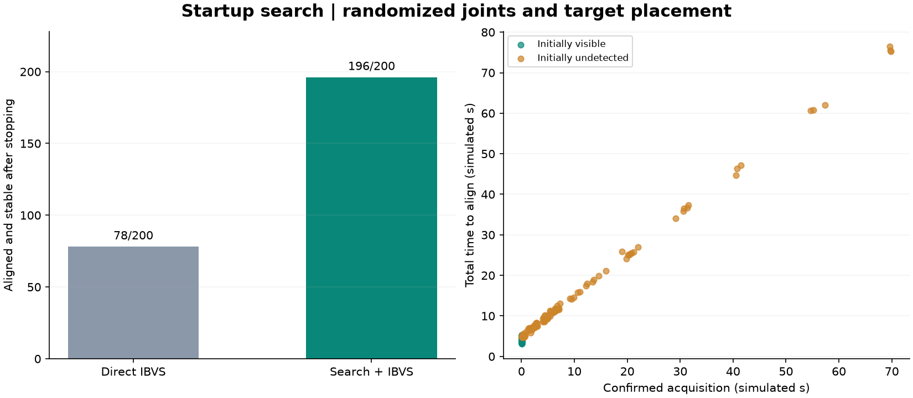

# Systematic startup-search evaluation

Seed 20260911; 200 randomized scenes, each run with both methods.
No sampled scene was rejected for visibility or reachability. Four negative controls
are reported separately from the randomized target-present group.

| Measurement | Direct IBVS | Startup search + IBVS |
|---|---:|---:|
| Aligned and stable for 1 s after stopping | 78/200 | 196/200 |
| Initially undetected | 122 | 122 |
| Initially undetected, then acquired | 0 | 120 |
| Initially undetected, then aligned | 0 | 118 |

Search acquisition median among initially undetected scenes that were acquired:
4.982999999999674 simulated seconds.
Successful search runs: median total time 6.498999999999507 s;
median time from confirmed acquisition to convergence 4.700000000000248 s.
Medians describe their stated groups; they are not paired speed comparisons.

Target translations are independent uniform offsets within +/- [0.06, 0.18, 0.1] m
in world X/Y/Z from the original scene. Robot joint boxes are unchanged from the
original benchmark. Every method receives the same saved image goal and camera
calibration. Search begins without a remembered robot viewpoint. Target position
is used only to arrange the test scene; it is never supplied to the controller.
The reference is not recaptured between trials. Gain is fixed at 1.2/s for both methods.

Two negative controls remove the marker board from rendering; two place the target
two metres sideways, beyond the arm's reach. The distant target can still be
visible; these cases test bounded failure after detection as well as during search.
Search negative-control outcomes: {'target_not_found': 2, 'recovery_limit': 1, 'timeout': 1}.
All negative controls had zero commanded velocity throughout the one-second post-stop observation:
True.

The search follows expanding yaw/pitch rectangles relative to the measured starting
joints, with radii 12, 24, 36 and 48 degrees. It checks images during motion,
brakes on detection, and requires three consecutive frames. Its speed cap is
0.25 rad/s, with 0.06 rad mechanical margins and a 90-second acquisition deadline.
After acquisition the existing IBVS/recovery controller has its own 45-second
overall budget (IBVS has a 20-second alignment timeout per episode).

This samples a limited static scene distribution; it does not establish arbitrary
workspace coverage. A two-joint scan can fail because of orientation, occlusion,
reachability or limited search time. Robot collisions remain disabled in this
teaching simulation, so these results do not establish collision-safe physical motion.

Outcomes: {'converged': 196, 'timeout': 2, 'target_not_found': 2}. Trace validation: PASS.
The manifest records configurations, source/reference hashes and library versions.
plan.json contains every scene; trials.jsonl contains every outcome; traces/ contains
numeric per-frame NPZ logs, including commands, detections, joint feedback and phases.
cases/ contains representative initial and final rendered images.

Reproduce: python run_startup_search.py --trials 200 --seed 20260911 --reference "PATH_TO_THIS_RUN/goal.npz"
Rebuild this report: python run_startup_search.py --analyze "PATH_TO_THIS_RUN"
