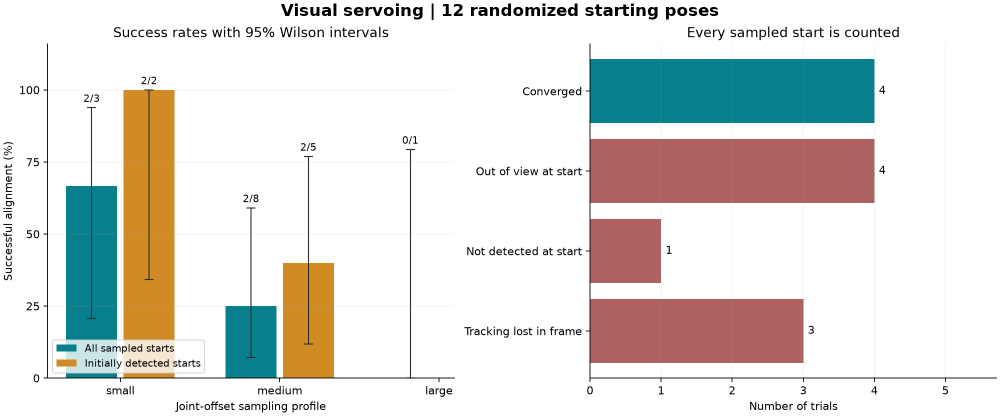
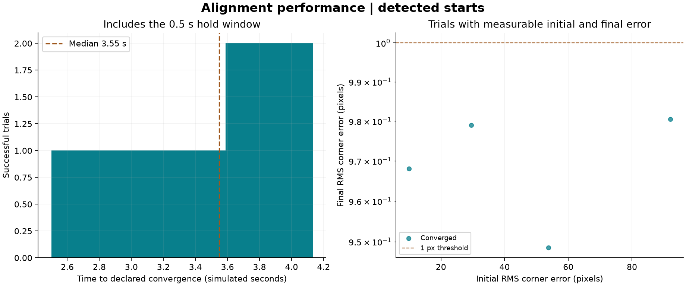

# Randomized visual-servoing benchmark

Completed **12 trials**, RNG seed **20260906**. Controller: unchanged step-2 fixed-gain marker IBVS.

- All starts: **4/12** converged; 33.3% [13.8, 60.9].
- Starts with the marker initially detected: **4/7**; 57.1% [25.0, 84.2].
- Brackets show 95% Wilson confidence intervals for the declared starting-pose distribution.

| Profile | Sampled starts | Marker detected at start | Converged | Success, all starts (95% CI) | Success, detected starts (95% CI) |
|---|---:|---:|---:|---|---|
| small | 3 | 2 | 2 | 66.7% [20.8, 93.9] | 100.0% [34.2, 100.0] |
| medium | 8 | 5 | 2 | 25.0% [7.1, 59.1] | 40.0% [11.8, 76.9] |
| large | 1 | 0 | 0 | 0.0% [0.0, 79.3] | No data |

## Sampling

Each trial chooses a profile uniformly, then samples six independent uniform joint offsets within that profile. No invisible starts are rejected. Camera poses follow the joint kinematics; they are not uniform in Cartesian space.

Bounds below are symmetric offsets about home, in joint degrees (J1 through J6).

| Profile | J1 | J2 | J3 | J4 | J5 | J6 |
|---|---:|---:|---:|---:|---:|---:|
| small | +/-3 | +/-3 | +/-4 | +/-4 | +/-3 | +/-4 |
| medium | +/-8 | +/-8 | +/-10 | +/-12 | +/-8 | +/-12 |
| large | +/-18 | +/-18 | +/-25 | +/-30 | +/-18 | +/-30 |

The plan is saved before simulation. No starts are rejected for visibility and no failed trials are rerun to improve the score.
Joint-space sampling induces a nonuniform camera-pose distribution. These intervals describe this simulation experiment, not physical-robot reliability.

## Outcomes

| Outcome | Count | First recorded example |
|---|---:|---|
| Converged | 4 | [Images and trial data](cases/converged/) |
| Out of view at start | 4 | [Images and trial data](cases/initial_out_of_view/) |
| Not detected at start | 1 | [Images and trial data](cases/initial_tracking_loss/) |
| Left camera view | 0 | - |
| Tracking lost in frame | 3 | [Images and trial data](cases/tracking_loss/) |
| Depth rejected | 0 | - |
| Stalled at joint limit | 0 | - |
| Stalled near singularity | 0 | - |
| Stalled | 0 | - |
| Timeout | 0 | - |
| Unstable after stopping | 0 | - |

Examples are the first occurrence of each outcome, not selected for best or worst performance.
Initial loss is distinguished from loss during motion. FOV labels use evaluation-only geometric projection; the controller never receives this ground truth.
A stalled trial is not labeled a proven local minimum. Joint-limit and singularity labels indicate observed conditions during the stall.

## Timing and accuracy

- Median declared-convergence time, successes only: **3.55 simulated seconds**.
- Median settling time, successes only: **3.05 simulated seconds**.
- Median final RMS corner error, successes only: **0.974 px**.

## Files and reproduction

- plan.json: exact starting offsets and trial IDs.
- manifest.json: source hashes, package versions, sampling and controller configuration.
- trials.jsonl and trials.csv: one summary per sampled start.
- traces/trial_NNNN.npz: numeric per-frame time, corners, depth, commands, actual joint rates, camera pose, conditioning and FOV diagnostics. Load with numpy.load(..., allow_pickle=False).
- summary.json: rates, confidence intervals and per-profile statistics.

From the project folder, regenerate the figures without running physics:

    python analyze_benchmark.py "PATH_TO_THIS_RUN"

Replay one exact starting pose (current source hashes must match the saved run):

    python benchmark.py --replay-run "PATH_TO_THIS_RUN" --trial-id 12

This step benchmarks one controller under fixed lighting and idealized dynamics. Baseline comparisons, learned features, noise/latency sweeps and physical validation are not included.

[Wilson interval method: NIST](https://www.itl.nist.gov/div898/handbook/prc/section2/prc241.htm).
